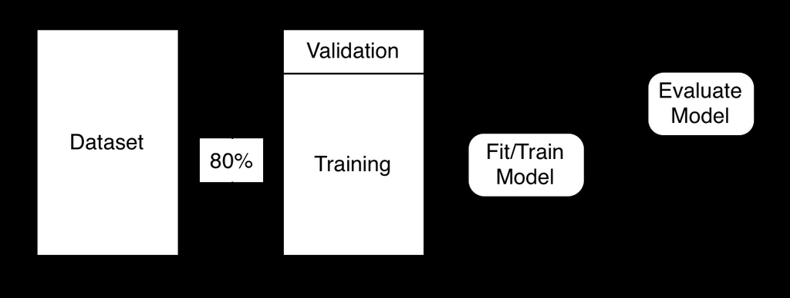

- **Chapter 2: Python for Machine Learning**
  - **2.1 Part 2.1: Introduction to Pandas**
    - Pandas provides high-performance, easy-to-use data structures and data analysis tools based on dataframes.
    - The Auto MPG dataset is used extensively for examples including loading, statistical summaries, handling missing values, and outlier removal.
    - Techniques include reading CSV, replacing missing values with medians, dropping irrelevant fields, concatenating columns/rows, and splitting data into training and validation sets.
    - Converting dataframes to numeric matrices and saving them to CSV or Pickle formats are demonstrated.
    - For further reference, see the [Pandas Documentation](https://pandas.pydata.org/docs/).
  - **2.1.1 Missing Values**
    - Missing horsepower values in the dataset are replaced with the median value to ensure data completeness.
    - Demonstrates use of `fillna()` to handle missing entries.
    - Notes the alternative option to drop missing values entirely.
  - **2.1.2 Dealing with Outliers**
    - Defines outliers as values several standard deviations from the mean and provides a function to remove them.
    - Example removes rows where MPG is more than two standard deviations away from the mean.
  - **2.1.3 Dropping Fields**
    - Illustrates removing columns irrelevant to the neural network, e.g., dropping the 'name' column from the dataset.
  - **2.1.4 Concatenating Rows and Columns**
    - Shows creating new datasets by concatenating columns (e.g., name with horsepower) and concatenating subsets of rows.
  - **2.1.5 Training and Validation**
    - Describes the importance of splitting data into training (in-sample) and validation (out-of-sample) sets.
    - Introduces simple random splits (80/20) and k-fold cross validation methods.
  - **2.1.6 Converting a Dataframe to a Matrix**
    - Neural networks require numeric matrices rather than dataframes.
    - Conversion is achieved via the `.values` property of dataframes, optionally selecting specific columns.
  - **2.1.7 Saving a Dataframe to CSV**
    - Demonstrates how to shuffle and save a dataframe as a CSV file without row numbers (index).
  - **2.1.8 Saving a Dataframe to Pickle**
    - Pickle provides a binary format for faster saving/loading without precision loss, though less universal than CSV.
    - Loading pickle files retains shuffled indices unlike reloading CSV.
  - **2.1.9 Module 2 Assignment**
    - Refers to assignment 2 as the practical application for the covered material.
  - **2.2 Part 2.2: Categorical and Continuous Values**
    - Neural networks require fixed numeric inputs; thus, categorical data must be encoded suitably.
    - Data types are categorized as nominal, ordinal (character), and interval, ratio (numeric).
    - See [Data Levels of Measurement](https://en.wikipedia.org/wiki/Level_of_measurement) for background.
  - **2.2.1 Encoding Continuous Values**
    - Introduces normalization via Z-Score to standardize numeric inputs.
    - Z-Score centers data at zero mean with unit variance to facilitate model training.
  - **2.2.2 Encoding Categorical Values as Dummies**
    - Explains one-hot encoding (dummy variables) as the standard approach for nominal categorical data.
    - Details creating new binary columns representing each category, and removing the original categorical column.
  - **2.2.3 Target Encoding for Categoricals**
    - Target encoding replaces categories with the mean target value per category to increase predictive power.
    - Includes smoothing to reduce overfitting risk by weighting category counts versus global target mean.
    - Useful mainly for regression problems; caution advised due to overfitting potential.
    - See article ["Target Encoding Done the Right Way"](https://www.kaggle.com/code/alexisbcook/target-encoding) for deeper insight.
  - **2.2.4 Encoding Categorical Values as Ordinal**
    - Ordinal categorical variables have inherent order and can be encoded as ordered integers to preserve ranking.
    - Example given is education levels requiring fewer dummy variables but retaining order information.
  - **2.3 Part 2.3: Grouping, Sorting, and Shuffling**
    - Demonstrates data preprocessing operations including shuffling (to randomize row order), reindexing, and sorting by column values.
    - Grouping (equivalent to SQL GROUP BY) summarizes data by aggregating with functions such as mean and count.
    - Grouped data can be converted to dictionaries for fast lookup, aiding in tasks like target encoding.
  - **2.3.1 Shuffling a Dataset**
    - Shuffling eliminates bias from row ordering, critical for valid training-validation splits.
    - `reindex` resets row indices post shuffle for consistency.
  - **2.3.2 Sorting a Data Set**
    - Sorting orders dataset rows by specified columns, useful for inspection or preprocessing.
  - **2.3.3 Grouping a Data Set**
    - Groups data by categorical column values to compute aggregate statistics like average MPG per cylinders.
  - **2.4 Part 2.4: Apply and Map**
    - Explains pandas functional programming tools: `map` and `apply`.
  - **2.4.1 Using Map with Dataframes**
    - `map` transforms column values using a dictionary or function, demonstrated by converting numeric region codes to textual names.
  - **2.4.2 Using Apply with Dataframes**
    - `apply` runs a function across dataframe rows or columns; example computes a new "efficiency" feature as displacement divided by horsepower.
    - Allows creation of new calculated columns.
  - **2.4.3 Feature Engineering with Apply and Map**
    - Processes IRS tax data to estimate Adjusted Gross Income (AGI) per zipcode by mapping income brackets to median values and grouping sums weighted by tax returns.
    - Demonstrates advanced use of groupby and lambda functions for custom aggregation.
    - For IRS data details see [IRS SOI Tax Stats](https://www.irs.gov/statistics/soi-tax-stats-individual-income-tax-statistics-2016-zip-code-data-soi).
  - **2.5 Part 2.5: Feature Engineering**
    - Feature engineering enhances machine learning models by adding meaningful new data features.
  - **2.5.1 Calculated Fields**
    - New columns can be derived from existing data, e.g., converting car weight from pounds to kilograms with a mathematical formula.
  - **2.5.2 Google API Keys**
    - External APIs like Google's Geocoding API can add location-based features.
    - Requires a personal Google API key for use.
    - See [Google Maps Platform](https://developers.google.com/maps/documentation/geocoding/get-api-key) for setup.
  - **2.5.3 Other Examples: Dealing with Addresses**
    - Addresses can be transformed into latitude/longitude coordinates for neural network input.
    - Distances between points (great circle distance) can serve as engineered features, e.g., distance from schools to a focal location.
    - Includes formula and code to compute distances accurately on Earth's surface.
    - Provides examples computing distances to multiple universities from Washington University in St. Louis.
