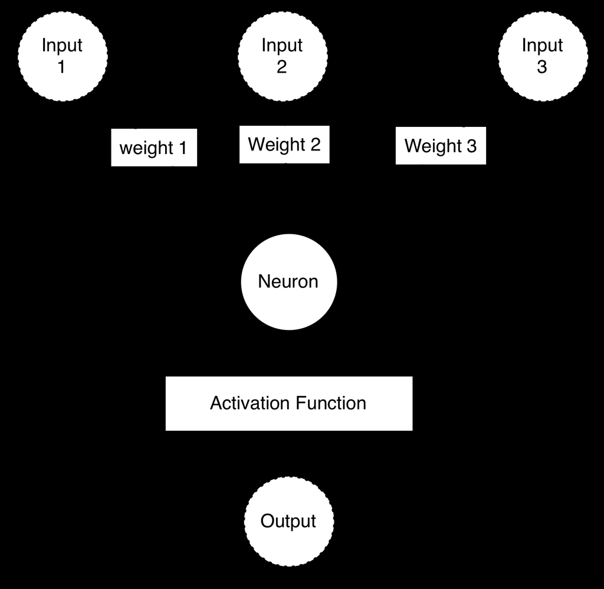

- **3.1 Part 3.1: Deep Learning and Neural Network Introduction**  
  - Neural networks have evolved through three popularity waves and deep learning implies networks with many hidden layers.  
  - Input to neural networks can be 1D vectors or higher-dimensional matrices depending on data type, such as images for CNNs.  
  - Neural networks perform either classification (categorical output) or regression (numeric output).  
  - Neural networks consist of interconnected neurons organized into layers, with each neuron computing weighted sums passed through activation functions.  
  - [Deep Learning as the Third Generation of Neural Networks](https://www.soa.org/globalassets/assets/files/research/projects/research-brief-dev-revised.pdf)

- **3.1.1 Classification or Regression**  
  - Regression networks output numeric values and classification networks output categories, with classification having an output neuron per class.  
  - Both types use a fixed-size input feature vector that determines the network structure.  
  - Two-class classification and regression networks typically have a single output neuron.

- **3.1.2 Neurons and Layers**  
  - A neuron multiplies inputs by weights, sums them, adds bias, and applies an activation function to produce output.  
  - Neural networks commonly arrange neurons in layers: input, hidden, output, with neurons fully connected to the next layer.  
  - Feedforward neural networks propagate signals forward without loops; recurrent networks introduce feedback loops.  

- **3.1.3 Types of Neurons**  
  - Neural networks typically have input neurons (accept features), hidden neurons (process data), output neurons (produce output), context neurons (maintain state), and bias neurons (act like intercepts).  
  - Bias neurons have a fixed output of 1 and allow shifting of activation function outputs.  

- **3.1.4 Input and Output Neurons**  
  - Input neurons map one-to-one with elements of the input vector and do not use activation functions.  
  - Output neurons produce values fed back to the program; output size matches the number of output neurons.  

- **3.1.5 Hidden Neurons**  
  - Hidden neurons receive input only from other neurons and output only to other neurons.  
  - Single-hidden-layer networks can approximate any function but deep networks with multiple hidden layers enable learning complex patterns.  
  - Efficient training techniques are necessary for deep networks.

- **3.1.6 Bias Neurons**  
  - Bias neurons always output a constant value, usually 1, and enable shifting the activation function output curve.  
  - Bias neurons appear in all layers except the output layer.  

- **3.1.7 Context Neurons**  
  - Context neurons maintain state information, enabling recurrent neural networks to process sequences and time-series data.  
  - They copy outputs from hidden layers to hold prior information for subsequent processing.

- **3.1.8 Other Neuron Types**  
  - Neurons may be called nodes or units; some deep learning models use specialized units like Boltzmann machines.  
  - Most networks are constructed from weighted connections among these processing units.

- **3.1.9 Why are Bias Neurons Needed?**  
  - Bias allows shifting activation functions like sigmoid to produce values other than fixed points for zero input.  
  - Weights control slope and shape, while bias shifts function horizontally.  

- **3.1.10 Modern Activation Functions**  
  - The Rectified Linear Unit (ReLU) is the preferred activation for hidden layers due to superior training performance.  
  - Softmax is commonly used on output layers for classification to produce normalized probability distributions.  
  - Linear functions are typically used for regression output layers.  

- **3.1.11 Linear Activation Function**  
  - The linear activation function outputs the input value directly and is used primarily for regression outputs.  
  - It does not alter the neuron's weighted sum.

- **3.1.12 Rectified Linear Units (ReLU)**  
  - ReLU outputs the input if positive, otherwise zero, avoiding saturation issues common in sigmoid/tanh.  
  - ReLU is non-saturating, enabling better gradient flow and faster training of deep networks.  
  - It was introduced in 2000 but recently gained widespread use.  

- **3.1.13 Softmax Activation Function**  
  - Softmax converts raw output values into probabilities summing to 1 across all output neurons.  
  - It is standard in multi-class classification networks.  
  - Each output neuron's value depends on all neuron outputs, normalizing to a probability distribution.  

- **3.1.14 Classic Activation Functions**  

- **3.1.15 Step Activation Function**  
  - The step function outputs 1 if input exceeds threshold, 0 otherwise; historically used in perceptrons.  
  - It is a discontinuous thresholding function, often replaced by smoother activations in modern networks.

- **3.1.16 Sigmoid Activation Function**  
  - The sigmoid function compresses inputs into the range (0,1), facilitating outputs interpretable as probabilities.  
  - It exhibits saturation at extremes and slower gradient effects compared to ReLU.  

- **3.1.17 Hyperbolic Tangent Activation Function**  
  - The tanh function outputs between -1 and 1 and is centered at zero, aiding training stability.  
  - It resembles sigmoid but covers a symmetric range including negative values.

- **3.1.18 Why ReLU?**  
  - ReLU's advantage arises from its non-saturating derivative, enabling better gradient-based training.  
  - Sigmoid derivatives saturate, causing vanishing gradient problems in deep networks.  
  - Frameworks like Keras prefer ReLU for hidden layers to enhance convergence speed.  

- **3.1.19 Module 3 Assignment**  
  - Provides the first course assignment related to the covered material.

- **3.2 Part 3.2: Introduction to TensorFlow and Keras**  
  - TensorFlow is Google’s open-source machine learning library supporting diverse platforms and GPU computing.  
  - Keras is a high-level neural network API built on TensorFlow enabling simplified model construction.  
  - PyTorch is TensorFlow’s main competitor and a popular alternative for research with more explicit coding of internals.

- **3.2.1 Why TensorFlow**  
  - TensorFlow offers cross-platform support, excellent GPU support, and is backed by Google.  
  - Python integration makes TensorFlow accessible to a large data science community.

- **3.2.2 Deep Learning Tools**  
  - Lists popular frameworks including TensorFlow, Keras, PyTorch, MXNet, Torch, Caffe, Theano, CNTK, and Deeplearning4j.  
  - Highlights differences in programming languages, GPU support, and community adoption.  

- **3.2.3 Using TensorFlow Directly**  
  - TensorFlow provides low-level mathematical operations compared to Keras’s high-level abstractions.  
  - Direct TensorFlow programming requires defining computation graphs and is similar to NumPy but designed for deep learning.

- **3.2.4 TensorFlow Linear Algebra Examples**  
  - Demonstrates basic matrix multiplication and subtraction operations in TensorFlow.  
  - Shows how to create constants and variables and perform operations with updated values.

- **3.2.5 TensorFlow Mandelbrot Set Example**  
  - Uses TensorFlow for non-machine learning tasks like rendering a Mandelbrot fractal.  
  - Displays TensorFlow’s capabilities beyond neural networks in numerical computation and visualization.  

- **3.2.6 Introduction to Keras**  
  - Keras simplifies neural network creation by providing a higher-level API atop TensorFlow.  
  - It is the preferred tool for course neural network implementations unless developing novel architectures.

- **3.2.7 Simple TensorFlow Regression: MPG**  
  - Uses the auto MPG dataset with preprocessing steps like median imputation and encoding categorical variables.  
  - Constructs a sequential Keras model with two hidden layers and a linear output neuron for regression.  
  - Demonstrates training with mean squared error loss and Adam optimizer over 100 epochs.

- **3.2.8 Introduction to Neural Network Hyperparameters**  
  - Discusses the choice of hidden layer sizes and number of layers as hyperparameters affecting model accuracy and training time.  
  - Larger networks can fit more complex data but risk overfitting; simpler networks may underfit.  
  - Notes that automated hyperparameter tuning is covered in later modules.  

- **3.2.9 Controlling the Amount of Output**  
  - Describes controlling training output verbosity via the 'verbose' argument in Keras fit method.  
  - Specifies options: 0 (no output), 1 (progress bar), and 2 (epoch summary useful in Jupyter notebooks).

- **3.2.10 Regression Prediction**  
  - Shows how to generate predictions from trained regression models, returning 2D arrays even for single output.  
  - Uses root mean squared error as a regression accuracy metric.  
  - Demonstrates printing predicted MPG values alongside actual values for the auto MPG data.

- **3.2.11 Simple TensorFlow Classification: Iris**  
  - Uses the Iris dataset for multi-class classification with one output neuron per iris species.  
  - Encodes species using one-hot encoding and uses softmax output activation with categorical cross-entropy loss.  
  - Demonstrates generating predictions, converting to class indexes with argmax, and measuring accuracy using sklearn’s accuracy_score.  
  - Includes examples of predicting single and multiple samples and interpreting predicted species.

- **3.3 Part 3.3: Saving and Loading a Keras Neural Network**  
  - Keras supports saving models in YAML, JSON (structure only), and HDF5 (structure plus weights) formats.  
  - Saving and loading models in HDF5 preserves entire neural network state including weights.  
  - Demonstrates saving a regression neural network to disk and reloading it to verify identical RMSE predictions.  

- **3.4 Part 3.4: Early Stopping in Keras to Prevent Overfitting**  
  - Overfitting occurs when neural networks memorize training data at the cost of generalization.  
  - Splits datasets into training, validation, and holdout sets to monitor generalization.  
  - Uses Keras’s EarlyStopping callback to halt training once validation loss stops improving based on parameters like patience and min_delta.  
  - Restores best weights from the epoch with lowest validation loss when stopping early.  
  - Shows code examples applying early stopping to both classification (Iris dataset) and regression (auto MPG dataset) tasks and reports validation accuracy/RMSE.

- **3.5 Part 3.5: Extracting Weights and Manual Network Calculation**  
  - Weight initialization affects training consistency; Xavier initialization uses normal distributions scaled by input/output layer sizes.  
  - One can extract trained weights and biases from Keras models to manually compute neural network output.  
  - Demonstrates training a small neural network for XOR, extracting weights, and replicating the network computations step-by-step with manual calculations.  
  - Explains how weights and biases of each neuron combine with inputs and pass through ReLU activation to form final outputs.  
  - Emphasizes that different random initializations may produce different valid solutions to the same problem.  
  - [Xavier Initialization Paper](http://proceedings.mlr.press/v9/glorot10a/glorot10a.pdf)
