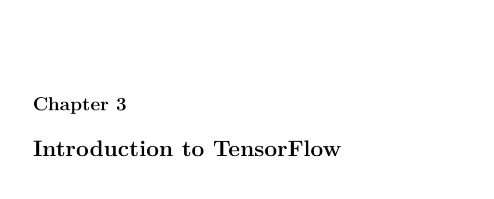

- **3.1 Part 3.1: Deep Learning and Neural Network Introduction**
  - Neural networks process input feature vectors of fixed size to produce output and form the basis of deep learning.
  - Inputs can be 1D vectors or higher-dimensional matrices, especially in convolutional neural networks (CNNs).
  - Neural networks function in either classification or regression modes, with differences in output neuron structure.
  - Neurons multiply inputs by weights, add bias, and apply activation functions to produce outputs.
  - Common neuron types include input, hidden, output, context, and bias neurons; neurons are organized in layers.
  - Activation functions covered include linear, ReLU, softmax, sigmoid, hyperbolic tangent, and step functions.
  - Bias neurons shift activation function outputs to increase network flexibility.
  - The softmax function normalizes output neurons' values into probabilities for classification tasks.
  - For more on deep learning fundamentals, refer to [Deep Learning](https://www.deeplearningbook.org).

- **3.2 Part 3.2: Introduction to Tensorflow and Keras**
  - TensorFlow is Google's open-source machine learning library widely used for research and production.
  - Keras is a high-level API on TensorFlow that simplifies neural network creation.
  - TensorFlow supports efficient computation graphs, GPU acceleration, and is cross-platform.
  - Deep learning tools include TensorFlow/Keras, PyTorch, MXNet, Torch, Caffe, and others.
  - Basic linear algebra operations in TensorFlow demonstrate its mathematical capabilities beyond neural networks.
  - Keras examples showcase building and training regression and classification models on the MPG and Iris datasets.
  - Neural network hyperparameters like layer sizes affect model complexity and performance, requiring tuning.
  - For TensorFlow usage and tutorials, visit [TensorFlow.org](https://www.tensorflow.org).

- **3.3 Part 3.3: Saving and Loading a Keras Neural Network**
  - Keras supports saving models in JSON, YAML (structure only), and HDF5 (complete with weights) formats.
  - The HDF5 format is recommended for saving complete neural network states for future loading and use.
  - Reloaded models can make predictions identical to the original, confirming successful persistence.
  - Saving and loading models enable avoiding retraining of complex networks for efficiency.
  - For Keras model serialization details, see [Keras Saving and Serialization](https://keras.io/guides/save_and_serialize/).

- **3.4 Part 3.4: Early Stopping in Keras to Prevent Overfitting**
  - Overfitting occurs when a network memorizes training data instead of generalizing, shown by divergence of training and validation error.
  - Datasets are split into training, validation, and holdout sets to monitor generalization.
  - Early stopping uses validation loss to halt training once no improvement occurs over a patience period.
  - Parameters like min_delta, patience, verbose, mode, and restore_best_weights control early stopping behavior.
  - Early stopping improves model generalization and training efficiency for classification and regression tasks.
  - More on early stopping is available at [Keras Callbacks](https://keras.io/api/callbacks/early_stopping/).

- **3.5 Part 3.5: Extracting Weights and Manual Network Calculation**
  - Weight initialization impacts network trainability; Xavier initialization with normally distributed weights centered at zero is preferred.
  - Xavier variance depends inversely on the number of input and output nodes to control weight scale.
  - Manual extraction of weights from trained models allows inspecting and replicating specific neural network calculations.
  - A small XOR neural network example demonstrates training, weight extraction, and manual forward propagation calculations.
  - Manually reproducing neuron outputs verifies network operation and deepens understanding of neural computations.
  - For further study, see [Understanding Xavier Initialization](http://proceedings.mlr.press/v9/glorot10a.html).
