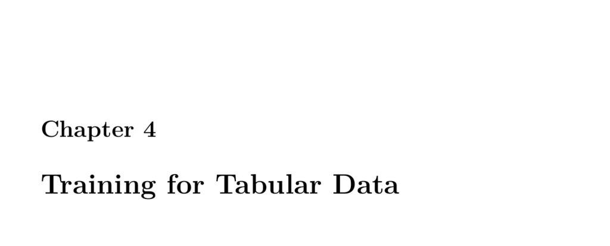

- **4.1 Part 4.1: Encoding a Feature Vector for Keras Deep Learning**
  - Neural networks require numeric input vectors where each vector corresponds to one row of tabular data.
  - Categorical features like "job" and "area" are converted into dummy variables to be used as inputs.
  - Missing values in numeric columns such as "income" are filled with median values.
  - The final dataset excludes irrelevant columns such as "id" and target columns like "product" from the predictor set.
  - See [Pandas get_dummies documentation](https://pandas.pydata.org/pandas-docs/stable/reference/api/pandas.get_dummies.html) for dummy variable creation.

- **4.1.1 Generate X and Y for a Classification Neural Network**
  - Predictor matrix X is extracted by removing target and id columns from the dataframe.
  - Target Y is generated by encoding the "product" column into dummy variables for multi-class classification.
  - Classification models use softmax activation with categorical_crossentropy loss.
  - Outputs correspond to the number of distinct target classes.

- **4.1.2 Generate X and Y for a Regression Neural Network**
  - Predictors X are created similarly to classification.
  - Target Y is a single continuous numeric variable, e.g., "income", used without dummy encoding.
  - Regression models typically use mean squared error loss.

- **4.1.3 Module 4 Assignment**
  - First assignment is referenced as assignment 4.
  - Assignment details are not provided in the text.

- **4.2 Part 4.2: Multiclass Classification with ROC and AUC**
  - Binary classification involves two classes, commonly used in medical testing.
  - ROC curves visualize trade-offs between sensitivity and specificity at different thresholds.
  - Multiclass classification requires multiple output neurons equal to the number of classes.
  - Evaluation metrics include ROC/AUC, accuracy, and log loss.

- **4.2.1 Binary Classification and ROC Charts**
  - Binary classification errors are categorized into false positives, false negatives, true positives, and true negatives.
  - ROC curves are plotted by varying probability thresholds to analyze classifier performance.
  - Threshold choice impacts sensitivity versus specificity trade-offs.
  - Visualizations help to understand classifier decision boundaries.
  - More sensitivity vs specificity info available at [Khan Academy](https://www.khanacademy.org).

- **4.2.2 ROC Chart Example**
  - Demonstrates training a binary classification neural network on breast cancer data.
  - Shows model architecture, training with early stopping, and ROC curve plotting.
  - Validation accuracy and loss are monitored during training.

- **4.2.3 Multiclass Classification Error Metrics**
  - For multi-class problems, output layer size equals number of classes with softmax activation.
  - Data preprocessing includes normalization (z-score) and dummy encoding of categorical features.
  - Model training details include early stopping and accuracy monitoring.
  - Example shows training epochs with validation accuracy progression.

- **4.2.4 Calculate Classification Accuracy**
  - Accuracy is the fraction of correctly predicted rows in classification.
  - Predictions are converted from probabilities to class labels using argmax.
  - Accuracy measurement is useful only for classification tasks.
  - Example uses sklearn's accuracy_score function.

- **4.2.5 Calculate Classification Log Loss**
  - Log loss penalizes confident incorrect predictions using probabilities.
  - Lower log loss values indicate better probabilistic prediction quality.
  - Neural networks output class probabilities used to compute log loss.
  - Log loss formula detailed for binary classification.
  - Visualizes the logarithmic penalty for various predicted confidences.
  - Use sklearn.metrics.log_loss for implementation.

- **4.3 Part 4.3: Keras Regression for Deep Neural Networks with RMSE**
  - Regression models predict continuous output rather than class probabilities.
  - Data preprocessing includes dummy encoding and standardization.
  - Neural network architecture includes hidden layers with ReLU activation.
  - Mean squared error (MSE) is used as the loss function.
  - Root mean square error (RMSE) is a preferred evaluation metric as it is in units of the target.
  - Lift charts visualize predicted versus actual values sorted by expected output.

- **4.3.1 Mean Square Error**
  - MSE measures average squared differences between predicted and actual values.
  - Lower MSE indicates better model fit.
  - MSE unit squares the target variable’s units.

- **4.3.2 Root Mean Square Error**
  - RMSE is the square root of MSE, aligning metric units with the target variable.
  - RMSE offers intuitive error magnitude understanding.
  - Lower RMSE corresponds to better regression performance.

- **4.3.3 Lift Chart**
  - Lift charts plot actual vs predicted values sorted by expected output percentiles.
  - They reveal how well the model tracks true data trends across the distribution.
  - Useful for diagnosing prediction accuracy across target value ranges.

- **4.4 Part 4.4: Training Neural Networks**
  - Classic backpropagation iteratively updates weights by subtracting scaled gradients.
  - Learning rate controls step size in weight updates; balance needed between too low or high.
  - Gradients are partial derivatives of the error function with respect to weights.
  - Gradient sign indicates direction to modify weights to reduce error.
  - Full exhaustive search for weights is intractable; gradient descent provides approximations.

- **4.4.2 Momentum Backpropagation**
  - Momentum adds a fraction of previous weight changes to the current update.
  - Helps accelerate training and escape shallow local minima.
  - Momentum parameter typically around 0.9.
  - Demonstrated visually how momentum smoothens and speeds convergence.

- **4.4.3 Batch and Online Backpropagation**
  - Online training updates weights per single training example.
  - Batch training sums gradients over entire training set before updating.
  - Mini-batch training updates weights after small subsets of data (size 32-64).
  - Epochs represent full passes through the training data; iterations count batch updates.

- **4.4.4 Stochastic Gradient Descent**
  - SGD uses random batches for each weight update step.
  - Causes irregular but generally descending error trend.
  - Advantages include computational efficiency and reducing overfitting.
  - Commonly used in modern neural network training.

- **4.4.5 Other Techniques**
  - Backpropagation is sensitive to learning rate and momentum settings.
  - More advanced optimizers include:
    - Resilient Propagation (only gradient magnitude, per-weight learning rates).
    - Nesterov Accelerated Gradient (anticipates gradient direction).
    - Adagrad (adaptive per-weight learning rate).
    - Adadelta (improvement over Adagrad).
  - Non-gradient methods also exist but are less common (simulated annealing, genetic algorithms).

- **4.4.6 ADAM Update**
  - Adam computes adaptive moment estimates of gradients: first moment (m) and second moment (v).
  - Bias correction applied to both moments to compensate initial zero biases.
  - Weight update combines these moments with learning rate for stable and effective training.
  - Default parameters recommended: β1=0.9, β2=0.999, ε=1e-8.
  - Adam is recommended as the first optimizer to try.

- **4.4.7 Methods Compared**
  - Various gradient-based algorithms compared visually regarding convergence speed and smoothness.
  - Image source credited to Alec Radford.

- **4.4.8 Specifying the Update Rule in TensorFlow**
  - TensorFlow supports optimizers: Adagrad, Adam, Ftrl, Momentum, RMSProp, SGD.
  - Example code shows replacing optimizer for regression network using Adam.
  - Data preparation includes dummy encoding and z-score normalization.
  - Early stopping is used during training to prevent overfitting.
  - Regression performance is visualized via lift charts.

- **4.5 Part 4.5: Error Calculation from Scratch**

  - **4.5.1 Regression**
    - Manual calculation of mean squared error (MSE) and root mean square error (RMSE) demonstrated.
    - MSE is the average squared difference; RMSE is its square root for interpretability.
    - Example uses small vectors of predicted and expected values.
    - Formulas shown explicitly for clarity.

  - **4.5.2 Classification**
    - Manual computation of log loss for binary classification shown.
    - Log loss penalizes confident incorrect predictions in probabilistic outputs.
    - Code replicates sklearn log_loss function using numpy log and absolute differences.
    - Example confirms match between manual and sklearn calculations.
