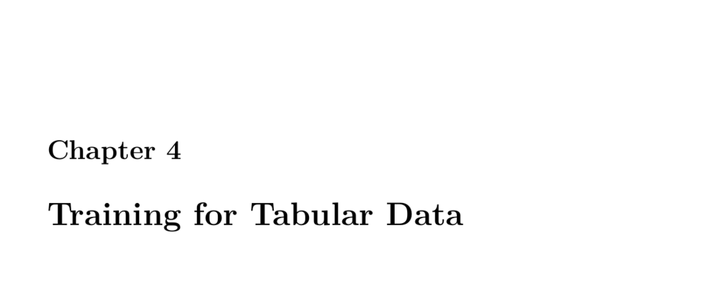

- **4.1 Part 4.1: Encoding a Feature Vector for Keras Deep Learning**  
  - Neural networks require numeric input formatted as feature vectors derived from tabular data.  
  - Categorical variables like job and area are converted to dummy variables with prefixes for interpretability.  
  - Missing values, such as in the income column, are filled using simple imputation like the median.  
  - Predictor columns exclude ID and target columns and are standardized where necessary.  
  - [Pandas get_dummies Documentation](https://pandas.pydata.org/pandas-docs/stable/reference/api/pandas.get_dummies.html)  

  - **4.1.1 Generate X and Y for a Classification Neural Network**  
    - The feature matrix (X) includes all predictor columns converted to numpy arrays.  
    - The target vector (Y) is generated using one-hot encoding (dummies) for classification purposes.  
    - Classification networks require output neurons equal to the number of target classes with softmax activation and categorical crossentropy loss.  
    - [Keras Classification Guide](https://keras.io/api/layers/activations/)  

  - **4.1.2 Generate X and Y for a Regression Neural Network**  
    - Predictors (X) are prepared similarly as in classification.  
    - The target vector (Y) uses the raw numeric values without dummy encoding for regression.  
    - Models for regression use different loss functions like mean squared error instead of crossentropy.  
    - [Keras Regression with Neural Networks](https://keras.io/examples/structured_data/regression/)  

  - **4.1.3 Module 4 Assignment**  
    - The first assignment related to encoding features and model training is available as assignment 4.  

- **4.2 Part 4.2: Multiclass Classification with ROC and AUC**  
  - Classification tasks include binary classification (2 classes), multiclass classification (more than 2 classes), and regression.  
  - ROC curves evaluate classifier performance by plotting true positive rate against false positive rate over various thresholds.  
  - False positives and false negatives are key error types with different implications depending on context, such as medical diagnosis or credit scoring.  
  - Threshold adjustment affects sensitivity (true positive rate) and specificity (true negative rate).  
  - [Khan Academy on Sensitivity vs Specificity](https://www.khanacademy.org/test-prep/mcat/processing-the-environment/mental-health-and-sensory-perception/a/sensitivity-specificity-and-false-positives)  

  - **4.2.1 Binary Classification and ROC Charts**  
    - Uses datasets like wcbreast_wdbc to distinguish between malignant and benign tumors.  
    - Predictive models output probabilities which are converted to positive/negative predictions based on thresholds.  
    - Visualization of ROC emphasizes trade-offs between false positives and false negatives.  
    - [ROC Curves Tutorial](https://developers.google.com/machine-learning/crash-course/classification/roc-and-auc)  

  - **4.2.2 ROC Chart Example**  
    - Demonstrates how to train a binary classification neural network using Keras with early stopping.  
    - Model outputs probabilities used to plot the ROC curve and calculate AUC as performance metric.  

  - **4.2.3 Multiclass Classification Error Metrics**  
    - Extends binary classification to multiple classes using one-hot encoding for targets.  
    - Uses neural networks with multiple output neurons and softmax activation for predictions.  
    - Metrics include accuracy, log loss, and confusion matrices to assess classification errors.  

  - **4.2.4 Calculate Classification Accuracy**  
    - Accuracy measures proportion of correctly classified examples.  
    - Predictions are converted from probabilities to class indices using argmax before accuracy calculation.  
    - [Scikit-learn accuracy_score](https://scikit-learn.org/stable/modules/generated/sklearn.metrics.accuracy_score.html)  

  - **4.2.5 Calculate Classification Log Loss**  
    - Log loss penalizes confident incorrect predictions by considering predicted class probabilities.  
    - Lower log loss indicates better model calibration and performance.  
    - Explains the formula and intuition behind log loss for binary classification.  
    - Visualizes the log function to demonstrate penalty behavior.  
    - [Scikit-learn log_loss](https://scikit-learn.org/stable/modules/generated/sklearn.metrics.log_loss.html)  

  - **4.2.6 Confusion Matrix Analysis**  
    - Presents raw and normalized confusion matrices showing classification performance per class.  
    - Normalized confusion matrices facilitate comparison across classes by expressing errors as proportions.  
    - Visualization aids interpretation of type and distribution of misclassifications.  

- **4.3 Part 4.3: Keras Regression for Deep Neural Networks with RMSE**  
  - Regression neural networks predict continuous values using target variable in raw numeric format.  
  - Model input preparation includes encoding categorical variables and imputing missing values followed by feature standardization.  
  - Uses mean squared error as loss function during training.  
  - Evaluates model performance using mean squared error (MSE) and root mean squared error (RMSE), where RMSE shares target units for interpretability.  
  - Lift charts help visualize alignment between predicted and expected continuous outputs.  
  - [Keras Regression Example](https://keras.io/examples/structured_data/regression/)  

  - **4.3.1 Mean Square Error**  
    - MSE calculates average squared differences between predicted and actual values.  
    - Lower MSE indicates more accurate regression predictions.  

  - **4.3.2 Root Mean Square Error**  
    - RMSE is the square root of MSE, sharing units with the predicted variable for better interpretability.  

  - **4.3.3 Lift Chart**  
    - Visualizes predicted versus expected outputs sorted by actual values to analyze model performance across the range.  

- **4.4 Part 4.4: Training Neural Networks**  
  - Discusses foundational neural network training techniques centered on backpropagation.  
  - Backpropagation adjusts weights to minimize prediction error using gradients scaled by learning rate.  
  - Learning rate tuning is critical; too low slows convergence, too high risks instability.  
  - Gradient signs indicate whether to increase or decrease weights to reduce error.  
  - Momentum enhances training by adding scaled previous weight update, improving convergence and escaping local minima.  
  - Different training modes include online, batch, and mini-batch, affecting weight update frequency and convergence behavior.  
  - Stochastic gradient descent (SGD) randomly samples training subsets each step, improving efficiency and mitigating overfitting but causing noisy convergence.  
  - Advanced training algorithms include resilient propagation, Nesterov accelerated gradient, Adagrad, Adadelta, and ADAM, each addressing training stability or learning rate adaptation.  
  - ADAM combines momentum and adaptive learning rates, with default parameters recommended by its authors.  
  - TensorFlow supports multiple optimizers including Adagrad, Adam, Ftrl, Momentum, RMSProp, and SGD selectable at model compilation.  
  - [ADAM Optimizer Paper](https://arxiv.org/abs/1412.6980)  
  - [TensorFlow Optimizers Guide](https://www.tensorflow.org/api_docs/python/tf/keras/optimizers)  

  - **4.4.1 Classic Backpropagation**  
    - Calculates gradients for every weight relative to the error function and adjusts weights accordingly.  
    - Training seeks weight values minimizing error across training set using gradient descent.  
    - Derivatives provide slope of error at weights to inform update direction and magnitude.  

  - **4.4.2 Momentum Backpropagation**  
    - Incorporates a fraction of the previous weight update into current update to accelerate convergence and overcome local minima.  
    - Common momentum value is 0.9.  

  - **4.4.3 Batch and Online Backpropagation**  
    - Describes batch size options: online (single example), batch (full dataset), and mini-batch (small subsets).  
    - Defines terminology including steps/iterations (number of batches processed) and epochs (complete dataset passes).  

  - **4.4.4 Stochastic Gradient Descent**  
    - Uses random subsets of training data per update for computational efficiency and reduced overfitting risk.  
    - Produces irregular but generally decreasing training error.  

  - **4.4.5 Other Techniques**  
    - Highlights challenges with fixed learning rates and momentum.  
    - Introduces adaptive techniques like resilient propagation, Nesterov acceleration, Adagrad, and Adadelta.  
    - Mentions non-gradient optimization methods rarely outperform gradient-based training.  

  - **4.4.6 ADAM Update**  
    - ADAM combines exponentially weighted averages of past gradients (first moment) and squared gradients (second moment).  
    - Includes bias corrections for initial training steps.  
    - Robust to hyperparameter settings, recommended as first optimizer choice.  

  - **4.4.7 Methods Compared**  
    - Visual comparisons indicate differing convergence behaviors of various training algorithms.  

  - **4.4.8 Specifying the Update Rule in Tensorflow**  
    - Shows example TensorFlow Keras model compilation with Adam optimizer and early stopping callbacks.  
    - Demonstrates data preparation with dummy encoding, median imputation, and z-score standardization.  

- **4.5 Part 4.5: Error Calculation from Scratch**  
  - Illustrates manual calculation of mean squared error (MSE) and root mean squared error (RMSE) for regression predictions.  
  - Demonstrates equivalence of vectorized library calls and explicit formula implementation.  
  - Shows manual calculation of log loss for binary classification using predicted probabilities and expected labels.  
  - Validates manual log loss against sklearn's implementation.  
  - [Scikit-learn mean_squared_error](https://scikit-learn.org/stable/modules/generated/sklearn.metrics.mean_squared_error.html)  
  - [Scikit-learn log_loss](https://scikit-learn.org/stable/modules/generated/sklearn.metrics.log_loss.html)
