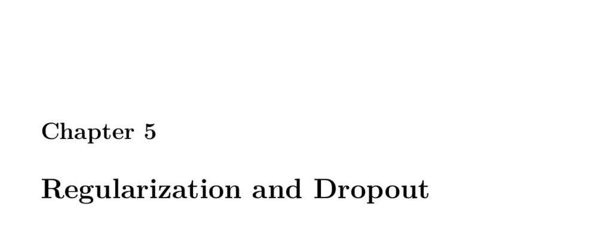

- **Regularization and Dropout**
  - **Part 5.1: Introduction to Regularization: Ridge and Lasso**
    - Regularization prevents overfitting by modifying neural network weights during training.
    - Humans and machines can both overfit, memorizing training data rather than learning general patterns.
    - Various regularization techniques exist that add penalties based on weights to the training process.
    - [Ng, 2004] is referenced for L1 and L2 regularization background.
  - **L1 and L2 Regularization**
    - Both add weight penalties to reduce overfitting and differ in how they calculate the penalty.
    - L1 (Lasso) creates sparse neural networks by forcing many weights toward zero, useful for feature selection.
    - L2 (Ridge) encourages smaller weights without sparsity, typically yielding better overall performance.
    - ElasticNet combines L1 and L2 penalties with tunable parameters to balance their effects.
    - Typical L2 values are below 0.1, and biases are not penalized.
  - **Linear Regression**
    - Linear regression illustrates the effects of L1 and L2 regularization on model coefficients and RMSE performance.
    - Ridge and Lasso regression are demonstrated on the auto-mpg dataset with different coefficient behaviors.
  - **Using K-Fold Cross-validation with Keras**
    - Cross-validation generates out-of-sample predictions, estimates training epochs, and evaluates hyperparameters.
    - Regression uses KFold, while classification requires StratifiedKFold to maintain class balance.
    - Different approaches exist for using fold models: select best, ensemble average, or retrain on full data.
    - Examples show regression and classification cross-validation with neural networks using Keras.
  - **Training with both a Cross-Validation and a Holdout Set**
    - Setting a holdout dataset before cross-validation preserves a final unbiased evaluation of model performance.
    - The holdout set is distinct and not used during training or validation folds.
    - Cross-validation trains multiple fold models on the remaining data, and the holdout is used for final scoring.
  - **Part 5.3: L1 and L2 Regularization to Decrease Overfitting**
    - L1 and L2 regularization penalize weights differently, imposing Laplace or Gaussian distributions respectively.
    - These regularizers do not penalize bias terms in neural networks.
    - Keras allows direct L1 or L2 activity regularization on layers to reduce overfitting and improve generalization.
    - Code examples demonstrate applying L1 regularization in Keras for classification problems.
  - **Part 5.4: Drop Out for Keras to Decrease Overfitting**
    - Dropout temporarily disables neurons randomly during training to reduce coadaptation and overfitting.
    - Unlike L1/L2, dropout removes neurons during training but retains all neurons at inference time.
    - Dropout acts similarly to bootstrapping by creating multiple subnetworks without full ensemble computation.
    - Most frameworks implement dropout as a layer that randomly masks neurons each training iteration.
    - Keras examples demonstrate adding dropout layers to neural networks for classification tasks.
    - Dropout percentages and placement (usually before final layer) influence regularization effectiveness.
    - [Hinton et al., 2012] introduced dropout for neural network regularization.
  - **Part 5.5: Benchmarking Regularization Techniques**
    - Hyperparameters such as layer count, neuron count, activation functions, dropout rates, and L1/L2 values affect model performance.
    - Bootstrapping, a resampling technique involving repeated randomized train/test splits with replacement, benchmarks hyperparameter choices.
    - Bootstrapping differs from cross-validation by allowing overlap and repeated samples in splits.
    - Early stopping is used during bootstrapping to find optimal epoch counts while avoiding overfitting.
    - Regression bootstrapping uses ShuffleSplit; classification uses StratifiedShuffleSplit to maintain class proportions.
    - Extensive code examples demonstrate bootstrapping for regression and classification neural networks in Keras.
    - The technique facilitates relative comparison of hyperparameter configurations by averaging scores over splits.
    - [A Recipe for Training Neural Networks](https://cs231n.github.io/neural-networks-2/) is recommended for further reading.
