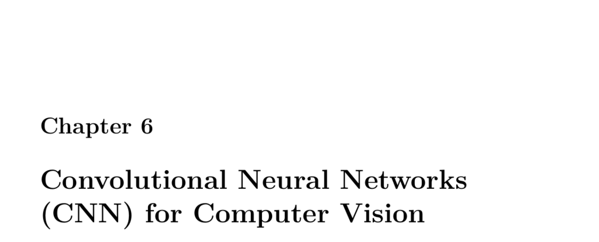

- **6.1 Part 6.1: Image Processing in Python**
  - Demonstrates how to load, display, and manipulate images using the Pillow package in Python.
  - Covers creating images from numpy arrays, transforming images at the pixel level, standardizing images by resizing and cropping, and adding noise.
  - Emphasizes preprocessing steps essential for preparing images for neural network input.
  - See [Pillow Documentation](https://python-pillow.org/) for further details.
  
- **6.2 Part 6.2: Keras Neural Networks for Digits and Fashion MNIST**
  - Introduces computer vision tasks using convolutional neural networks with Keras, focusing on classification with 3D image inputs.
  - Describes popular datasets: MNIST Digits, Fashion MNIST, CIFAR-10/100 and highlights their characteristics.
  - Explains convolutional, max pooling, dense, and dropout layers essential to CNN architectures.
  - Provides detailed Keras code examples to load, display, preprocess, train, evaluate CNN models on MNIST and Fashion MNIST.
  - Recommends Stanford’s [CS231n course](http://cs231n.stanford.edu/) for in-depth understanding.

- **6.3 Part 6.3: Implementing a ResNet in Keras**
  - Discusses deep residual learning (ResNet) to ease training of very deep CNNs, introducing skip (residual) connections.
  - Compares Keras Sequential API and Functional API for constructing complex models like ResNet.
  - Details the CIFAR dataset as a training example and the hyperparameters used.
  - Provides implementations of ResNet V1 and V2 architectures with explanations of their layer design and batch normalization differences.
  - Includes training strategies such as learning rate decay, data augmentation, and model evaluation.
  - Further reading: [Deep Residual Learning for Image Recognition](https://arxiv.org/abs/1512.03385) by He et al.

- **6.4 Part 6.4: Using Your Own Images with Keras**
  - Explains how to load, preprocess, and normalize user-provided images for training neural networks.
  - Covers making images square via cropping, resizing to standard dimensions, and normalizing pixel values between -1 and 1.
  - Shows how to convert image lists into 4D numpy arrays suitable for Keras models.
  - Advises saving processed image data using numpy format for efficiency and compatibility.
  - Discusses data type conversions from uint8 to float32 common in neural networks.

- **6.5 Part 6.5: Recognizing Multiple Images with Darknet**
  - Introduces YOLO (You Only Look Once) for multi-object detection in single images, emphasizing efficiency by scanning once.
  - Explains YOLO’s output tensor structure predicting bounding boxes with coordinates, dimensions, label probabilities, and confidence.
  - Describes installation steps for YoloV3-TF2 including weight conversion and required files like weights and class names.
  - Details running YOLO in Python with TensorFlow 2.0, configuring with Keras flags and loading models ready for real-time use.
  - For additional information, see [YOLO: Real-Time Object Detection](https://pjreddie.com/darknet/yolo/).
