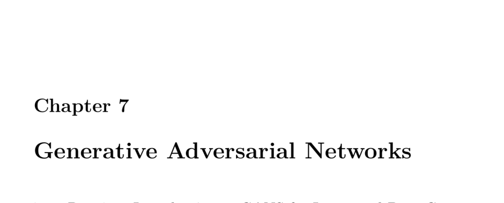

- **Chapter 7: Generative Adversarial Networks**
  - **7.1 Part 7.1: Introduction to GANS for Image and Data Generation**
    - GANs consist of two neural networks contesting in a game to generate new data matching training set statistics.
    - Initially applied to datasets like MNIST, CIFAR, and Toronto Face Dataset, with convolutional networks used only in later models.
    - GANs serve for unsupervised, semi-supervised, supervised, and reinforcement learning.
    - Original GAN architecture involves separate generator and discriminator networks.
    - Further reading: [Goodfellow et al., 2014](https://arxiv.org/abs/1406.2661)
  - **7.2 Part 7.2: Implementing DCGANs in Keras**
    - DCGANs replace pooling layers with strided and fractional-strided convolutions and use batch normalization and LeakyReLU/ReLU activations.
    - Training images are scaled to [-1, 1]; Adam optimizer is used with tuned learning rate 0.0002 and momentum β1=0.5 for stability.
    - The generator creates images from random seeds, and the discriminator classifies images as real or fake.
    - Training involves separate losses for generator and discriminator with gradient updates controlled via TensorFlow’s GradientTape.
    - Further reading: [Radford et al., 2015](https://arxiv.org/abs/1511.06434)
  - **7.3 Part 7.3: Face Generation with StyleGAN and Python**
    - StyleGAN series (StyleGAN, StyleGAN2, and StyleGAN2 ADA) produce highly photorealistic faces with resolutions up to 1024x1024.
    - Adaptive Discriminator Augmentation (ADA) augments training images dynamically to prevent discriminator memorization and reduce required dataset size.
    - StyleGAN2 weights can be used via Google CoLab for face generation or retraining with personal datasets.
    - Latent vector interpolation enables smooth transformation between generated images.
    - Further reading: [NVIDIA StyleGAN2 ADA GitHub](https://github.com/NVlabs/stylegan2-ada)
  - **7.4 Part 7.4: GANS for Semi-Supervised Training in Keras**
    - Semi-supervised GANs use a discriminator trained to classify real data classes plus a fake class for generated data.
    - Semi-supervised training leverages mostly unlabeled data combined with a smaller labeled subset for improved classification or regression.
    - The discriminator’s output neurons correspond to classes plus one fake data class in classification tasks.
    - Regression tasks use separate output neurons for regression predictions and fake data detection.
    - Further reading: [Semi-supervised learning with GANs](https://arxiv.org/abs/1606.01583)
  - **7.5 Part 7.5: An Overview of GAN Research**
    - Several curated resources list Keras GAN implementations and GAN applications.
    - Selected projects include Few-Shot Adversarial Learning for Neural Talking Heads and Deep Fake research.
    - GAN research continues advancing synthetic data generation and manipulation.
    - Further reading: [Curated Awesome GAN Applications](https://github.com/nashory/gans-awesome-applications)
