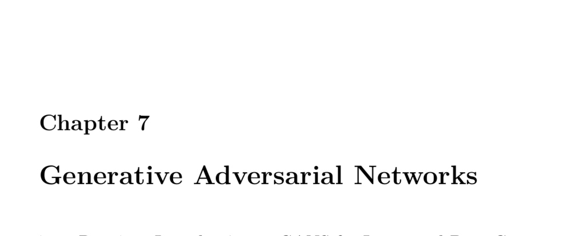

- **Chapter 7 Generative Adversarial Networks**
  - **Part 7.1: Introduction to GANs for Image and Data Generation**
    - GANs consist of two neural networks contesting in a game to generate data matching training statistics.
    - Originally unsupervised, GANs have also proved useful for semi-supervised, supervised, and reinforcement learning.
    - Early GANs generated images for datasets like MNIST, CIFAR, and the private Toronto Face Dataset.
    - Convolutional neural networks became increasingly important in GANs, especially for image generation.
    - See [Ian Goodfellow's original GAN paper](https://arxiv.org/abs/1406.2661) for foundational reading.
    
  - **Part 7.2: Implementing DCGANs in Keras**
    - Deep Convolutional GANs (DCGANs) use strided convolutions instead of pooling, batch normalization, and specific activation functions (ReLU for generator, LeakyReLU for discriminator).
    - Training uses Adam optimizer with learning rate 0.0002 and β1 momentum set to 0.5 for training stability.
    - Code implementation mounts Google Drive in Colab, preprocesses image datasets, builds generator and discriminator models, and trains them adversarially.
    - Training utilizes TensorFlow 2.x with GradientTape for separate gradient updates of generator and discriminator.
    - Useful resources include TensorFlow DCGAN example and Keras GAN implementations.
    
  - **Part 7.3: Face Generation with StyleGAN and Python**
    - StyleGAN series by NVIDIA significantly advanced photorealistic face generation, culminating in StyleGAN2 ADA which uses adaptive discriminator augmentation.
    - ADA augments training images in real time, allowing effective training with fewer images than previously required.
    - StyleGAN-generated faces exhibit very high quality but still contain telltale GAN artifacts like abstract backgrounds and distorted facial features.
    - Users can generate faces using pretrained StyleGAN2 models via Google Colab; training own models requires significant compute resources.
    - See NVIDIA's StyleGAN2 ADA repository and pretrained models for further exploration.
    
  - **Part 7.4: GANs for Semi-Supervised Training in Keras**
    - Semi-supervised learning combines unsupervised data with a small subset of labeled data to improve model performance.
    - In semi-supervised GANs, the discriminator acts as the classifier for real classes plus an additional "fake" class.
    - Semi-supervised GANs support both classification (multiple classes + fake) and regression (output neuron for prediction plus fake detection).
    - Semi-supervised learning leverages unlabeled data rather than discarding it, improving predictions on new data with limited labels.
    - Refer to examples such as the Street View House Numbers (SVHN) dataset and related GAN semi-supervised papers.
    
  - **Part 7.5: An Overview of GAN Research**
    - A variety of Keras implementations and curated GAN applications are available for study.
    - Select projects include adversarial learning of neural talking head models, pose-guided person image generation, and deep fake technologies.
    - These projects demonstrate GANs' broad application spectrum from realistic video synthesis to pose-based generation.
    - See curated lists like [Awesome GAN Applications](https://github.com/nashory/gans-awesome-applications) for detailed research resources.
