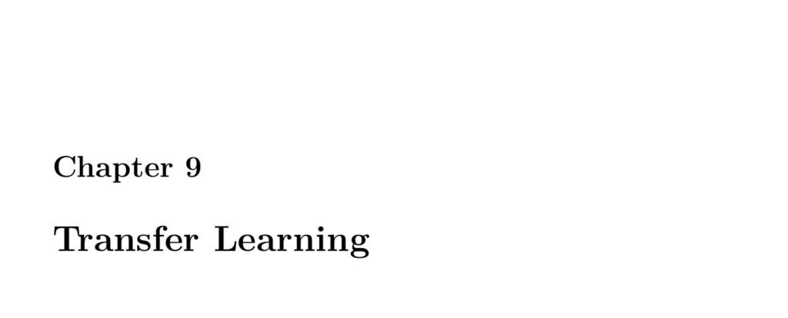

- **9.1 Part 9.1: Introduction to Keras Transfer Learning**  
  - Transfer learning uses pretrained neural network weights to save training time and resources.  
  - Lower layers of pretrained networks recognize subcomponents useful for new tasks.  
  - The imagenet dataset provides many pretrained models suitable for transfer learning.  
  - Transfer learning usually involves freezing pretrained layers and training new top layers.  
  - See the [Imagenet dataset](http://www.image-net.org/) for relevant pretrained models.

  - **9.1.1 Transfer Learning Example**  
    - Demonstrates transfer learning by cloning and adapting neural networks using the iris dataset.  
    - Shows freezing lower layers and replacing output layers for new classification targets.  
    - Trained models achieve high in-sample accuracy despite limited dataset size.  
    - Illustrates how to transfer learned feature extraction to classify new hypothetical flowers.  
    - Provides code examples on handling layer trainability in Keras.

  - **9.1.2 Module 9 Assignment**  
    - Refers to an assignment related to transfer learning, titled "assignment 9".  
    - No further details or resources provided within this excerpt.

- **9.2 Part 9.2: Popular Pretrained Neural Networks for Keras**  
  - Popular pretrained models available in Keras include DenseNet, InceptionResNetV2, MobileNet, NASNet, ResNet, VGG, and Xception.  
  - TensorFlow Model Zoo and Papers with Code are recommended external resources for pretrained models.  
  - Each model emphasizes unique architectural benefits like feature reuse, efficient parameter use, or mobile optimization.  
  - DenseNet connects each layer to all others to alleviate vanishing gradients and strengthen features.  
  - NASNet employs architecture search on small datasets to produce transferable high-performing blocks.

  - **9.2.1 DenseNet**  
    - Features feed-forward connections from every layer to all subsequent layers.  
    - Reduces vanishing gradients and promotes feature reuse for efficient training.  
    - Evaluated on CIFAR-10, CIFAR-100, SVHN, and ImageNet benchmarks with state-of-the-art results.  
    - Code and pretrained models are available in Keras documentation.

  - **9.2.2 InceptionResNetV2 and InceptionV3**  
    - InceptionResNetV2 is a CNN variant combining Inception V3 with ResNet techniques.  
    - Achieves state-of-the-art accuracy on ILSVRC image classification benchmarks.  
    - Incorporates residual connections with inception modules for improved training.

  - **9.2.3 MobileNet**  
    - Designed for mobile and embedded vision applications using depthwise separable convolutions.  
    - Introduces hyperparameters to balance latency and accuracy to fit diverse constraints.  
    - Performs strongly on ImageNet classification and other vision tasks.

  - **9.2.4 MobileNetV2**  
    - Advances MobileNet with better accuracy and efficiency over multiple benchmarks.  
    - Supports lightweight architectures for object detection (SSDLite) and semantic segmentation (Mobile DeepLabv3).

  - **9.2.5 NASNet**  
    - Uses neural architecture search to design convolutional building blocks on small datasets.  
    - Achieves state-of-the-art ImageNet results surpassing human-designed models.  
    - Improves generalization with ScheduledDropPath regularization technique.  
    - Demonstrates better computational efficiency with fewer FLOPS than prior models.

  - **9.2.6 ResNet, ResNetV2, ResNeXt**  
    - Deep residual networks enable extremely deep architectures with good convergence.  
    - Identity mappings in residual blocks improve signal propagation and generalization.  
    - Shows superior results with very deep models (e.g., 1001-layer ResNet) on CIFAR and ImageNet.

  - **9.2.7 VGG16 and VGG19**  
    - Explore depth impact on convolutional nets using very small (3x3) filters.  
    - Achieved top rankings in ImageNet 2014 challenge.  
    - Models generalize well to other datasets and remain widely used feature extractors.

  - **9.2.8 Xception**  
    - Interprets Inception modules as intermediate between regular convolution and depthwise separable convolution.  
    - Replaces Inception modules with depthwise separable convolutions for efficiency.  
    - Outperforms Inception V3 on ImageNet and larger classification datasets with same parameter count.

- **9.3 Part 9.3: Transfer Learning for Computer Vision and Keras**  
  - Demonstrates use of Keras MobileNet pretrained on imagenet for classifying new, specialized image categories.  
  - Removes MobileNet's original top layer to add custom classification layers for four media types.  
  - Freezes pretrained base layers during training to preserve learned features.  
  - Employs Keras ImageDataGenerator's flow_from_directory to manage image datasets organized by class folders.  
  - Shows how to train and evaluate transferred models on small datasets to classify specialized images.

  - **9.3.1 Transfer**  
    - Explains importance of freezing pretrained layers to retain generic feature extraction abilities.  
    - Details addition of new fully connected layers and classification output for new tasks.  
    - Provides example of training on 52 images across 4 classes with transfer learning.  
    - Shows how to retrieve and interpret class indices from Keras generator.  
    - Includes example inference code with images from URLs to verify transfer learning usage.

- **9.4 Part 9.4: Transfer Learning for Languages and Keras**  
  - Focuses on using pretrained text embedding models for natural language processing (NLP) tasks in Keras.  
  - Introduces TensorFlow Hub as a resource for loading pretrained models easily.  
  - Demonstrates usage of pretrained universal sentence encoder and GNEWS Swivel embeddings.  
  - Applies transfer learning to classify IMDB movie reviews as positive or negative.  
  - Includes installation commands for tensorflow_hub and tensorflow_datasets.  
  - Provides training, evaluation, and accuracy/loss visualization examples for sentiment classification.  
  - References relevant papers: Universal Sentence Encoder, Deep Transfer Learning for NLP, and Keras tutorial for spam classification.

- **9.5 Part 9.5: Transfer Learning for Keras Feature Engineering**  
  - Shows how to use pretrained networks to extract feature vectors from images by removing dense layers.  
  - Features are obtained from the final convolutional output as high-dimensional tensors (e.g., 7x7x1024).  
  - These feature representations can serve as inputs to other machine learning models.  
  - Example uses MobileNet pretrained on imagenet with the top layers excluded.  
  - Provides code to download images, preprocess, and extract feature tensors for further analysis.
