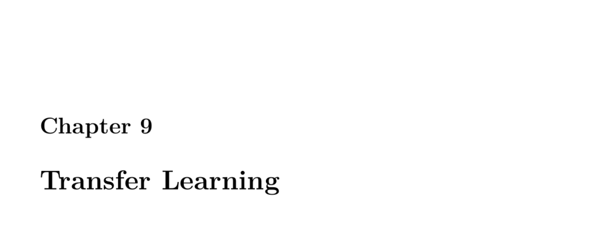

- **Transfer Learning**
  - **Part 9.1: Introduction to Keras Transfer Learning**
    - Transfer learning initializes neural networks with pretrained weights rather than training from scratch.
    - It typically removes the top layers of a pretrained model and retrains new layers for a specialized task.
    - This approach saves compute resources and leverages learned features like sub-object recognition.
    - The ImageNet dataset contains many pretrained models suitable for transfer learning.
    - See [Keras Transfer Learning Guide](https://keras.io/guides/transfer_learning/) for official details.
  - **9.1.1 Transfer Learning Example**
    - The example demonstrates transferring layers from a neural network trained on the iris dataset.
    - It shows creating a clone network and then modifying the output layer for new classes with frozen base layers.
    - Training is limited to the new output layer, illustrating how pretrained features can generalize to related problems.
    - Transfer learning is effective even when the new task has limited data and similar input features.
    - Refer to the original paper on transfer learning concepts: [A Survey on Transfer Learning](https://ieeexplore.ieee.org/document/5288526).
  - **Part 9.2: Popular Pretrained Neural Networks for Keras**
    - Keras includes popular pretrained models like DenseNet, InceptionResNetV2, MobileNet, NASNet, ResNet, VGG16, and Xception.
    - Each model employs specialized architectures for efficiency, accuracy, or transferability.
    - DenseNet introduces dense connectivity to improve gradient flow and parameter efficiency.
    - NASNet uses automated architecture search to design efficient convolutional cells transferable across datasets.
    - For more model details, see the [TensorFlow Model Zoo](https://github.com/tensorflow/models).
  - **Part 9.3: Transfer Learning for Computer Vision and Keras**
    - Demonstrates using MobileNet pretrained on ImageNet with its top classification layer removed.
    - New classification layers are stacked on MobileNet's convolutional base to specialize on custom classes (e.g., storage media).
    - The pretrained weights are frozen in the base to preserve learned features, training only the new layers.
    - Training uses Keras ImageDataGenerator to load images organized by subdirectories for each class.
    - Transfer learning enables effective training with small datasets without building networks from scratch.
    - Consult [MobileNet paper](https://arxiv.org/abs/1704.04861) for architectural insights.
  - **Part 9.4: Transfer Learning for Languages and Keras**
    - Transfer learning applies to Natural Language Processing (NLP) via pretrained embeddings and models.
    - Uses TensorFlow Hub to load pretrained Universal Sentence Encoder embeddings for text classification tasks.
    - The IMDB movie reviews dataset is used to fine-tune a simple neural network with pretrained embeddings.
    - Training achieves solid accuracy by leveraging pretrained semantic representations of sentences.
    - Relevant resource: [Universal Sentence Encoder](https://arxiv.org/abs/1803.11175).
  - **Part 9.5: Transfer Learning for Keras Feature Engineering**
    - Pretrained convolutional models can be stripped of their classification layers to output feature vectors.
    - These feature vectors represent rich image attributes that can act as inputs for other machine learning models.
    - The example extracts 1,024-dimensional features from MobileNet's last convolutional layer.
    - Feature engineering via transfer learning enhances performance on image-related tasks without retraining entire networks.
    - Further reading on feature extraction: [Deep Feature Extraction for Image Classification](https://www.tensorflow.org/tutorials/images/transfer_learning).
