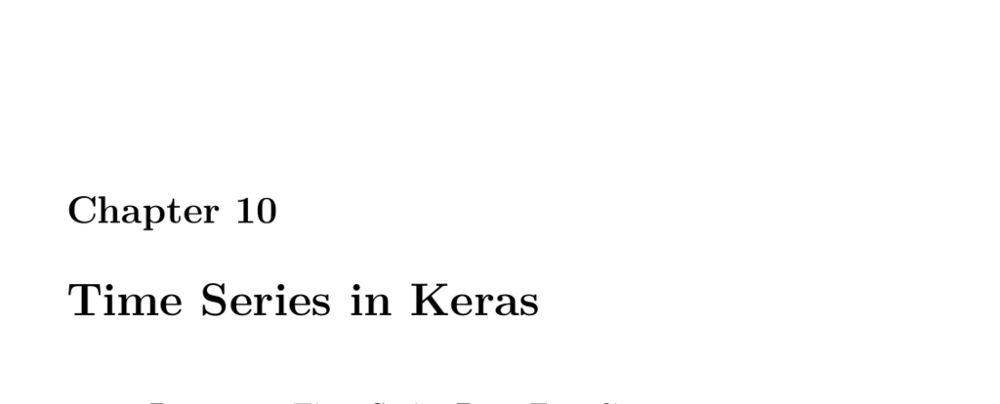

- **10.1 Part 10.1: Time Series Data Encoding**
  - Time series encoding represents temporal events to neural networks, necessary for feedforward networks since they output fixed values for inputs.
  - Recurrent neural networks (RNNs) naturally handle temporal data without special encoding.
  - Input data tensors for time series have three axes: sequences, sequence length, and features.
  - Examples illustrate adding features (e.g., volume) and sequence formatting to prepare data for neural networks.
  - Feedforward networks predict the same output for given input, limiting temporal prediction accuracy, unlike time series encoding or RNNs.
  
- **10.2 Part 10.2: Programming LSTM with Keras and TensorFlow**
  - LSTM layers are recurrent units maintaining internal state, enabling modeling of time-dependent data.
  - Recurrent connections allow neurons to link back to themselves or previous layers, forming short-term memory.
  - LSTM uses sigmoid and hyperbolic tangent transfer functions internally for gating mechanisms.
  - The three gates of LSTM (forget, input, output) control memory retention, updates, and outputs.
  - TensorFlow Keras examples demonstrate LSTM for classification and regression tasks, including a sunspot prediction example using early stopping.
  - Further reading includes [Understanding LSTM Networks](https://colah.github.io/posts/2015-08-Understanding-LSTMs/) and [Recurrent Neural Networks in TensorFlow](https://www.tensorflow.org/tutorials/text/text_generation).
  
- **10.3 Part 10.3: Text Generation with LSTM**
  - LSTM networks generate free-form text from training documents by learning character-level or word-level patterns.
  - Character-level generation enables the network to form words without explicit word boundaries.
  - Text preprocessing includes cleaning, lowering case, and vectorizing characters into input sequences for training.
  - A sampling function applies softmax and temperature scaling to control randomness in generated text.
  - Training involves generating sample text after each epoch to observe progressive learning.
  - Useful resources include [The Unreasonable Effectiveness of Recurrent Neural Networks](https://karpathy.github.io/2015/05/21/rnn-effectiveness/) and [Keras LSTM Generation Example](https://keras.io/examples/lstm_text_generation/).
  
- **10.4 Part 10.4: Image Captioning with Keras and TensorFlow**
  - Image captioning combines CNNs (e.g., InceptionV3) for image feature extraction with LSTM networks for natural language generation.
  - Transfer learning integrates pre-trained CNNs for image features and GloVe embeddings for word vector representations.
  - The Flickr8k dataset is processed by cleaning captions, building vocabulary, and filtering infrequent words.
  - Data generators efficiently produce training batches by combining image features and partial caption sequences.
  - The captioning model merges image and text inputs into dense layers, using dropout to prevent overfitting.
  - Caption generation is iterative: starting with a start token, the model predicts one word at a time until a stop token or max length.
  - Performance evaluation shows better captioning results on Flickr8k-like images than on unrelated photos.
  - Additional resources: Andrej Karpathy’s dissertation on image captioning and [GloVe](https://nlp.stanford.edu/projects/glove/).
  
- **10.5 Part 10.5: Temporal CNN in Keras and TensorFlow**
  - Temporal CNNs apply convolutional layers (Conv1D) to time series data, offering an alternative to LSTMs.
  - Data preparation mimics LSTM sequence formatting but the network architecture uses Conv1D followed by dense layers.
  - Examples include numeric sequence classification and sunspot regression with Conv1D layers combined with dropout and pooling.
  - Early stopping is used during training to cease model fitting when validation loss no longer improves.
  - Root mean squared error (RMSE) evaluates regression accuracy on the sunspot prediction test set.
  - Relevant reading: research on CNNs for time series analysis and comparisons with recurrent approaches.
