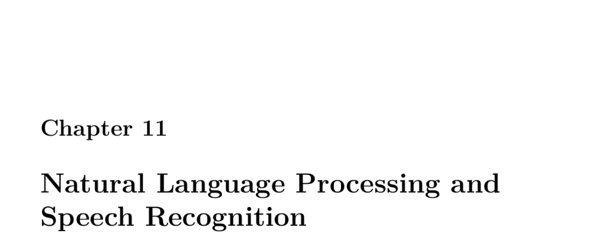

- **11.1 Part 11.1: Getting Started with Spacy in Python**
  - Spacy is preferred for word-level NLP due to its object abstraction of sentences.
  - Installing Spacy requires downloading an English language model with `python -m spacy download en`.
  - Tokenization splits text into tokens and handles punctuation appropriately.
  - Spacy provides part-of-speech tagging and can identify entities like numbers.
  - Sentence diagramming with Spacy visualizes sentence structure interactively.
  - Lemmatization reduces words to their stems for normalized processing.
  - Spacy includes a predefined stop words list to filter common uninformative words.
  - Further reading: [Spacy official documentation](https://spacy.io/usage/spacy-101)

- **11.2 Part 11.2: Word2Vec and Text Classification**
  - Word2Vec models produce word embeddings by learning vector representations from a large text corpus.
  - Gensim is a common Python library used to load and work with Word2Vec embeddings.
  - Words are represented as 300-dimensional vectors capturing semantic similarities.
  - Word2Vec enables vector arithmetic like `queen ≈ king - man + woman`.
  - Functions include finding similar words, odd-one-out detection, and similarity scores.
  - Further reading: [Gensim Word2Vec tutorial](https://radimrehurek.com/gensim/models/word2vec.html)

- **11.3 Part 11.3: What are Embedding Layers in Keras**
  - Embedding layers map integer indexes to dense vectors, expanding dimensionality inside a neural network.
  - Key parameters: `input_dim` (vocabulary size), `output_dim` (vector length), and `input_length` (sequence length).
  - Embedding layers initialize weights randomly but can be replaced with pretrained or custom embeddings.
  - One-hot encoding can be injected as fixed embeddings for categorical data.
  - Embeddings can be trained end-to-end within classification models for tasks like sentiment analysis.
  - Further reading: [Keras Embedding Layer](https://keras.io/api/layers/core_layers/embedding/)

- **11.4 Part 11.4: Natural Language Processing with Spacy and Keras**
  - Neural networks for text generation can operate at character or word level; word-level offers semantic coherence.
  - Spacy tokenizes and builds vocabularies from raw text, handling URL, email, and digit filtering.
  - Text sequences are created with fixed length and tokenized into one-hot encoded input/output arrays.
  - An LSTM model predicts the next word given a seed sequence and uses temperature sampling to control randomness.
  - Sampling at different temperatures balances conservatism and creativity in text generation.
  - Further reading: [TensorFlow Text Generation Tutorial](https://www.tensorflow.org/text/tutorials/text_generation)

- **11.5 Part 11.5: Learning English from Scratch with Keras and TensorFlow**
  - End-to-End Memory Networks learn to answer questions about short stories by parsing and encoding story and query.
  - The bAbI dataset from Facebook provides stories, queries, and answers for training question-answering models.
  - Vocabulary is built from dataset words, padded for sequence uniformity, and indexed numerically.
  - The model architecture encodes inputs and queries with embeddings, computes similarity, applies an LSTM, and outputs answer probabilities.
  - Training converges to ~95.6% accuracy on test data, demonstrating successful learning of basic reading comprehension.
  - Further reading: [bAbI tasks dataset](https://research.fb.com/downloads/babi/), [Keras Memory Networks example](https://keras.io/examples/nlp/babi_memnn/)
