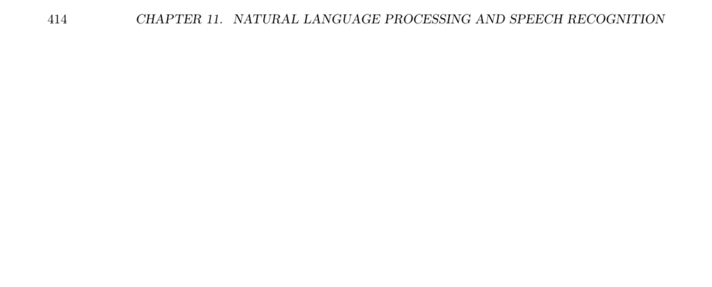

- **12.1 Part 12.1: Introduction to the OpenAI Gym**
  - OpenAI Gym provides a standardized interface with diverse environments to benchmark general intelligence in AI research.
  - It currently supports Python and has limitations including restricted OS support for Atari and rendering issues on Google CoLab.
  - The Gym environment comprises action space, observation space, agent, step, episode, render, reward, and nondeterministic properties.
  - The leaderboard in OpenAI Gym operates on an honor system maintained via GitHub and requires reproducibility documentation.
  - Further reading: [OpenAI Gym GitHub](https://github.com/openai/gym)
- **12.1.1 OpenAI Gym Leaderboard**
  - The leaderboard is informal and user-scored locally, emphasizing reproducibility over competition.
  - Score submissions require instructions for reproduction and optionally a video recording.
- **12.1.2 Looking at Gym Environments**
  - Environment attributes include discrete or continuous action and observation spaces, maximum episode steps, and determinism.
  - Examples like MountainCar-v0, CartPole-v1, and Breakout demonstrate different action/observation specifications.
  - The seed method controls stochastic behavior, ensuring reproducibility when possible.
- **12.1.3 Render OpenAI Gym Environments from CoLab**
  - Rendering Gym environments in CoLab requires virtual display tools and specific installation steps.
  - Video recording and embedding are necessary due to lack of direct animation rendering.
  - Utility functions facilitate capturing and displaying gameplay videos within notebooks.
- **12.2 Part 12.2: Introduction to Q-Learning**
  - Q-Learning builds a Q-table mapping state-action pairs to expected rewards, addressing discrete state and action spaces.
  - It uses a temporal difference update rule balancing learning rate, rewards, and discounted future values.
  - Continuous states require binning into discrete buckets; continuous actions are challenging for classic Q-Learning.
  - The Mountain Car environment serves as a case study for Q-Learning, including a charted learning process.
  - Further reading: [Sutton & Barto, Reinforcement Learning](http://incompleteideas.net/book/the-book-2nd.html)
- **12.2.1 Introducing the Mountain Car**
  - Mountain Car environment involves an underpowered car in a valley that must leverage momentum to overcome a hill.
  - The environment has three discrete actions and continuous observation states (position and velocity).
  - Visualization of the environment is possible using TF-Agents rendering techniques.
- **12.2.2 Programmed Car**
  - A hand-programmed policy applies force in the current movement direction to eventually solve Mountain Car.
  - The policy is deterministic but simplistic compared to learning-based agents.
- **12.2.3 Reinforcement Learning**
  - Reinforcement learning updates Q-values using a temporal difference formula involving learning rate, discount factor, and rewards.
  - Epsilon-greedy action selection balances exploration and exploitation during training.
  - Q-values converge by iteratively updating based on observed rewards and estimated future returns.
- **12.2.4 Q-Learning Car**
  - A discretization function converts continuous states to discrete buckets for indexing the Q-table.
  - The training loop iteratively runs episodes, updating Q-values and decaying exploration probability (epsilon).
  - Multiple hyperparameters govern learning rate, discount factor, episode count, bucket size, and epsilon decay.
  - Performance generally improves over episodes, often reaching near-perfect success rates after sufficient training.
- **12.2.5 Running and Observing the Agent**
  - The trained Q-Learning agent can be run with rendering enabled to observe learned behaviors.
- **12.2.6 Inspecting the Q-Table**
  - The Q-table is a multi-dimensional array mapping discretized state buckets to action values.
  - Analyzing row and column means reveals patterns correlating states to preferred actions.
- **12.3 Part 12.3: Keras Q-Learning in the OpenAI Gym**
  - Traditional Q-Learning suffers from large Q-tables for complex state spaces; Deep Q-Networks (DQN) use neural networks to generalize.
  - DQN maps environment states to expected Q-values for actions, enabling function approximation over large or continuous spaces.
  - TF-Agents provides modular components for environment interfacing, agents, policies, metrics, replay buffers, and training.
- **12.3.1 DQN and the Cart-Pole Problem**
  - The Cart-Pole environment features four continuous state variables and two discrete actions (left/right force).
  - The goal is to keep a pole balanced on a moving cart.
  - Components created in TF-Agents include Q-Network, DQN agent, policies, replay buffer, and training loop.
- **12.3.2 Hyperparameters**
  - Key hyperparameters include number of training iterations, initial random steps for data collection, batch size, learning rate, logging frequency, and evaluation intervals.
- **12.3.3 Environment**
  - The CartPole environment is loaded through TF-Agents’ suite_gym and wrapped as a TensorFlow compatible wrapper.
  - Observations and action specs show continuous 4-dimensional inputs and discrete two-action outputs.
- **12.3.4 Agent**
  - A QNetwork neural network estimates Q-values; here a single fully connected hidden layer with 100 units is defined.
  - The DqnAgent is initialized with the network, optimizer (Adam), loss function, and step counter.
- **12.3.5 Policies**
  - Two policies are used: the agent’s main policy for evaluation and the collect policy for data gathering.
  - A random policy is also created to seed initial replay buffer data.
- **12.3.6 Metrics and Evaluation**
  - Average return over multiple episodes measures policy performance.
  - The compute_avg_return function runs episodes and sums rewards for average calculation.
- **12.3.7 Replay Buffer**
  - Replay buffer stores trajectories (observations, actions, rewards) for experience replay training.
  - TFUniformReplayBuffer is used to manage data with specified batch sizes and buffer lengths.
- **12.3.8 Data Collection**
  - Data collection functions run policies in the environment, convert transitions to trajectories, and add them to the replay buffer.
  - The replay buffer exposes a TensorFlow dataset pipeline for efficient sampling of experience batches.
- **12.3.9 Training the agent**
  - Training involves alternating data collection steps and neural network training on sampled replay batches.
  - Periodic evaluation prints average return and tracking of training loss.
  - TF functions are used to optimize training execution.
- **12.3.10 Visualization**
  - Matplotlib plots average return over training iterations, showing improvement towards a maximum reward.
- **12.3.11 Plots**
  - Plots visualize training progression and performance improvements.
- **12.3.12 Videos**
  - Functions embed mp4 gameplay videos in Jupyter notebooks for trained and random policy agents.
  - This visualization contrasts learned agent performance with a random baseline.
- **12.4 Part 12.4: Atari Games with Keras Neural Networks**
  - Atari 2600 games provide challenging benchmarks for reinforcement learning due to their pixel-based state spaces and complex dynamics.
  - OpenAI Gym integrates with Atari games via the Stella Emulator, with environments offering either raw screen pixels or RAM states.
- **12.4.1 Actual Atari 2600 Specs**
  - Atari 2600 hardware specs include a 1.19 MHz CPU, 40x192 pixel playfield, limited colors and sprites, and 2-channel monaural sound.
- **12.4.2 OpenAI Lab Atari Pong**
  - Shows adaptation of TF-Agents to Atari Pong, a simple two-dimensional paddle and ball game.
  - Atari environments require preprocessing such as frame skipping, resolution reduction, and frame stacking.
- **12.4.3 Hyperparameters**
  - Larger training iterations, increased data collection steps, smaller batch size, and tuned learning rate for Atari complexity.
- **12.4.4 Atari Environment’s**
  - Uses suite_atari from TF-Agents with wrappers for preprocessing (frame skip and stacking).
  - Environments return images representing the Atari screen as observation state.
- **12.4.5 Agent**
  - Custom AtariQNetwork subclass normalizes pixel inputs by dividing by 255.
  - Convolutional layers with specified filters, kernel sizes, and strides precede fully connected layers for Q-value estimation.
  - Uses RMSProp optimizer; agent configured with parameters specific to Atari’s frame skip and target updates.
- **12.4.6 Metrics and Evaluation**
  - Average return over episodes remains the primary metric.
- **12.4.7 Replay Buffer**
  - Replay buffer stores state transitions with batch size and prefetching to create efficient dataset pipelines.
- **12.4.8 Random Collection**
  - Initial data collection with a random policy is necessary to prime the replay buffer before training.
- **12.4.9 Training the agent**
  - Training follows the standard TF-Agents loop with periodic logging of loss and average return.
  - Training is computationally intensive and time-consuming.
- **12.4.10 Visualization**
  - Average return plots monitor training progression on Atari games.
- **12.4.11 Videos**
  - Functions to capture and embed gameplay videos illustrate agent performance for trained and random policies.
- **12.5 Part 12.5: Application of Reinforcement Learning**
  - Introduces the Deep Deterministic Policy Gradients (DDPG) agent, which supports continuous action spaces.
  - Demonstrates a financial planning simulation environment allowing continuous allocation of income across various financial actions.
- **12.5.1 Create an Environment of your Own**
  - The custom environment class must extend gym.Env and implement seed, reset, step, and render functions.
  - The simulator models a salary-based mortgage payoff and retirement savings with continuous action inputs.
  - State includes age, salary, home value, loan status, required payments, and savings account balances.
  - Action space comprises continuous values representing home loan payment, tax-advantaged savings, taxable savings, and luxury spending.
  - The environment incorporates inflation, interest, taxes, expenses, and investment returns as underlying simulation parameters.
  - The step function updates state using action allocations, manages loan payoff logic, investment returns, and enforces monthly and yearly events.
