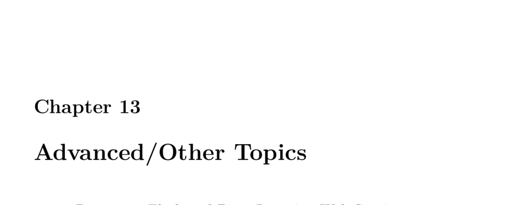

- **Advanced/Other Topics**
  - **Flask and Deep Learning Web Services**
    - Flask facilitates quick deployment of Python applications, including TensorFlow models, as web services.
    - Flask is suited for development but not designed for high-volume production systems, often wrapped by Gunicorn or TensorFlow Serving for scalability.
    - Practical examples include a "Hello World" Flask server and a Flask-wrapped neural network predicting miles per gallon (MPG) from JSON inputs.
    - Flask services can handle both JSON inputs and image file uploads for classification tasks, e.g., using MobileNet.
    - Relevant resource: [Flask Documentation](https://flask.palletsprojects.com/)
  - **MPG Flask**
    - Trains a neural network on the MPG dataset and saves the model as an .H5 file for later deployment.
    - Defines expected input JSON format and logical ranges for input validation within Flask.
    - Demonstrates client interactions via PostMan and Python HTTP POST requests to the Flask API.
  - **Flask MPG Client**
    - Illustrates accessing the MPG Flask web service through HTTP POST requests using PostMan or Python requests library.
    - The client sends structured JSON and handles JSON responses, confirming successful predictions.
  - **Images and Web Services**
    - Extends Flask web services to accept image files and classify them with pretrained networks like MobileNet.
    - Outlines client usage via PostMan form data or Python code uploading image files.
    - Demonstrates successful JSON classification output containing predicted classes and probabilities.
  - **Interrupting and Continuing Training**
    - Describes stopping and resuming model training using checkpoints to save and restore model weights.
    - Provides utility functions for organizing experiment outputs and logging training progress to files.
    - Implements a convolutional model on MNIST dataset with training control and evaluation metrics.
    - Introduces the Logger class to redirect and save standard output and error streams.
  - **Using a Keras Deep Neural Network with a Web Application**
    - Combines the Flask image classification API with a ReactJS single-page web application for image upload and prediction.
    - Uses static web assets (HTML, CSS, JavaScript) served by Flask to enable user interaction.
    - Demonstrates seamless frontend-backend integration for neural network inference via a browser interface.
    - Further reading on ReactJS and image uploading integration.
  - **When to Retrain Your Neural Network**
    - Defines dataset drift as changes in input data distribution over time causing model performance degradation.
    - Explains that retraining is necessary when new data distributions differ significantly from the training data.
    - Uses synthetic data and visualization to illustrate drift effects on model predictions.
    - Applies KS-statistic to detect differences between training and test data distributions with p-values and statistics.
    - Demonstrates drift detection by training a classifier to distinguish train vs. test samples, using AUC thresholds.
    - External resource: [Sberbank Russian Housing Market Dataset](https://www.kaggle.com/c/sberbank-russian-housing-market)
  - **Using a Keras Deep Neural Network with a Web Application**
    - (Duplicate section title; content focused on iOS deployment)
    - Describes deploying Keras-trained neural networks on iOS devices via Apple’s CoreML framework.
    - Lists Mac and Apple Developer account requirements for iOS app development and deployment.
    - Provides detailed environment setup and package installation to export MobileNet to CoreML format.
    - Illustrates converting Keras model to CoreML using coremltools, including class label integration.
    - Links to IOS Classify example GitHub repository and tutorials for building CoreML iOS applications.
    - Relevant reading: [Running Keras models on iOS with CoreML](https://blog.keras.io/running-keras-models-on-ios.html)
