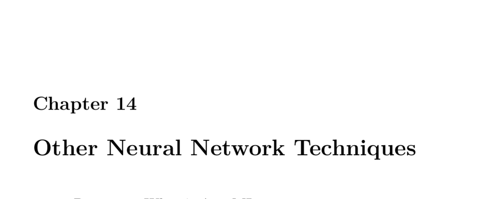

- **14.1 Part 14.1: What is AutoML**  
  - AutoML automates machine learning by taking raw data and generating models automatically.  
  - Commercial AutoML solutions include Rapid Miner, Dataiku, DataRobot, and H2O Driverless.  
  - Google Cloud offers AutoML via cloud-based tutorials and tools.  
  - A simple AutoML system involves reading CSV data sources, analyzing feature encodings, transforming data, and training neural networks.  
  - Further reading: [AutoML on Google Cloud](https://cloud.google.com/automl)  

- **14.2 Part 14.2: Using Denoising AutoEncoders in Keras**  
  - Function approximation uses neural networks to model data relationships without requiring explicit equations.  
  - Neural networks can output multiple regression values simultaneously, useful in multi-output regression tasks.  
  - Autoencoders learn compressed data representations by training to reproduce their inputs at the output layer.  
  - Image autoencoders apply this concept to images, reconstructing inputs with potential distortions.  
  - Adding noise to inputs and training denoising autoencoders enables removal of noise from data for improved reconstruction.  
  - Further reading: [Denoising Autoencoders](https://www.cs.toronto.edu/~hinton/absps/denoisingAutoencoders.pdf)  

  - **14.2.1 Function Approximation**  
    - Neural networks approximate functions like sine with reasonable accuracy from data.  
    - They remove the need for manual equation derivation by learning data mappings algorithmically.  
    - The example uses a regression network to fit a noisy sine function.  
    - Visualization of predictions against expected values demonstrates fit quality.  

  - **14.2.2 Multi-Output Regression**  
    - Neural networks can regress multiple outputs simultaneously from the same input.  
    - The example predicts sine and cosine values together using two output neurons.  
    - Root Mean Squared Error (RMSE) assesses regression performance.  

  - **14.2.3 Simple Autoencoder**  
    - An autoencoder has equal input and output neurons and fewer hidden neurons for compression.  
    - It learns to reconstruct input data through a bottleneck representation.  
    - The example compresses a sequence of numbers and reconstructs it with some error quantified by RMSE.  

  - **14.2.4 Autoencode (single image)**  
    - Autoencoders can encode and reconstruct images by flattening pixel data into vectors.  
    - Training on a single image shows distortions in the reconstructed output.  
    - Image dimensions and pixel arrays are critical in input formatting.  

  - **14.2.5 Standardize Images**  
    - When processing multiple images, standardizing size and shape is essential for consistent processing.  
    - Cropping ensures images are perfectly square, so neural networks receive uniform input dimensions.  
    - The example downloads and processes seven images into a normalized array for training.  

  - **14.2.6 Image Autoencoder (multi-image)**  
    - Autoencoders can be trained on multiple images to learn a general encoding scheme.  
    - The example trains a neural network to reconstruct seven standardized images.  
    - Outputs demonstrate the network’s ability to recreate inputs from encoded representations.  

  - **14.2.7 Adding Noise to an Image**  
    - Noise can be artificially introduced to images as random black squares to simulate corruption.  
    - This noise augmentation facilitates training of denoising autoencoders.  
    - The example shows image dimensions and applies noise while preserving RGB format.  

  - **14.2.8 Denoising Autoencoder**  
    - Denoising autoencoders are trained to map noisy inputs back to clean outputs.  
    - The example creates ten noisy versions of each image for training.  
    - The neural network progressively reduces noise in test images demonstrating learned denoising ability.  
    - Training losses decrease consistently over epochs, showing improved performance.  

- **14.3 Part 14.3: Anomaly Detection in Keras**  
  - Anomaly detection identifies deviations from normal patterns without supervised labels.  
  - It is widely applied in cybersecurity to detect network intrusions and unconventional activities.  
  - The KDD-99 dataset is a benchmark dataset for intrusion and anomaly detection tasks.  
  - Autoencoders trained on normal data detect anomalies by observing elevated reconstruction errors on abnormal data.  
  - Further reading: [KDD Cup 1999 Data](http://kdd.ics.uci.edu/databases/kddcup99/kddcup99.html)  

  - **14.3.1 Read in KDD99 Data Set**  
    - The KDD99 dataset contains network connection records with attack and normal labels.  
    - The dataset requires adding explicit column names since it comes without headers.  
    - It contains over 490,000 instances involving multiple types of network activity.  

  - **14.3.2 Preprocessing**  
    - Numeric columns are standardized using z-scores for consistent scaling.  
    - Categorical columns are encoded as dummy variables to enable machine processing.  
    - Preprocessing prepares data for neural network input and facilitates meaningful anomaly detection.  

  - **14.3.3 Training the Autoencoder**  
    - The autoencoder compresses high-dimensional normal network data into a low-dimensional representation.  
    - Training occurs solely on normal data without labels, reflecting unsupervised learning.  
    - The model attempts to reconstruct its inputs minimizing mean squared error.  

  - **14.3.4 Detecting an Anomaly**  
    - Reconstruction errors measured by RMSE differ significantly between normal and attack data.  
    - Normal data yields low RMSE values indicating good reconstruction.  
    - Attack data yields higher RMSE, signaling deviations from training data and detecting anomalies.  

- **14.4 Part 14.4: Training an Intrusion Detection System with KDD99**  
  - The KDD99 dataset is foundational in intrusion detection for classifying network attacks.  
  - It contains a range of simulated intrusion types alongside normal traffic in a military context.  
  - Training aims to distinguish “bad” connections from normal ones using predictive models.  
  - Further reading: [Intrusion Detection Systems Overview](https://www.us-cert.gov/ncas/tips/ST04-015)  

  - **14.4.1 Read in Raw KDD-99 Dataset**  
    - The raw dataset needs to be downloaded and loaded as a CSV with no headers.  
    - Explicit column names corresponding to network features and outcomes are added post-loading.  
    - Dataset size exceeds 490,000 rows representing diverse network interactions.  

  - **14.4.2 Analyzing a Dataset**  
    - An overview script provides unique counts and distributions per column.  
    - Numeric columns often have large numbers of unique values; categorical columns usually have few.  
    - Distribution analysis shows dominant categories and percentages in categorical variables.  

  - **14.4.3 Encode the feature vector**  
    - Numeric features are transformed into z-scores for normalization.  
    - Categorical features are converted to dummy variables for neural net compatibility.  
    - The final feature matrix excludes the target column and is prepared as a numpy array for training.  

  - **14.4.4 Train the Neural Network**  
    - A multi-layer neural network is constructed with two hidden layers using ReLU activations.  
    - The output layer uses softmax activation for multi-class attack classification.  
    - Early stopping monitors validation loss to prevent overfitting during training.  
    - The model achieves approximately 99% accuracy on the test set, verifying classification effectiveness.
