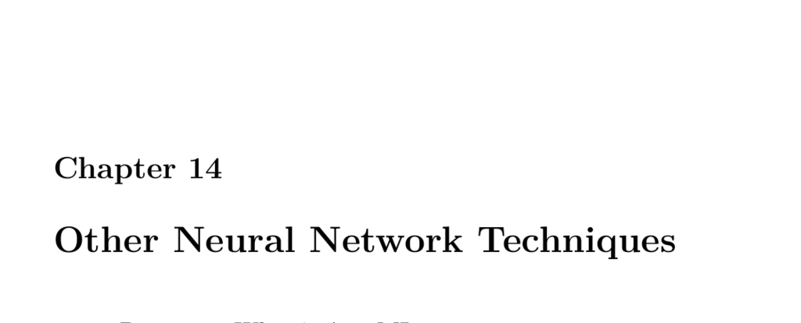

- **14.1 Part 14.1: What is AutoML**
  - AutoML automates machine learning model generation from raw data without manual intervention.
  - Commercial AutoML applications include Rapid Miner, Dataiku, DataRobot, and H2O Driverless.
  - Google Cloud offers AutoML services with tutorials for implementation.
  - The provided example demonstrates a simple AutoML pipeline with data analysis, encoding, transformation, and neural network training.
  - Further reading: [Google Cloud AutoML Tutorial](https://cloud.google.com/automl)

- **14.2 Part 14.2: Using Denoising AutoEncoders in Keras**
  - Function approximation uses neural networks to algorithmically derive equations fitting data, demonstrated with a noisy sine function.
  - Neural networks can perform multi-output regression, predicting several values simultaneously, such as sine and cosine functions from input data.
  - Simple autoencoders learn to compress and reconstruct input data by reducing dimensionality in hidden layers.
  - Image autoencoders can learn encodings for single or multiple images with preprocessing for size and squareness.
  - Adding noise manipulation techniques allow training denoising autoencoders which reconstruct clean images from noisy inputs.
  - Further reading: [Autoencoder tutorial on Keras](https://keras.io/examples/)

- **14.3 Part 14.3: Anomaly Detection in Keras**
  - Anomaly detection uses unsupervised autoencoders to identify data significantly different from training data.
  - The KDD-99 dataset is a standard benchmark for intrusion detection and anomaly detection in cybersecurity.
  - Data preprocessing is essential, converting numeric features to Z-scores and categorical features to dummy variables.
  - Autoencoders trained on normal network traffic data produce low reconstruction error which rises significantly for attack data.
  - Further reading: [KDD Cup 1999 Data](http://kdd.ics.uci.edu/databases/kddcup99/kddcup99.html)

- **14.4 Part 14.4: Training an Intrusion Detection System with KDD99**
  - The KDD-99 dataset contains raw network traffic data without headers, requiring manual column naming.
  - Dataset analysis reveals categorical and numeric feature distributions useful for preprocessing strategy decisions.
  - Preprocessing involves Z-score normalization for numeric columns and conversion to dummy variables for categorical fields.
  - Neural networks trained on the preprocessed data classify network connection outcomes, including various attack types and normal traffic.
  - The trained neural network achieves high classification accuracy, making it suitable for intrusion detection applications.
  - Further reading: [Anomaly Detection in Network Security](https://ieeexplore.ieee.org/document/6789993)
