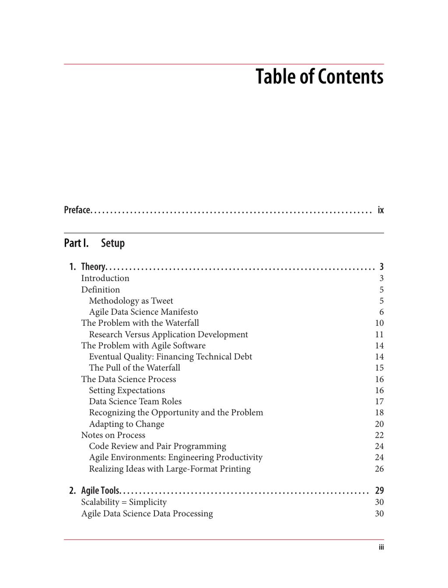

- **Preface**
  - The preface introduces the overall book content and purpose.
  - It prepares readers for the topics covered in data science and agile methodologies.
  - Further reading: [Preface examples in technical books](https://www.oreilly.com/library/view/writing-copy-for/9781491914827/ch01.html)

- **Part I. Setup**
  - **1. Theory**
    - Introduction defines the scope of agile data science theory.
    - Discusses methodology in concise formats including the Agile Data Science Manifesto.
    - Highlights issues with Waterfall and Agile software development processes.
    - Details the data science process, team roles, and adaptive approaches.
    - Suggests practices such as code review, pair programming, and engineering productivity.
    - Further reading: [Agile Manifesto](https://agilemanifesto.org/)
  - **2. Agile Tools**
    - Discusses the principle "Scalability = Simplicity" as central to tools.
    - Covers setup of local and EC2 environments for data processing.
    - Introduces use of Python 3 and tools like JSON Lines, Parquet, Spark, MongoDB, Elasticsearch, Kafka, and Airflow.
    - Explains lightweight web applications and data presentation techniques.
    - Summarizes toolset tour for data science workflows.
    - Further reading: [Apache Airflow Documentation](https://airflow.apache.org/)
  - **3. Data**
    - Presents sources of data including flight on-time performance and weather data.
    - Compares structured vs. semi-structured data and SQL vs. NoSQL databases.
    - Explains data serialization and evolving schemas.
    - Discusses feature extraction from data and data processing techniques.
    - Further reading: [NoSQL Databases: An Overview](https://www.mongodb.com/nosql-explained)

- **Part II. Climbing the Pyramid**
  - **4. Collecting and Displaying Records**
    - Details collection, serialization, and publishing of flight data using MongoDB.
    - Covers serving data with Flask, HTML5 rendering, and pagination.
    - Explains creating search indices with Elasticsearch and web search features.
    - Further reading: [Flask Web Framework](https://flask.palletsprojects.com/)
  - **5. Visualizing Data with Charts and Tables**
    - Emphasizes iterative improvement for chart quality.
    - Explains database scaling for data presentation forms.
    - Explores seasonality and flight volume queries.
    - Covers data enrichment by extracting tail numbers and automating web form submissions.
    - Further reading: [D3.js Data Visualization](https://d3js.org/)
  - **6. Exploring Data with Reports**
    - Defines airlines as groups of airplanes and queries airline data.
    - Describes ontology curation for semi-structured data.
    - Details enriching airline data with Wikipedia content.
    - Investigates airplane entities, comparing SQL subqueries and dataflow programming.
    - Develops search and visualization features, including manufacturer bar charts and entity resolution.
    - Further reading: [Entity Resolution Techniques](https://link.springer.com/chapter/10.1007/978-3-030-25262-7_11)
  - **7. Making Predictions**
    - Defines the role and purposes of predictions in data science.
    - Introduces predictive analytics concepts and regression techniques.
    - Covers feature extraction with PySpark and model training/testing with scikit-learn.
    - Describes classification models using Spark MLlib and handling nulls and variable transformations.
    - Further reading: [Introduction to Predictive Analytics](https://www.ibm.com/cloud/learn/predictive-analytics)
  - **8. Deploying Predictive Systems**
    - Explains deploying scikit-learn models as web services with APIs.
    - Covers saving/loading models and integrating APIs into products.
    - Describes batch prediction deployments with Airflow and Spark ML.
    - Details streaming prediction implementations using Kafka and Spark Streaming.
    - Discusses end-to-end testing and workflow automation.
    - Further reading: [Deploying ML Models](https://mlflow.org/docs/latest/models.html)
  - **9. Improving Predictions**
    - Addresses when and how to improve prediction models.
    - Recommends rigorous metrics and experimental methods for model evaluation.
    - Introduces feature engineering including time-of-day and airplane data incorporation.
    - Describes iterative improvements in classifier performance.
    - Further reading: [Feature Engineering for Machine Learning](https://www.kdnuggets.com/2020/01/feature-engineering-data-science.html)
  - **A. Manual Installation**
    - Provides manual installation instructions for required software and tools.
    - Supports users preferring setup without automated scripts.
    - Further reading: [Manual Installation Best Practices](https://www.redhat.com/sysadmin/manual-installation-guide)
  - **Index**
    - Comprehensive list of topics and keywords for reference.
    - Facilitates quick lookup of subject matter throughout the book.
