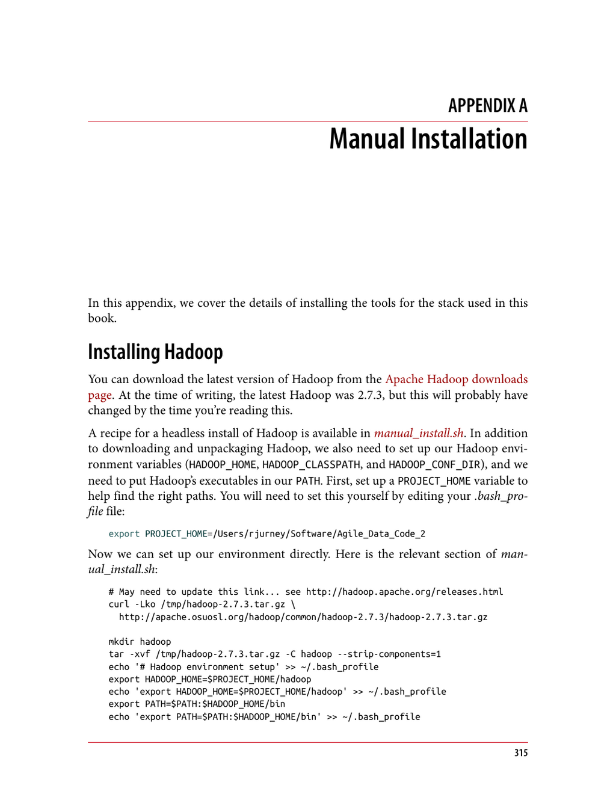

- **Manual Installation**
  - **Installing Hadoop**
    - Provides instructions for downloading Hadoop version 2.7.3 as an example, noting the version may change.
    - Details setting environment variables HADOOP_HOME, HADOOP_CLASSPATH, HADOOP_CONF_DIR, and updating PATH.
    - Refers to a script, manual_install.sh, for a headless installation recipe.
    - Further reading: [Apache Hadoop Releases](http://hadoop.apache.org/releases.html)
  - **Installing Spark**
    - Covers downloading Spark 2.1.0 without Hadoop and setting environment variables including SPARK_HOME and HADOOP_CONF_DIR.
    - Explains configuring Spark defaults such as compression codec and driver memory.
    - Mentions logging configuration to reduce output verbosity.
    - Further reading: [Apache Spark Downloads](http://spark.apache.org/downloads.html)
  - **Installing MongoDB**
    - Advises downloading MongoDB from the official site and unpacking into a local directory.
    - Describes starting the MongoDB server and using the mongo shell to insert and query a test record.
    - Recommends consulting MongoDB official installation guides and tutorial.
    - Further reading: [MongoDB Installation Documentation](https://www.mongodb.com/docs/manual/installation/)
  - **Installing the MongoDB Java Driver**
    - Specifies downloading version 3.4.2 of the MongoDB Java driver using curl.
    - Directs storing the driver JAR file into the lib directory.
  - **Installing mongo-hadoop**
    - Outlines downloading the mongo-hadoop project (version r1.5.2), unpacking it, and building with gradlew.
    - Instructs copying built JAR files into lib/.
    - Further reading: [Mongo-Hadoop GitHub Releases](https://github.com/mongodb/mongo-hadoop/releases)
  - **Installing pymongo_spark**
    - Details installing pymongo_spark Python package from mongo-hadoop sources using setup.py.
    - Explains updating PYTHONPATH to include the package location.
  - **Installing Elasticsearch**
    - Describes downloading Elasticsearch 2.3.5, unpacking, and running the server locally.
    - Demonstrates inserting and querying a record via curl commands.
    - Notes the server must be restarted if the machine is rebooted.
    - Further reading: [Elasticsearch Downloads](https://www.elastic.co/downloads/elasticsearch)
  - **Installing Elasticsearch for Hadoop**
    - Covers downloading Elasticsearch for Hadoop 5.0.0-alpha5, unzipping, and copying relevant JARs to lib/.
    - Sets spark.speculation to false in Spark configuration.
  - **Setting Up Our Spark Environment**
    - Shows configuring spark-defaults.conf to load MongoDB and Elasticsearch JAR files automatically.
    - Simplifies launching PySpark with preloaded dependencies.
  - **Installing Kafka**
    - Provides instructions for downloading Kafka 0.10.2.0 and extracting it locally.
    - Notes installation is for local mode development; distributed mode is possible but not covered here.
    - Further reading: [Apache Kafka Downloads](https://kafka.apache.org/downloads)
  - **Installing scikit-learn**
    - Notes Anaconda includes scikit-learn; otherwise, install via pip or easy_install.
    - Mentions dependencies on numpy and scipy may be required.
    - Encourages exploring scikit-learn tutorials.
    - Further reading: [scikit-learn User Guide](https://scikit-learn.org/stable/user_guide.html)
  - **Installing Zeppelin**
    - Details downloading Apache Zeppelin 0.6.2, unpacking, and configuring with SPARK_HOME and SPARK_MASTER.
    - Describes starting Zeppelin daemon and accessing the UI via localhost.
    - Recommends completing the Zeppelin tutorial after installation.
    - Further reading: [Apache Zeppelin Downloads](https://zeppelin.apache.org/download.html)
