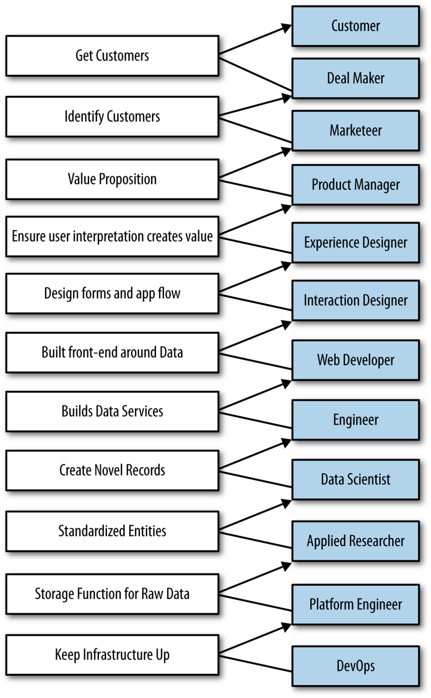

- **Theory**
  - **Introduction**
    - Agile Data Science centers on web application development as the primary output of data science.
    - It emphasizes the fundamental skill of application development for data scientists.
    - Traditional agile software methods like Scrum do not adequately handle the uncertainty in data science artifacts.
    - The Agile Data Science manifesto proposes a new methodology suited to data science's uncertainty.
    - [The Agile Manifesto](https://agilemanifesto.org/)
  - **Definition**
    - Agile Data Science documents and guides exploratory data analysis to discover a critical path to a compelling analytics product.
    - It emphasizes managing the process ("going meta") rather than focusing solely on the final product.
  - **Agile Data Science Manifesto**
    - **Iterate, iterate, iterate**
      - Insight derives from multiple iterations of queries and model tuning.
      - Iteration is essential for extracting, visualizing, and productizing insights.
    - **Ship intermediate output**
      - Iteration often leaves incomplete outputs by sprint end; shipping these avoids wasted effort.
      - Sharing incomplete work improves team visibility and avoids the "death loop."
    - **Prototype experiments over implementing tasks**
      - Data science work focuses more on running experiments than completing fixed tasks.
      - Good analytical assets emerge as artifacts from exploratory analysis.
    - **Integrate the tyrannical opinion of data**
      - Data's constraints and possibilities must inform product management decisions.
      - Visualization and exploratory analysis ground product discussions in data reality.
    - **Climb up and down the data-value pyramid**
      - The pyramid has five layers: records, charts & tables, reports, predictions, and actions.
      - Value increases with refinement and actionable insights; skipping layers incurs technical debt.
    - **Discover and pursue the critical path to a killer product**
      - The team must identify and organize around the most essential feature for product success.
      - Complex dependencies exist across data refinement, modeling, and application stages.
    - **Get meta**
      - Emphasizes documenting the analytics process over focusing only on end products.
      - Enables agility by shipping intermediate insights iteratively.
    - [Agile Data Science website](https://agiledatascience.com/)
  - **Synthesis**
    - The principles structure exploratory data analysis into actionable analytics applications.
    - An example waterfall project (LinkedIn Career Explorer) demonstrated the failure of applying agile without adaptation.
    - Real-world analytics products require iterative exploration, contrasting with linear project plans.
  - **The Problem with the Waterfall**
    - Waterfall projects tested concepts only late in development, leading to failures.
    - Fixed deadlines, static mock-ups, and late integration testing exposed critical issues.
    - User interest and product viability often remain unknown until too late.
    - Waterfall methodology creates project predictability illusions but blocks agility.
    - [Waterfall model overview](https://en.wikipedia.org/wiki/Waterfall_model)
  - **Research Versus Application Development**
    - Research is iterative and uncertain with no fixed endpoint; engineering is linear and predictable.
    - Data science projects face a fundamental timeline conflict between research and engineering tasks.
    - This conflict causes substitution with placeholders and broken feedback loops.
    - [Scientific method](https://en.wikipedia.org/wiki/Scientific_method)
    - [PERT chart](https://en.wikipedia.org/wiki/Program_evaluation_and_review_technique)
  - **The Problem with Agile Software**
    - Agile software methodologies like Scrum do not fully address the uncertainty inherent in data science.
    - Technical debt is tolerated differently in data science: code can be initially "ugly" but must be improved eventually.
    - Prototypes generate debt financed by experimentation payoff; many prototypes are discarded.
    - Complex modern tech stacks and broad skillsets create pull back to waterfall sequencing.
    - Iteration within sprints is necessary to avoid slow, compartmentalized progress.
    - [Technical debt definition](https://www.techopedia.com/definition/10133/technical-debt)
  - **The Data Science Process**
    - **Setting Expectations**
      - Fixed ship dates are unrealistic due to variable research timelines.
      - Stakeholders get visibility into ongoing work via continuously updated working software.
      - Collaboration aligns other business functions with the reality of exploratory research.
    - **Data Science Team Roles**
      - Roles span from customers and business development to product managers, designers, engineers, and operations.
      - Each role contributes uniquely; coordination across these diverse perspectives is critical.
    - **Recognizing the Opportunity and the Problem**
      - Specialized expertise in different roles can improve problem-solving efficiency.
      - Large teams increase communication overhead risking misaligned visions and waterfall tendencies.
    - **Adapting to Change**
      - Emphasizes generalists over specialists and small teams over large.
      - Uses high-level, scalable platforms and a culture of sharing intermediate, incomplete results regularly.
    - **Harnessing the power of generalists**
      - Team members have broad skillsets covering multiple related disciplines.
      - Cross-disciplinary abilities improve agility and iteration speed.
    - **Leveraging agile platforms**
      - Use cloud computing, distributed systems, and PaaS to reduce complexity and cost.
      - Simple stacks allow faster iteration on all available data without infrastructure bottlenecks.
      - [Cloud computing overview](https://en.wikipedia.org/wiki/Cloud_computing)
    - **Sharing intermediate results**
      - Publishing incomplete data continuously keeps teams united and informed.
      - Growing audiences see evolving artifacts from internal researchers to external customers.
  - **Notes on Process**
    - Data science workflows require continuous consensus to avoid diverging product visions.
    - Mocks are insufficient for data products due to data complexity and unpredictability.
    - Data products require early delivery of working systems to reveal true data insights.
    - Code review and pair programming are critical to catch errors and foster team understanding.
    - Code quality in data science is "eventually good," focusing on utility and clean-up upon validation.
    - Agile environments must support deep focus with spaces for collaboration, personal work, and private quiet.
    - Large-format printing supports immersion and creativity through tangible data visualization.
    - [Code review best practices](https://smartbear.com/learn/code-review/what-is-code-review/)
    - [Work environment impact on productivity](https://www.researchgate.net/publication/283651700_Work_Environment_and_Employee_Productivity
