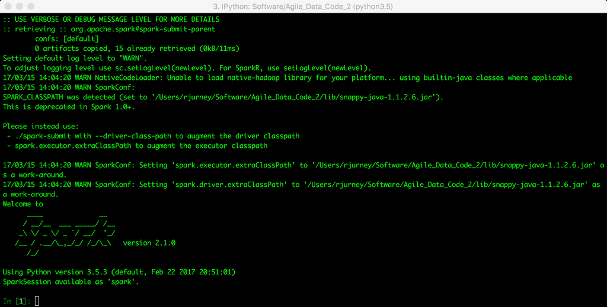

- **Agile Tools**
  - **Scalability = Simplicity**
    - The focus is on building applications that use scalable infrastructure, not on infrastructure management itself.  
    - The stack prioritizes simplicity to avoid distractions from data processing tasks.  
    - Collaboration is enabled by a stack that accommodates diverse skills without requiring distributed systems experts.  
    - For scalability, horizontal scaling is preferred over expensive proprietary hardware.  
    - Further reading: [NoSQL Distilled](https://martinfowler.com/books/nosql.html)  
  - **Agile Data Science Data Processing**
    - The data pipeline covers collecting, storing, processing, publishing, and decorating data end-to-end.  
    - Events are serialized primarily in JSON Lines and sometimes Apache Parquet for efficiency.  
    - Components include collectors (Kafka), bulk storage (S3), document stores (MongoDB), web servers (Python/Flask), and client applications.  
    - The architecture is optimized for scalability and analytic processing.  
    - Further reading: [Apache Kafka](https://kafka.apache.org/)  
  - **Local Environment Setup**
    - Vagrant and VirtualBox are recommended for local virtual machine setup requiring at least 9 GB RAM.  
    - Alternative deployment via AWS EC2 is detailed, using scripts to automate instance creation and tunneling.  
    - Example datasets are downloaded through provided shell scripts.  
    - All code examples reside in the Agile_Data_Code_2 GitHub repository.  
    - Further reading: [Vagrant Documentation](https://www.vagrantup.com/docs)  
  - **Touring the Toolset**
    - **Python 3**
      - Python 3.5 is used for compatibility with Spark 2.1.0; Python 2.7 is possible but less recommended.  
      - Python 3-specific syntax mainly involves exception formatting and bytes/string handling in Kafka APIs.  
      - Further reading: [Python 3.5 Release Notes](https://docs.python.org/3.5/whatsnew/3.5.html)  
    - **Anaconda and Miniconda**
      - Anaconda provides a comprehensive data science Python distribution; Miniconda is a minimal alternative used on prepared images.  
      - Conda and pip are employed to install required packages quickly.  
      - Further reading: [Anaconda](https://www.anaconda.com/)  
    - **Jupyter Notebooks**
      - Jupyter enables interactive coding and visualization, sharing analyses with stored variables and charts.  
      - A notebook server runs on localhost:8888 in both Vagrant and EC2 environments.  
      - Further reading: [Jupyter Project](https://jupyter.org/)  
    - **Serializing Events with JSON Lines and Parquet**
      - JSON Lines stores one JSON object per line to facilitate language interoperability.  
      - Apache Parquet is used for performant, columnar storage with fast partial data loading.  
      - Avro was abandoned in favor of JSON Lines due to complexity and native JSON language support.  
      - Further reading: [Apache Parquet](https://parquet.apache.org/)  
    - **JSON for Python**
      - The Python standard library json module handles JSON reading and writing without additional installation.  
      - Helper functions abstract JSON Lines file reading and writing for simplicity and reliability.  
      - Further reading: [Python json Module](https://docs.python.org/3/library/json.html)  
    - **Collecting Data**
      - Kafka serves as the event aggregator to collect and buffer streaming data before bulk storage.  
      - Local examples use filesystem-based batch data, but production would use Kafka or Kinesis streaming to S3.  
      - Further reading: [Kafka Documentation](https://kafka.apache.org/documentation/)  
    - **Data Processing with Spark**
      - Apache Spark is the primary distributed data processing platform, optimized for in-memory computation.  
      - Spark supports both local mode on single machines and cluster deployment for scalability.  
      - Spark replaces Hadoop MapReduce in this stack, though it requires Hadoop for ecosystem integration.  
      - PySpark provides Python bindings to Spark's RDD and DataFrame APIs.  
      - Further reading: [Apache Spark](https://spark.apache.org/docs/latest/)  
    - **Publishing Data with MongoDB**
      - MongoDB acts as a distributed document store for publishing processed data accessible by web apps.  
      - PySpark writes data to MongoDB easily using the pymongo_spark module with minimal schema management.  
      - MongoDB is preferred for simple document fetching queries, avoiding complex operations that could impact scalability.  
      - Further reading: [MongoDB Manual](https://docs.mongodb.com/manual/)  
    - **Searching Data with Elasticsearch**
      - Elasticsearch provides a RESTful, JSON-based search engine that is easy to use and scalable.  
      - Index creation, document insertion, and querying are done via HTTP requests (usually curl).  
      - PySpark can directly write data to Elasticsearch using the Elasticsearch Hadoop connector.  
      - Pyelasticsearch Python client facilitates Elasticsearch operations programmatically.  
      - Further reading: [Elasticsearch Guide](https://www.elastic.co/guide/en/elasticsearch/reference/current/index.html)  
    - **Distributed Streams with Apache Kafka**
      - Kafka organizes messages into topics and supports fault-tolerant, scalable real-time data pipelines.  
      - ZooKeeper coordinates Kafka; Kafka topics and message production/consumption are handled with provided scripts.  
      - Kafka is mainly used for real-time prediction deployment with Spark Streaming in this stack.  
      - Further reading: [Kafka Streams](https://kafka.apache.org/documentation/streams/)  
    - **Kafka in Python with kafka-python**
      - kafka-python is a lightweight Python library to interact with Kafka for producing and consuming messages.  
      - It requires handling byte streams and JSON decoding when consuming messages.  
      - Further reading: [kafka-python GitHub](https://github.com/dpkp/kafka-python)  
    - **Processing Streams with PySpark Streaming**
      - PySpark Streaming enables processing mini-batches from Kafka streams with simple code integration.  
      - The streaming batch duration defines processing intervals for real-time computations.  
      - This approach facilitates prototyping in batch mode before moving to streaming production setups.  
      - Further reading: [Spark Streaming Programming Guide](https://spark.apache.org/docs/latest/streaming-programming-guide.html)  
    - **Machine Learning with scikit-learn and Spark MLlib**
      - scikit-learn provides utilities and real-time classification/regression capabilities for small data sets.  
      - Spark MLlib offers scalable machine learning on large datasets within Spark clusters.  
      - The stack uses sklearn for simpler or real-time tasks and MLlib for large-scale batch processing.  
      - Further reading: [scikit-learn](https://scikit-learn.org/stable/)  
    - **Scheduling with Apache Airflow (Incubating)**
      - Apache Airflow manages batch data pipelines with Python-coded DAGs for scheduling and execution.  
      - Airflow avoids complex XML-based schedulers like Oozie, favoring convention over configuration.  
      - It supports task dependencies, retry policies, backfilling, and logging to simplify pipeline orchestration.  
      - Further reading: [Apache Airflow](https://airflow.apache.org/)  
    - **Lightweight Web Applications**
      - Lightweight web frameworks (e.g., Flask) deliver data via JSON with minimal overhead.  
      - Flask is chosen for simplicity and Python compatibility with machine learning libraries.  
      - Flask integrates easily with MongoDB using pymongo to fetch and serve stored analytics.  
      - Further reading: [Flask Documentation](https://flask.palletsprojects.com/)  
    - **Presenting Our Data**
      - Bootstrap is used to create easily styled, human-readable tabular displays of data.  
      - D3.js provides flexible, high-quality data visualization using standards such as SVG, CSS3, and HTML5.  
      - Data design and presentation are integral parts of the iterative analytics application development process.  
      - Further reading: [D3.js Gallery](https://observablehq.com/@d3/gallery)  
  - **Conclusion**
    - The combined stack forms a scalable, modifiable data pipeline across collection, processing, publishing, and presentation.  
    - One-line commands enable easy modification at each stage without disrupting the overall workflow.  
    - The architecture avoids reliance on tools locked to specific database paradigms, preserving agility.  
    - Developers gain freedom to select and combine best-of-breed tools and languages within this stack.  
    - Further reading: [Building Data Streaming Applications with Kafka and Spark Streaming](https://databricks.com/blog/2015/09/23/building-data-streaming-applications-with-apache-kafka-and-spark-streaming.html)
