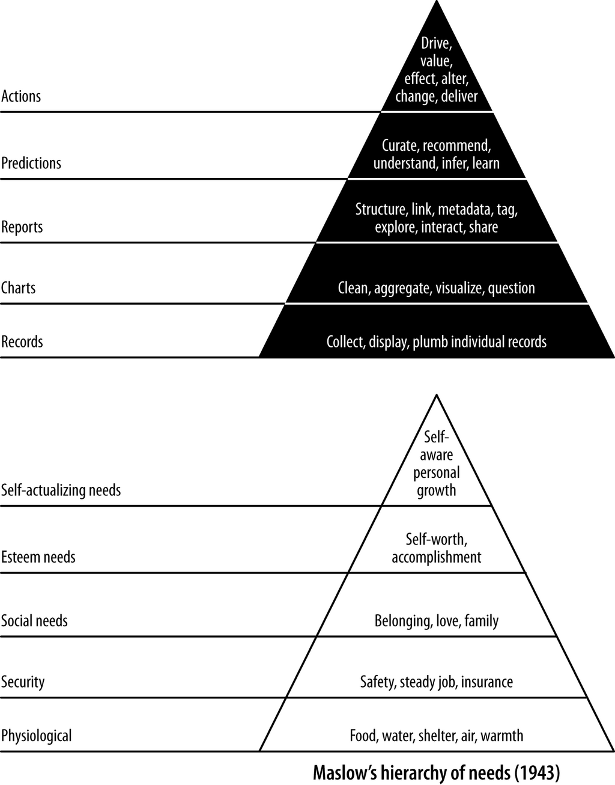

- **Chapter 3: Data**
  - **Air Travel Data**
    - Air travel data is central to global urban economy and widely regulated, resulting in freely available aviation datasets.
    - The core data consists of on-time flight records, supplemented by airline, weather, and route information.
    - Flight on-time records accumulate to several gigabytes yearly, presenting "medium" big data challenges necessitating scalable tools.
    - Familiarity with air travel aids in developing data intuition through analysis and querying of flight data.
    - Refer to [Bureau of Transportation Statistics On-Time Performance](https://www.bts.gov/topics/airlines-and-airports/on-time-performance) for data descriptions.
  - **Flight On-Time Performance Data**
    - Available records cover approximately 90-95% of US-originating flights, aggregated for 2015 in a large gzipped CSV file.
    - Dataset fields are numerous and detailed, including times, delays, airports, carriers, and cancellations.
    - Data is stored as a fully denormalized, semistructured table to prioritize simplicity over normalization.
    - The BTS website offers detailed field descriptions for comprehensive understanding.
  - **OpenFlights Database**
    - OpenFlights.org provides free databases containing airport, airline, and route data used to characterize airports.
    - The database is freely downloadable with suggested donations to support dataset maintenance.
    - Data retrieval uses simple shell scripts downloading CSV files from the OpenFlights GitHub repository.
    - For more information, visit [OpenFlights Data](https://openflights.org/data.html).
  - **Weather Data**
    - Weather data is sourced from the National Centers for Environmental Information (NCEI), including geographic station information.
    - WBAN Master List is used to associate weather stations with airports for flight delay prediction enhancement.
    - Quality-controlled hourly and daily summaries are downloaded monthly for the year 2015.
    - Weather data acquisition scripts automate downloads and unzipping processes.
    - Refer to [NCEI Weather Data](https://www.ncdc.noaa.gov/data-access) for access and documentation.
  - **Data Processing in Agile Data Science**
    - Agile Data Science uses semistructured data combined with SQL and NoSQL dataflow programming.
    - Schemas are evolving and defined on the fly, supporting data refinement and productivity.
    - Serialization formats include Thrift, Protobuf, Avro, and increasingly JSON Lines (NDJSON) for simplicity.
    - Feature extraction evolves concurrently with schema development, emphasizing incremental improvement and product readiness.
    - See Pete Warden’s talk “[Embracing the Chaos of Data](https://petewarden.com/2014/06/09/embracing-the-chaos-of-data/)” for a deeper discussion.
  - **Structured Versus Semistructured Data**
    - Semistructured data contains markers separating semantic elements but lacks formal relational database schema conformity.
    - Relational databases use normalized schemas optimized for transaction processing and predefined rules.
    - The NoSQL movement emerged to overcome relational database limitations with big and fuzzy data.
    - Hadoop and allied technologies liberated data processing from rigid schemas, enabling new analytics applications.
    - Reference [Wikipedia: Semistructured Data](https://en.wikipedia.org/wiki/Semi-structured_data) for further reading.
  - **SQL Versus NoSQL**
    - SQL offers declarative querying, specifying what is desired rather than how to compute it.
    - Complex queries can become obscure and inefficient on large datasets if query planning fails.
    - NoSQL and dataflow programming use imperative languages for iterative, incremental data feature extraction.
    - Spark unifies SQL and NoSQL paradigms, allowing switching between declarative and imperative styles.
    - For a balanced approach to big data, see [Spark SQL and DataFrames](https://spark.apache.org/sql/).
  - **SQL**
    - SQL efficiently expresses straightforward queries on structured data, ideal for simple aggregates and reports.
    - SQL abstracts execution details but may suffer performance issues without manual query plan optimization.
    - SQL complexity increases with nested subqueries, reducing readability for complex analytics.
    - Declarative SQL remains valuable for consuming existing structured data in analytics applications.
    - Consult [SQL Tutorial](https://www.w3schools.com/sql/) for foundational knowledge.
  - **NoSQL and Dataflow Programming**
    - NoSQL supports flexible data formats, accommodating unstructured, denormalized, and evolving data schemas.
    - Imperative programming languages like Python and PySpark enable iterative data refinement pipelines.
    - Dataflow programming aligns with distributed systems like Hadoop and Spark to process large-scale analytics.
    - Mining complex features often requires exploratory, incremental coding beyond declarative queries.
    - Review [Dataflow Programming](https://en.wikipedia.org/wiki/Dataflow_programming) for conceptual background.
  - **Spark: SQL + NoSQL**
    - Spark supports both declarative SQL querying and imperative dataflow programming seamlessly.
    - This unification allows flexible, efficient querying and data processing within a single framework.
    - Spark improves on earlier tools by bridging previously isolated communities of SQL and dataflow users.
    - Leveraging Spark enables scalable, agile data science workflows combining exploration and production.
    - Explore [Apache Spark Documentation](https://spark.apache.org/docs/latest/) for comprehensive guidance.
  - **Schemas in NoSQL**
    - Rigorous, external schemas inhibit agility in data science by constraining data exploration and iteration.
    - Semistructured data carries schema inherently, enabling schema evolution synchronized with feature extraction.
    - Agile data science prioritizes manipulating data directly and incrementally forming structure as needed.
    - The schema evolves dynamically rather than being predefined before analysis begins.
    - See [Schema-on-Read Approach](https://www.oreilly.com/library/view/hadoop-the-definitive/9781491901687/ch04.html) for additional context.
  - **Data Serialization**
    - Serialization imposes structure on data records and includes support for schema definition.
    - Common systems include Thrift, Protobuf, and Avro; this book transitions from Avro to JSON Lines for simplicity.
    - JSON Lines format uses one JSON record per line, enhancing interoperability and ease of debugging.
    - Serialization choice impacts productivity and tool compatibility in large-scale data pipelines.
    - Refer to [JSON Lines Format](https://jsonlines.org/) for details on this serialization method.
  - **Extracting and Exposing Features in Evolving Schemas**
    - Freely available data is often crude, unstructured, and voluminous, forming the essence of “big data.”
    - Feature extraction is iterative and incremental, exposing intermediate products to users to enable feedback.
    - Schemas begin as unstructured blobs and evolve in parallel with feature development for product readiness.
    - Exposing incremental features prevents “free fall” states where data products never mature.
    - Pete Warden’s concept of “embracing chaos” emphasizes managing evolving data and schemas effectively.
  - **Conclusion**
    - The chapter concludes the data description and introduces future dataset integrations.
    - Forthcoming chapters focus on progressively building value using the datasets and framework introduced.
    - Readers are prepared to move into the data-value pyramid framework for data science development.
- **Part II: Climbing the Pyramid**
  - **Introduction to the Data-Value Pyramid**
    - The data-value pyramid structures the journey from raw data display to value-generating predictions.
    - The pyramid aligns with Maslow's hierarchy, ensuring foundational steps precede complex analytics.
    - Stages include displaying records, charts, interactive reports, statistical inference, and driving user actions.
    - The framework supports staged, reproducible insights to build value incrementally in Agile Data Science.
  - **Data-Value Stack Explained**
    - Initial stage focuses on plumbing the data pipeline and simple record display.
    - Subsequent stage introduces charts to extract and visualize aggregate properties.
    - Interactive reports identify data relationships and encourage exploration.
    - Statistical inference generates predictions from interactive data analysis.
    - Predictions are used to drive behavioural changes that create and capture value.
  - **Figure II-1: The Journey–Warden Data-Value Pyramid**
    - Visualizes the layered data-value hierarchy developed in 2011 by Jurney and Warden.
    - Demonstrates dependency of higher analytic stages on the foundation of data plumbing.
    - Emphasizes an iterative ascent through data preparation and insight to impactful application.
    - Connects theory with practice for constructing analytics applications in a staged manner.
    - Further information can be found at [Agile Data Science Resources](https://agiledatascience.com/).
