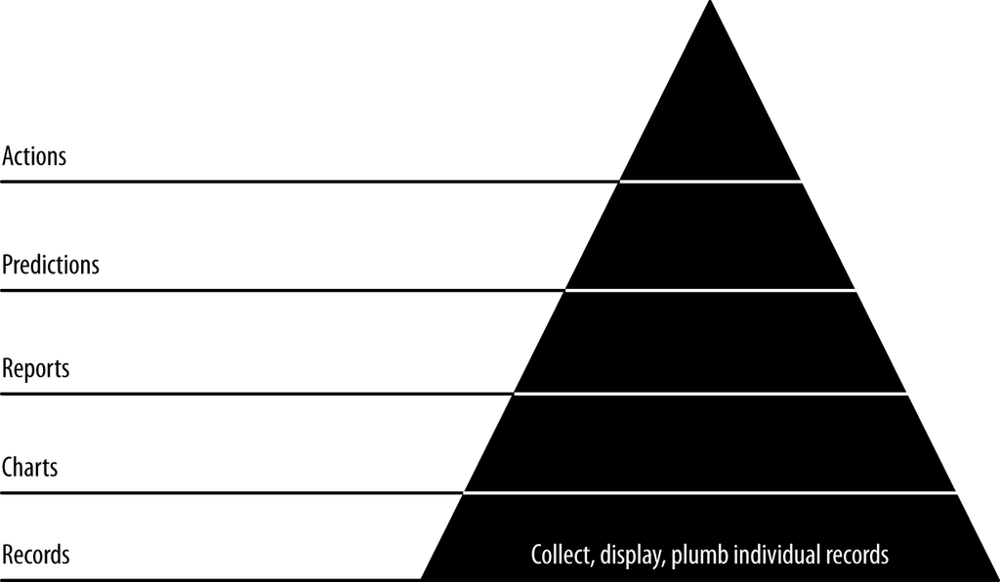

- **Collecting and Displaying Records**
  - **Putting It All Together**
    - The stack setup allows scalable iteration and improvement without repeating initial work.  
    - Atomic records represent the most granular data essential for accurate analysis.  
    - The on-time flight dataset for US flights in 2015 serves as the primary data for demonstrations.  
    - [Bureau of Transportation Statistics On-Time Performance](https://www.transtats.bts.gov/ONTIME/On_Time_Reporting_Carrier_Device_Location.asp)
  - **Collecting and Serializing Flight Data**
    - Raw flight data is downloaded and trimmed to relevant fields with manual type casting to fix schema inference issues.  
    - Data is saved efficiently in JSON Lines and Parquet formats for better performance and usability in PySpark.  
    - Parquet files are smaller and faster due to columnar storage compared to CSV and JSON formats.  
    - Serialization enables easier inspection and interaction with flight records.  
    - The sample data and code are available in the [Agile Data Science GitHub repository](https://github.com/rjurney/Agile_Data_Code_2).
  - **Processing and Publishing Flight Records**
    - Flight records are published to MongoDB using pymongo_spark integration after converting Spark DataFrames to RDDs of dictionaries.  
    - Indexes on frequent query fields (Carrier, FlightDate, FlightNum) improve MongoDB query performance significantly.  
    - The document store approach prioritizes reproducibility and operational simplicity over complex database features.  
    - Verification commands ensure data integrity and accessibility within MongoDB.
  - **Presenting Flight Records in a Browser**
    - Flask and pymongo enable serving individual flight records as JSON or rendered HTML with Jinja2 templates.  
    - bson.json_util.dumps() is required for serializing MongoDB documents to JSON in responses.  
    - Templates use inheritance and Bootstrap for consistent layout and styling.  
    - Sample templates include `flight.html` for individual flights and a layout template importing Bootstrap.  
    - Real user feedback is critical at this stage to validate assumptions and guide further feature development.  
    - Learn more about Flask view functions and template rendering at the [Flask Documentation](https://flask.palletsprojects.com/en/latest/).
  - **Listing Flights**
    - Flight listings are implemented by querying MongoDB for flights between two airports on a given date, sorted by departure and arrival times.  
    - Adding an index on {Origin, Dest, FlightDate} is essential to avoid performance issues and errors during sorting.  
    - The Flask route uses URL slugs and renders a table of flights, linking each flight to its detail page.  
    - Tables leverage Bootstrap classes for clear tabular data presentation suitable for listing flights.  
    - The listing establishes a navigable connection between individual records and aggregated views.
  - **Paginating Data**
    - Pagination controls prevent overwhelming the browser by limiting the number of flights displayed per page.  
    - Navigation offsets for "Next" and "Previous" links are calculated in Python helpers and passed to Jinja2 templates.  
    - Jinja2 macros modularize rendering of pagination links, improving template maintainability.  
    - Configurable page size is externalized in a config file for easier adjustment.  
    - This manual approach allows flexible adaptation to big data visualization needs beyond typical CRUD interfaces.  
    - Further pagination concepts are discussed in [Flask Pagination Tutorial](https://flask.palletsprojects.com/en/latest/patterns/pagination/).
  - **Searching for Flights**
    - An Elasticsearch index is created with a single shard and replica for flight data storage and search.  
    - Flight data is published to Elasticsearch via Spark integration with batched indexing to avoid overloading the cluster.  
    - Elasticsearch queries are constructed dynamically in Flask based on user-provided search parameters, including carrier, date, origin, destination, tail number, and flight number.  
    - Search results and counts are processed and rendered with pagination support in the web interface, persisting search parameters across pages.  
    - Web forms provide users with an interface to input search criteria for flights.  
    - Learn more from the [Elasticsearch Getting Started Guide](https://www.elastic.co/guide/en/elasticsearch/reference/current/getting-started.html).
