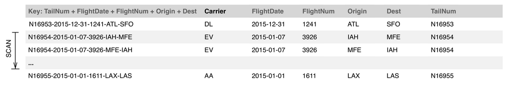

- **Chart Quality: Iteration Is Essential**  
  - Most charts fail to tell a story or yield insight due to lack of iterative improvement.  
  - Effective charts emerge through ad hoc, interactive exploratory data analysis rather than upfront specification.  
  - Agile Data Science emphasizes web-first visualization using modern JavaScript chart libraries for scalability and interactivity.  
  - Well-formed URLs enable chart generalization for different data slices.  
  - See [Data Visualization Best Practices](https://www.data-to-viz.com).

- **Scaling a Database in the Publish/Decorate Model**  
  - Different data access patterns involve trade-offs between batch processing and real-time database operations.  
  - Increasing batch processing reduces operational complexity and improves scalability.  
  - Using database features thoughtfully avoids complexity; batch computation is preferred over heavy database dependence.  
  - Database types vary in administration overhead and single points of failure, influencing design choices.

  - **First Order Form**  
    - Stores fully prepared, nested objects per chart or entity in key/value or document stores.  
    - Queries use a single unique key, offering high scalability and simple operation without complex database features.  
    - Ideal when minimal database dependency and maximum horizontal scalability are required.  
    - Consult [Key-Value Stores Overview](https://en.wikipedia.org/wiki/Key-value_database).

  - **Second Order Form**  
    - Utilizes sorted key range scans in Bigtable-like stores like HBase, enabling efficient range queries.  
    - Complex queries implemented via novel compound key design and SQL abstraction layers like Apache Phoenix.  
    - Scales well to petabyte data volumes with relatively simple operation.  
    - See [HBase Schema Design](https://www.cloudera.com/documentation/enterprise/latest/topics/hbase_schema.html).

  - **Third Order Form**  
    - Uses relational or document databases with indexing and aggregation capabilities for complex queries and joins.  
    - Supports GROUP BY and computing aggregates at query time or via pre-aggregated summaries.  
    - Increases operational complexity and may break batch processing advantages.  
    - Familiar from conventional SQL database applications.

  - **Choosing a Form**  
    - Lower-order forms simplify scaling and horizontal expansion.  
    - Databases can be used in simpler modes regardless of feature set, enhancing flexibility.  
    - Use database features conservatively and migrate complex processing to batch layers if needed.  
    - Understand database consequences to balance scalability and functionality.  
    - Refer to [Database Normalization Basics](https://www.studytonight.com/dbms/database-normalization.php).

- **Exploring Seasonality**  
  - Seasonality occurs when measures change repeatedly and consistently over time, e.g., flight volumes by month.  
  - SQL easily expresses aggregations like total flights by month for a given year.  
  - Charting flight volume data enhances insight into seasonal trends not obvious from raw tables.  
  - The example uses PySpark to query and MongoDB to store aggregated flight data.  
  - Further reading: [Seasonality in Time Series Data](https://otexts.com/fpp3/seasonality.html).

  - **Querying and Presenting Flight Volume**  
    - PySpark loads and queries flight data from Parquet files aggregated by month and year.  
    - Data is saved to MongoDB for efficient retrieval and subsequent chart generation.  
    - Flask controllers serve both HTML tables and JSON data asynchronously.  
    - Initial tables are simple but insufficient for trend recognition, motivating chart creation.

  - **Iterating on Our First Chart**  
    - Initial bar chart using D3 visualizes total flights by month but lacks immediate clarity for mode detection.  
    - Enhancements include highlighting the mode value with a distinct color using a D3 function.  
    - Iterative refinement reveals July as the busiest month at a glance.  
    - Emphasizes starting charts simple and improving via iteration.

- **Extracting Metal (Airplanes [Entities])**  
  - Entity extraction emerges as a natural step from aggregating data properties, identifying airplanes by tail number.  
  - Grouping flights by tail number creates an entity listing all flights per aircraft, enabling richer analysis.  
  - Prefers batch processing in PySpark for scalability and persistent bulk storage in MongoDB.  
  - Key entity access pattern: querying flights by a plane's unique tail number.

  - **Grouping and Sorting Data in Spark**  
    - Tail number serves as the key with flights grouped as sorted lists by date and identifiers.  
    - Combining RDD transformations and reductions produces structured dictionaries for storage.  
    - Dropping redundant tail numbers inside flight lists optimizes data size.  
    - See [PySpark RDD Transformations](https://spark.apache.org/docs/latest/rdd-programming-guide.html#transformations).

  - **Publishing Airplanes with Mongo**  
    - Activating pymongo_spark facilitates saving precomputed flight data per airplane to MongoDB.  
    - Mongo stores documents with tail numbers as keys and arrays of flights as values for efficient lookup.

  - **Serving Airplanes with Flask**  
    - Flask controller retrieves flights by tail number and renders an HTML table using Bootstrap styling.  
    - Links individual flights back to detailed flight pages, enhancing navigation.  
    - Templates iterate over flight lists to display carrier, date, flight number, and airports.

  - **Ensuring Database Performance with Indexes**  
    - Indexes in Mongo (analogous to B-tree indexes in relational DBs) optimize query speeds.  
    - Prior to indexing, queries scan thousands of documents; after, they scan only relevant entries for near-instant responses.  
    - Index creation via ensureIndex improves read performance and application responsiveness.  
    - See [MongoDB Indexing](https://docs.mongodb.com/manual/indexes/).

  - **Linking Back in to Our New Entity**  
    - Flight pages modified to link tail numbers to airplane entity pages for seamless user flow.  
    - Enhances information architecture by interconnecting related data artifacts logically.

  - **Assessing Our Airplanes**  
    - Counting distinct tail numbers in data reveals 4,897 unique airplanes for 2015 flights.  
    - Raises questions about airplane manufacturers, models, and total value for further enrichment.

- **Data Enrichment**  
  - Enhances flight data by integrating external sources, e.g., the FAA Registry containing manufacturer, model, and owner info.  
  - Enrichment is critical for adding meaningful dimensions to raw data not originally included.  
  - The FAA Registry data is not downloadable, requiring web scraping of N-Number inquiry forms.  
  - Web form submission is via HTTP GET requests, amenable to Python automation.

  - **Gathering Tail Numbers**  
    - PySpark extracts unique tail numbers and saves them as a JSON lines file for scraper input.  
    - The generated list serves as input for systematic FAA Registry inquiries.

  - **Automating Form Submission**  
    - Python's requests and BeautifulSoup libraries automate form GET submissions and HTML parsing.  
    - Script pauses between requests to comply with responsible scraping and avoid server overload.  
    - Manual development in iPython eases debugging before full loop execution.  
    - See [Python Web Scraping Tutorial](https://realpython.com/python-web-scraping-practical-introduction/).

  - **Extracting Data from HTML**  
    - Targeted data resides inside specific tables (5, 6, and 7) on FAA pages, accessed by index.  
    - Parsing table cells (td elements) extracts fields like serial number, manufacturer, model year, owner, engine details.  
    - Handling missing records via try-except ensures robustness and partial data recovery.  
    - Complete extracted records are appended to a list for later storage.

  - **Evaluating Enriched Data**  
    - Resulting JSON lines file contains 4,272 enriched records from FAA data.  
    - Joining enriched data with local tail numbers shows an 83.65% successful join rate.  
    - Evaluating join failures is necessary to assess bias or randomness in enrichment completeness.  
    - This enriched dataset enables deeper analysis in subsequent work.

- **Conclusion**  
  - Chapter covers initial data structuring via tables and charts, illuminating seasonality and entities.  
  - Demonstrates enrichment by integrating external authoritative data to enhance analysis dimensions.  
  - Emphasizes building foundations for scalable, interactive visualizations and richer information architecture.  
  - Sets the stage for advancing to report generation and deeper data exploration.
