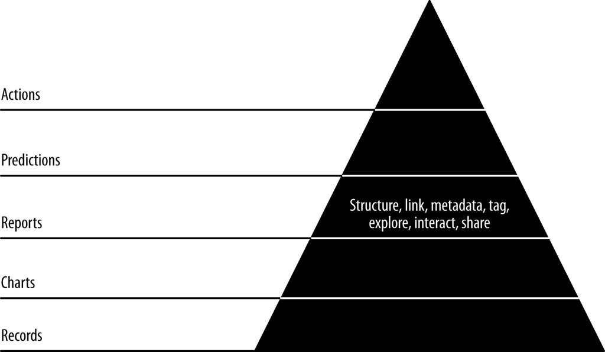

- **Extracting Airlines (Entities)**
  - Airlines are defined as groups of airplanes characterized by unique carrier codes and tail numbers.
  - Tail numbers for each airline are gathered using PySpark from on-time performance data and stored in MongoDB.
  - Airline pages are created using Flask controllers, linking tail numbers to respective airline codes with HTML templates.
  - Links to airline pages are integrated into airplane, flight, and search pages to enable data exploration.
  - A homepage listing all airlines is implemented to help users browse data without prior knowledge of carrier codes.
  - Relevant resource: [PySpark Documentation](https://spark.apache.org/docs/latest/api/python/)

- **Curating Ontologies of Semi-structured Data**
  - Interactive ontologies connect airlines, airplanes, and flights through clickable links on web pages.
  - The approach enables agile sprints with small batches of work per entity advancing browsability and data exploration.
  - Ontologies provide users with insight by allowing pivoting between related entities, serving as simple recommendations.
  - This method underpins the agile data science theme of connecting teams to ground truth through exploration.
  - Further reading: [Ontology Development 101](https://protege.stanford.edu/publications/ontology_development/ontology101.pdf)

- **Improving Airlines**
  - Carrier codes extracted from the dataset are enriched by joining with airline names from the OpenFlights dataset.
  - Airline names and carrier codes are combined using PySpark SQL operations, then stored as JSON files.
  - Wikipedia is leveraged via the Python wikipedia package and BeautifulSoup to fetch airline summaries, logos, and websites.
  - The enriched airlines data is imported into MongoDB for later integration into web pages.
  - Airline web pages are updated to display the enriched information including multimedia content and hyperlinks.
  - Relevant resource: [Wikipedia API](https://www.mediawiki.org/wiki/API:Main_page)

- **Investigating Airplanes (Entities)**
  - Airplane data is combined from FAA inquiry records and unique tail numbers, then stored as JSON files.
  - Statistical analysis is performed to summarize airplane counts by manufacturer using SQL and PySpark.
  - Percentage market shares are computed via both dataflow programming and SQL subqueries illustrating different paradigms.
  - A Flask controller and HTML template create an /airplanes page displaying manufacturer statistics.
  - Search functionality is added by indexing airplane records in Elasticsearch, enabling parameterized searches and pagination.
  - Relevant resource: [Elasticsearch Guide](https://www.elastic.co/guide/en/elasticsearch/reference/current/index.html)

- **Creating a Manufacturers Bar Chart**
  - Manufacturer count data is aggregated and stored in MongoDB to serve data for a D3.js bar chart.
  - The D3.js visualization includes labeled x and y axes showing total airplanes per manufacturer.
  - Initial chart issues (thin bars, left-shifted data) are addressed by limiting the dataset to the top 10 manufacturers.
  - The x-axis labels are truncated programmatically to prevent overlapping.
  - Further reading: [D3.js Bar Chart Examples](https://observablehq.com/@d3/bar-chart)

- **Entity Resolution: Another Chart Iteration**
  - Manufacturer name variations cause data duplication and distort market share visualization.
  - Entity resolution identifies records representing the same real-world manufacturer via longest common beginning substring heuristic.
  - PySpark joins a manually or programmatically created mapping table to unify manufacturer names.
  - A resolved airplanes dataset is generated and used to update the bar chart, improving accuracy in representing market shares.
  - Relevant resource: [Entity Resolution Tutorial](https://arxiv.org/abs/1811.08378)

- **Boeing versus Airbus Revisited**
  - The deduplicated dataset shows Boeing holds 49.04% market share, and Airbus holds 23.43% in the US commercial fleet.
  - Manual data inspection and cleaning reveal significant changes in results after entity resolution.
  - Accurate market share statistics depend on resolving raw data inconsistencies before modeling or visualization.
  - This data cleaning improves the foundation for subsequent analytic modeling and predictions.
  - Further reading: [Data Cleaning Best Practices](https://www.kdnuggets.com/2020/05/data-cleaning-best-practices.html)

- **Conclusion**
  - Creating interconnected records with key/value pairs or document models enables exploratory data analysis.
  - Lightweight web frameworks like Flask facilitate exposing data through JSON APIs and interactive pages.
  - Elaboration and enrichment of entities over time improve data utility and user engagement.
  - The next step in the data-value pyramid is prediction, demonstrated with flight delay modeling in subsequent work.
  - Relevant resource: [Flask Tutorial](https://flask.palletsprojects.com/en/latest/tutorial/)
