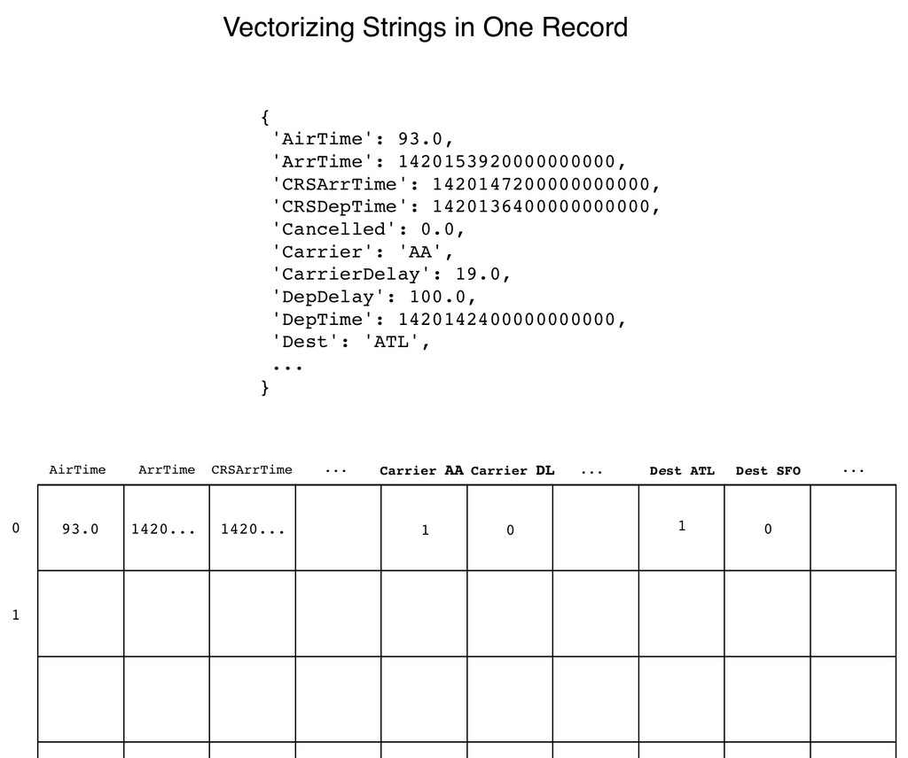

- **The Role of Predictions**
  - Statistical inference underpins many accurate forecasts, including elections and weather.
  - Machine learning (ML) enables predictions without explicit programming.
  - Nate Silver’s 538 regression model exemplifies statistical election prediction.
  - ML is complex but accessible via modern libraries.
  - See [TechTarget on Machine Learning](https://www.techtarget.com/searchenterpriseai/definition/machine-learning-ML) for ML basics.

- **Predict What?**
  - The chapter predicts flight arrival delays using historical flight data.
  - Prediction focuses on arrival delay as a practical metric for travelers.
  - Feature engineering leverages entities like airlines, airports, and flight details.

- **Introduction to Predictive Analytics**
  - Predictive analytics combines modeling, machine learning, and data mining.
  - Training data includes dependent (target) and independent (feature) variables.
  - Feature engineering is critical for creating effective predictions.
  - Agile Data Science emphasizes interactive visualization in feature engineering.
  - See [Wikipedia on Predictive Analytics](https://en.wikipedia.org/wiki/Predictive_analytics) for overview.

- **Making Predictions**
  - Two main approaches: regression (numeric output) and classification (categorical output).
  - Regression suits continuous outcomes; classification suits discrete categories.
  - Decision trees enable both regression and classification.
  - Model choice depends on business context and interface considerations.

- **Features**
  - Features are properties or fields of example data used for prediction.
  - Feature importance helps identify which features impact model accuracy most.
  - Decision trees provide insights into feature importance.
  - Feature engineering may require creating new features from raw data.

- **Regression**
  - Linear regression predicts a numerical dependent variable from independent variables.
  - It models cause and effect relationships using least-squares fitting.
  - Flight delay in minutes is an example of a suitable regression target.
  - See [Stat Trek on Linear Regression](https://stattrek.com/regression/linear-regression.aspx) for tutorials.

- **Classification**
  - Classification converts continuous variables into discrete buckets.
  - Flight delays are bucketed to categories like on time, slightly late, very late.
  - Categorization simplifies prediction and interface presentation.

- **Exploring Flight Delays**
  - Flights arrive late 35.9% of the time in the dataset.
  - Average departure delay is 9.4 minutes; average arrival delay is 4.4 minutes.
  - Carrier and NAS (National Airspace System) delays dominate delay causes.
  - Weather and security delays are comparatively rare.
  - Source delay definitions from [FAA website](https://www.faa.gov).

- **Extracting Features with PySpark**
  - Selected features include FlightNum, FlightDate, Carrier, origin/destination, delays, and scheduled times.
  - Null delay entries are filtered out.
  - Datetime fields are converted into proper timestamp formats for modeling.
  - Data is explicitly sorted to ensure consistent order.
  - Data is exported as compressed JSON Lines file for downstream modeling.

- **Building a Regression with scikit-learn**
  - scikit-learn (sklearn) is used to build a “quick and dirty” predictive model.
  - Large dataset (5.4 million records) may require sampling down to 1 million for memory.
  - Arrival delay chosen as the regression target.
  - Features are vectorized with DictVectorizer to convert categorical data into numeric form.
  - Cross-validation using train-test split prevents overfitting.
  - LinearRegression is trained and evaluated using median absolute error and R2 score.
  - Model shows median error around 9.93 minutes and R2 of 0.829.
  - Visualization shows predicted vs actual delay correlation.
  - See [scikit-learn documentation](https://scikit-learn.org/stable/) for usage examples.

- **Building a Classifier with Spark MLlib**
  - Spark MLlib scales machine learning across large datasets using DataFrames.
  - Training data loaded with explicit schema including typed fields.
  - Null values detected and addressed to prevent errors.
  - FlightNum replaced with a route feature combining origin and destination airports.
  - Continuous arrival delay bucketized into four categorical bins for classification.
  - Bucketization performed via both custom UDF and Spark’s Bucketizer.
  - Nominal string columns indexed with StringIndexer for vectorization.
  - Continuous and indexed features combined with VectorAssembler into feature vectors.
  - Data split into training and test sets using randomSplit.
  - RandomForestClassifier used for multi-class classification.
  - maxBins parameter adjusted for large number of feature values.
  - Model evaluated with MulticlassClassificationEvaluator yielding ~59.7% accuracy.
  - Prediction distribution sanity-checked to confirm reasonable class proportions.
  - See [Spark MLlib Guide](https://spark.apache.org/docs/latest/ml-guide.html) for detailed API.

- **Conclusion**
  - Spark enables scalable training on datasets too large for sklearn on single machines.
  - Prediction models require deployment strategies, especially for Spark ML models.
  - Next steps involve deploying models to production applications.
  - Iterative model improvement planned in subsequent chapters.
