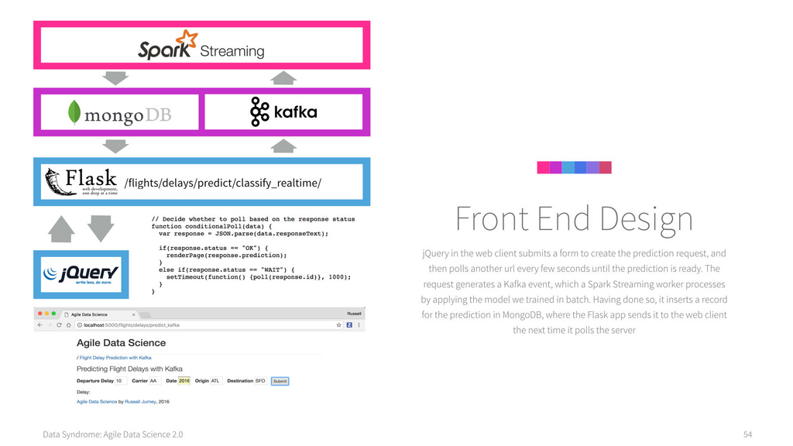

- **Deploying Predictive Systems**
  - **Deploying a scikit-learn Application as a Web Service**
    - Model and feature vectorizer must be saved and loaded to serve predictions.
    - API input often requires derivation and enrichment of features for prediction.
    - Example includes flight delay regression with derived fields like date features and distance lookup.
    - Testing is performed via curl and a simple web form integration.
    - See [scikit-learn serialization](https://scikit-learn.org/stable/modules/model_persistence.html) for model saving/loading.
  - **Saving and Loading Models**
    - Models and vectorizers can be saved using pickle or joblib with simple interfaces.
    - pickle is a general serialization utility; joblib offers concise methods specific to sklearn.
    - Proper environment setup is needed to load models regardless of working directory.
  - **Groundwork for Serving Predictions**
    - Input data must be user-friendly; users supply minimal arguments which are expanded for the model.
    - Limitations exist when essential real-time data is unavailable, constraining deployable model features.
  - **Creating Our Flight Delay Regression API**
    - Loads models at application startup.
    - Accepts and processes API fields, deriving extra features such as distance and date components.
    - Vectorizes processed features before making predictions and returning JSON responses.
  - **Filling in the predict_utils API**
    - Distance between origin and destination airports is precomputed and stored in MongoDB.
    - Date arguments are parsed to derive day of month, day of week, and day of year using iso8601 and datetime.
    - Utilities enable real-time feature derivation compatible with model input.
  - **Testing Our API**
    - curl tests POST requests with flight data fields to predict flight delay.
    - Successful responses return JSON with predicted delay values.
  - **Pulling Our API into Our Product**
    - Web form generated dynamically with Jinja templates using a configuration array.
    - JavaScript with jQuery handles form submission and displays prediction results inline.
    - Example produces a minimal but functional user interface for flight delay prediction.
  - **Deploying Spark ML Applications in Batch with Airflow**
    - Deployment complexity increases due to Spark’s batch processing paradigm.
    - Airflow is used to schedule and orchestrate the pipeline components.
    - The batch pipeline involves extraction, training, request gathering, prediction, and result storage.
    - Tasks are executed daily, suitable for workloads such as email recommender systems.
    - Refer to [Apache Airflow documentation](https://airflow.apache.org/docs/) for scheduling details.
  - **Gathering Training Data in Production**
    - Adapted PySpark scripts are used to extract training data into JSON files on disk.
    - Conditional Spark context/session initialization supports development and production modes.
    - Scripts are executable via command line to facilitate Airflow integration.
  - **Training, Storing, and Loading Spark ML Models**
    - Models and feature transformers such as bucketizers, indexers, and vector assemblers are saved to disk.
    - Storing the complete transformation pipeline ensures consistent feature processing at prediction time.
    - Loading the models avoids retraining, reducing latency in production.
  - **Creating Prediction Requests in Mongo**
    - Web applications store prediction requests as MongoDB documents for batch processing.
    - Augmentation such as timestamps and derived features are added before storage.
    - BSON and JSON serialization utilities handle datetime fields appropriately.
  - **A frontend for generating prediction requests**
    - Similar to scikit-learn forms but submits requests that create MongoDB records rather than immediate predictions.
    - Simple user interface with confirmation upon successful task submission.
  - **Fetching Prediction Requests from MongoDB**
    - PySpark scripts query MongoDB for daily prediction requests using ISO8601 date filters.
    - Data is stored in date-partitioned directories to enable easy incremental processing.
    - Explicit removal of directories ensures overwrite and idempotency for batch runs.
  - **Making Predictions in a Batch with Spark ML**
    - Loads persisted models and applies transformations to incoming prediction requests.
    - Predicts using the trained classifier and stores outputs as daily JSON files.
    - Outputs include predicted classes along with input features for traceability.
  - **Storing Predictions in MongoDB**
    - Prediction results are read back and stored in a MongoDB collection.
    - This enables web applications to query and display prediction outcomes.
    - Utilizes PySpark’s MongoDB connector for efficient storage.
  - **Displaying Batch Prediction Results in Our Web Application**
    - Web controllers query MongoDB for daily prediction results by date range.
    - Jinja templates render results in a table with decoding of prediction classes into human-readable categories.
    - Enables end-user viewing of batch-generated predictions via a web interface.
  - **Automating Our Workflow with Apache Airflow (Incubating)**
    - Airflow DAGs define the scheduling and dependencies of batch tasks.
    - BashOperators execute PySpark scripts with parameterized commands.
    - Separate DAGs for model training and daily prediction pipelines are created.
    - Command-line Airflow utilities enable testing of tasks and DAG runs.
    - Web interface provides task monitoring and graphical dependency views.
  - **Deploying Spark ML via Spark Streaming**
    - Real-time prediction deployment uses Kafka for messaging and Spark Streaming for processing.
    - Models are reused from batch-trained versions but applied continuously on incoming streams.
    - Best suited for workloads needing low-latency predictions but limited to single model usage.
  - **Sending Prediction Requests to Kafka**
    - Kafka topic is created to receive prediction requests as events.
    - Zookeeper and Kafka server must be started; topics verified via CLI tools.
    - Kafka Consumers enable real-time monitoring of incoming events.
    - Refer to [Apache Kafka documentation](https://kafka.apache.org/documentation/) for Kafka setup.
  - **Feeding Kafka recommendation tasks from a Flask API**
    - Flask API produces prediction request messages to Kafka with unique UUIDs for traceability.
    - Utilizes kafka-python client with JSON-serialized event payloads.
    - API responses include status acknowledgment and assigned UUID.
  - **A frontend for generating prediction requests**
    - Web page includes a form that submits prediction requests to the Kafka-emitting API.
    - Implements polling of a separate endpoint to fetch prediction results asynchronously.
    - Design pattern inspired by LinkedIn InMaps for asynchronous computation and retrieval.
  - **Polling requests and LinkedIn InMaps**
    - Frontend implements periodic polling with delay to await prediction completion.
    - Two separate API endpoints: one for submitting requests, another for fetching prediction results by UUID.
    - Polling responses indicate whether to wait or display prediction.
    - Insertion of prediction results into MongoDB enables reply retrieval upon readiness.
    - This architecture decouples request submission from response delivery, improving UI responsiveness.
