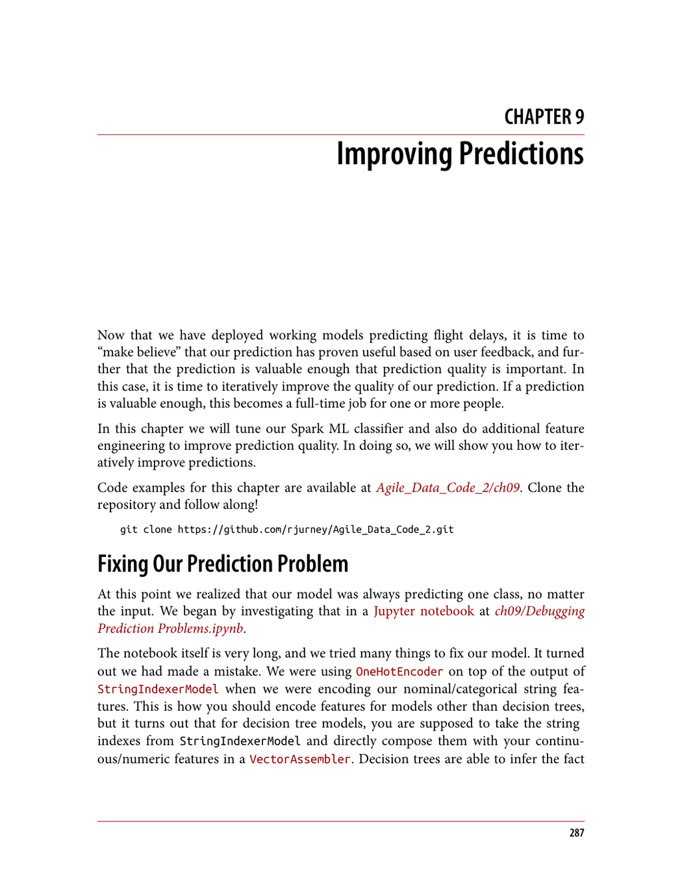

- **Fixing Our Prediction Problem**
  - The model incorrectly always predicted one class due to misuse of OneHotEncoder on StringIndexer outputs for categorical features.
  - Decision tree models require directly using StringIndexer indexes combined with numeric features, allowing better interpretability of feature importances.
  - The mistake and fix process is detailed in a Jupyter notebook for debugging prediction problems.
  - For further reading, see the official [Spark ML Feature Transformation Guide](https://spark.apache.org/docs/latest/ml-features.html).

- **When to Improve Predictions**
  - Prediction improvement is only worthwhile if the predictions prove useful and valuable to users.
  - Initial models should be fast and crude to establish minimum viable products (MVPs).
  - Extensive tuning is resource-intensive; engagement with users is essential before committing to improvement.
  - See [Lean Startup Principles](https://leanstartup.co/) for MVP and user feedback strategies.

- **Improving Prediction Performance**
  - Two main approaches: tuning model hyperparameters and feature engineering, with emphasis on the latter.
  - Feature engineering uses insights from exploratory data analysis to provide the algorithm with more relevant input.
  - Hyperparameter tuning is covered in Spark ML documentation on [Model Selection and Tuning](https://spark.apache.org/docs/latest/ml-tuning.html).

- **Experimental Adhesion Method: See What Sticks**
  - Quickly select all easy-to-compute features and test with decision tree models to evaluate feature importance.
  - Retain most important features to form the base model.
  - Use feature importances to guide subsequent feature creation, removal, or data acquisition.
  - The process is iterative, logical, and systematic.
  - Reference: [Feature Engineering Techniques](https://www.analyticsvidhya.com/blog/2020/10/feature-engineering-techniques/).

- **Establishing Rigorous Metrics for Experiments**
  - Use multiple metrics: accuracy, weighted precision, weighted recall, and f1 score for classification evaluation.
  - Metrics provide complementary views on prediction quality: accuracy measures correctness, precision measures usefulness, recall measures completeness, and f1 combines precision and recall.
  - Cross-validation by repeating experiments multiple times improves confidence in evaluation.
  - Refer to [Spark ML MulticlassClassificationEvaluator](https://spark.apache.org/docs/latest/api/python/reference/api/pyspark.ml.evaluation.MulticlassClassificationEvaluator.html).

- **Implementing a More Rigorous Experiment**
  - Run multiple (e.g., three) train/test splits and evaluate model for each metric on each split.
  - Store scores in a dictionary of lists for aggregation.
  - Compute average and standard deviation of scores to assess stability and variation.
  - Balance between thorough cross-validation and experimental efficiency to avoid discouragement.
  - Spark provides tools for model evaluation and cross-validation: [CrossValidator](https://spark.apache.org/docs/latest/ml-tuning.html#cross-validation).

- **Comparing Experiments to Determine Improvements**
  - Automate experiment logging using pickle files to persist metric averages and compare runs.
  - Compute the delta (change) in metrics between current and previous runs to detect improvements or degradation.
  - Print experiment reports to easily track model progress.
  - This process supports data-driven decision making in feature engineering.
  - See standard Python serialization with [pickle](https://docs.python.org/3/library/pickle.html).

- **Inspecting Changes in Feature Importance**
  - Collect feature importances from the RandomForestClassificationModel for each experimental run.
  - Compute average importance per feature and sort descending to identify key contributors.
  - Persist and compare feature importance logs across runs to assess feature impact over time.
  - Use feature deltas to decide which features to add or remove to improve model accuracy.
  - Feature importance is critical for interpretability and model refinement in decision trees.
  - Further info at [Understanding Random Forest Feature Importance](https://machinelearningmastery.com/calculate-feature-importance-with-python/).

- **Time of Day as a Feature**
  - Scheduled departure and arrival hours show meaningful correlation with flight delay averages.
  - Flights at 1 PM are about 10 minutes late on average; those at 11 PM tend to be early.
  - Construct features for flight hour of day from CRSDepTime and CRSArrTime timestamps.
  - Adding these features increased feature importance but only marginally improved model accuracy.
  - Temporal features affect delay patterns, but more advanced time series analysis is required for larger gains.
  - Reference SQL time functions: [Spark SQL Built-in Functions](https://spark.apache.org/docs/latest/api/sql/index.html#datetime-functions).

- **Incorporating Airplane Data**
  - Joined airplane metadata to flight features via TailNum with left outer join.
  - Nulls in airplane data are replaced with 'Empty' strings to maintain model compatibility and signal missingness.
  - Added aircraft-related categorical features such as EngineManufacturer, Manufacturer, and OwnerState.
  - Initial inclusion of airplane features decreased overall model performance despite some increase in TailNum importance.
  - Removal of less important airplane features plus DayOfMonth and DayOfWeek produced a slight positive impact.
  - Model simplicity is preferred; unhelpful features should be dropped to improve interpretability and speed.
  - See FAA aircraft registry data for contextual understanding: [FAA Registry](https://registry.faa.gov/aircraftinquiry/).

- **Incorporating Flight Time**
  - Computed flight duration via unix_timestamp subtraction of CRSArrTime minus CRSDepTime.
  - Added FlightTime as a numeric feature to the model.
  - Inclusion of FlightTime improved weighted precision significantly and contributed meaningfully to feature importance.
  - FlightTime feature helps reduce importance of Distance and DepDelay, reflecting conceptual similarity.
  - Flight duration is a valuable predictor for flight delay models when combined with other temporal and distance features.
  - See Spark SQL timestamp functions: [unix_timestamp](https://spark.apache.org/docs/latest/api/sql/index.html#unix_timestamp).
