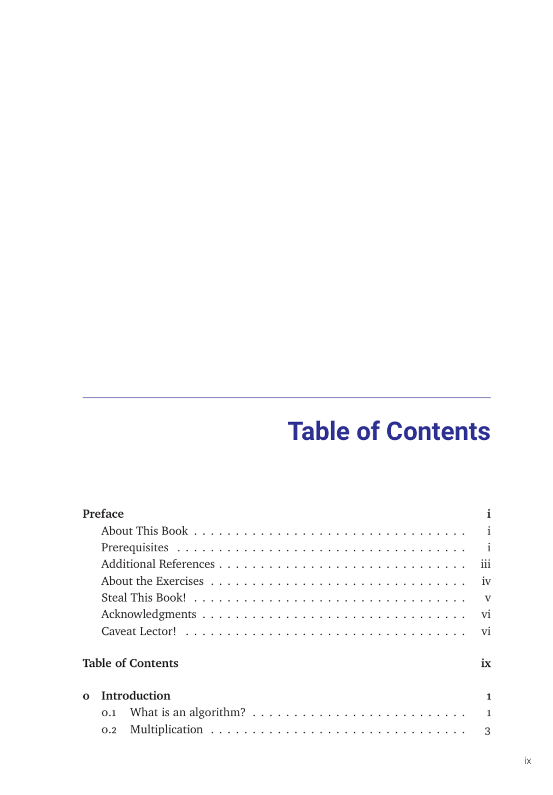

- **Preface**
  - **About This Book**
    - Introduces the scope and purpose of the book.
    - Establishes expectations for reader engagement.
    - Suggests foundational knowledge necessary for comprehension.
    - Further reading: [How to Read a Book](https://en.wikipedia.org/wiki/How_to_Read_a_Book)
  - **Prerequisites**
    - Details the assumed background knowledge for readers.
    - Highlights important concepts readers should understand before proceeding.
    - Encourages review of specified topics for optimal learning.
    - Further reading: [Khan Academy: Prerequisites](https://www.khanacademy.org)
  - **Additional References**
    - Lists supplemental resources that complement book contents.
    - Guides readers to authoritative texts for extended learning.
  - **About the Exercises**
    - Explains the role and structure of exercises throughout the book.
    - Encourages active practice to reinforce concepts.
  - **Steal This Book!**
    - Advocates open sharing and dissemination of knowledge.
    - Addresses copyright and usage considerations.
  - **Acknowledgments**
    - Credits contributors and influences behind the book's creation.
  - **Caveat Lector!**
    - Provides cautionary advice for readers interpreting the material.
    - Emphasizes critical thinking and scrutiny when reading.

- **0 Introduction**
  - **What is an algorithm?**
    - Defines the concept of an algorithm.
    - Establishes algorithms as step-by-step procedures for problem-solving.
    - Further reading: [Introduction to Algorithms](https://mitpress.mit.edu/books/introduction-algorithms-third-edition)
  - **Multiplication**
    - Discusses methods of multiplication including classical and alternative techniques.
    - Covers "Lattice Multiplication," "Duplication and Mediation," and "Compass and Straightedge" approaches.
  - **Congressional Apportionment**
    - Examines the problem of distributing seats proportionally.
    - Details historical and practical challenges.
  - **A Bad Example**
    - Presents a flawed algorithm to illustrate common pitfalls.
  - **Describing Algorithms**
    - Explores how to formally specify problems and describe algorithms.
  - **Analyzing Algorithms**
    - Covers correctness proofs and measuring running time.
  - **Exercises**
    - Reinforces introductory concepts through practice problems.

- **1 Recursion**
  - **Reductions**
    - Defines reductions as a means to transform problems into simpler forms.
  - **Simplify and Delegate**
    - Encourages breaking complex problems into manageable subproblems.
  - **Tower of Hanoi**
    - Demonstrates recursion via the classic Tower of Hanoi puzzle.
  - **Mergesort**
    - Details the divide-and-conquer recursive sorting algorithm.
    - Covers correctness and performance analysis.
    - Further reading: [Mergesort Algorithm](https://en.wikipedia.org/wiki/Merge_sort)
  - **Quicksort**
    - Describes the recursive sorting method using partitioning.
    - Discusses correctness and average-case analysis.
  - **The Pattern**
    - Identifies recurring themes in recursive algorithm design.
  - **Recursion Trees**
    - Introduces a visual tool to analyze recursive running time.
  - **Linear-Time Selection**
    - Explains an efficient recursive algorithm for selecting order statistics.
  - **Fast Multiplication**
    - Presents recursive techniques for accelerating multiplication.
  - **Exponentiation**
    - Describes recursive methods to perform fast powering.
  - **Exercises**
    - Contains problems reinforcing recursion concepts.

- **2 Backtracking**
  - **N Queens**
    - Introduces a backtracking solution to place N queens on a chessboard safely.
  - **Game Trees**
    - Explores modeling games with trees for decision making.
  - **Subset Sum**
    - Presents the subset sum problem and backtracking solutions.
    - Discusses correctness, analysis, and variants.
  - **The General Pattern**
    - Distills common structures underlying backtracking algorithms.
  - **String Segmentation (Interpunctio Verborum)**
    - Applies backtracking to the problem of segmenting strings into words.
  - **Longest Increasing Subsequence**
    - Explains backtracking approaches to find the longest increasing subsequence.
  - **Longest Increasing Subsequence, Take 2**
    - Presents an optimized variant of the previous algorithm.
  - **Optimal Binary Search Trees**
    - Discusses backtracking methods in constructing optimal BSTs.
  - **Exercises**
    - Contains exercises to practice backtracking techniques.

- **3 Dynamic Programming**
  - **Mātrāvr̥tta**
    - Explains the transition from backtracking to dynamic programming.
    - Introduces memoization and efficient computation strategies.
  - **Aside: Even Faster Fibonacci Numbers**
    - Addresses mathematical techniques to accelerate Fibonacci computations.
  - **Interpunctio Verborum Redux**
    - Revisits string segmentation with dynamic programming improvements.
  - **The Pattern: Smart Recursion**
    - Describes patterns for converting naive recursive algorithms into dynamic programs.
  - **Warning: Greed is Stupid**
    - Advises against using greedy methods when dynamic programming is appropriate.
  - **Longest Increasing Subsequence**
    - Details dynamic programming solutions for this classic problem.
  - **Edit Distance**
    - Covers algorithms to compute the minimal edits transforming one string into another.
  - **Subset Sum**
    - Reexamines subset sum with dynamic programming techniques.
  - **Optimal Binary Search Trees**
    - Presents DP methods to optimize BST construction.
  - **Dynamic Programming on Trees**
    - Extends DP techniques to tree-structured data.
  - **Exercises**
    - Includes problems to solidify dynamic programming skills.

- **4 Greedy Algorithms**
  - **Storing Files on Tape**
    - Discusses greedy methods for arranging data optimally on storage media.
  - **Scheduling Classes**
    - Applies greedy strategies to maximize class scheduling efficiency.
  - **General Structure**
    - Outlines common principles underlying greedy algorithms.
  - **Huffman Codes**
    - Details the greedy approach to variable-length prefix coding.
  - **Stable Matching**
    - Explains stable matching algorithms including Gale-Shapley.
    - Covers algorithmic correctness and running time.
  - **Exercises**
    - Provides practice related to greedy techniques.

- **5 Basic Graph Algorithms**
  - **Introduction and History**
    - Reviews fundamental concepts and historical development of graph algorithms.
  - **Basic Definitions**
    - Establishes terminology for vertices, edges, and graph types.
  - **Representations and Examples**
    - Describes adjacency lists and matrices.
  - **Data Structures**
    - Compares adjacency lists and matrices for storage efficiency.
  - **Whatever-First Search**
    - Introduces generic graph search algorithms.
  - **Important Variants**
    - Covers depth-first, breadth-first, best-first search variants and directed/disconnected graphs.
  - **Graph Reductions**
    - Discusses simplifying graphs through reductions like flood fill.
  - **Exercises**
    - Challenges readers to apply basic graph algorithms.

- **6 Depth-First Search**
  - **Preorder and Postorder**
    - Explains traversal orders and vertex/edge classification.
  - **Detecting Cycles**
    - Presents DFS-based cycle detection methods.
  - **Topological Sort**
    - Uses DFS for ordering vertices in directed acyclic graphs.
  - **Memoization and Dynamic Programming**
    - Shows DP applications in DAGs via DFS.
  - **Strong Connectivity**
    - Defines strongly connected components.
  - **Strong Components in Linear Time**
    - Details linear-time algorithms by Kosaraju, Sharir, and Tarjan.
  - **Exercises**
    - Reinforces understanding of DFS and its applications.

- **7 Minimum Spanning Trees**
  - **Distinct Edge Weights**
    - Discusses MST uniqueness conditions.
  - **The Only Minimum Spanning Tree Algorithm**
    - Introduces the fundamental MST algorithm principle.
  - **Borůvka’s Algorithm**
    - Presents an early MST algorithm beneficial for parallelism.
  - **Jarník’s (“Prim’s”) Algorithm**
    - Describes a greedy MST approach, with potential improvements.
  - **Kruskal’s Algorithm**
    - Details MST construction via edge sorting and union-find.
  - **Exercises**
    - Includes problems to practice MST algorithms.

- **8 Shortest Paths**
  - **Shortest Path Trees**
    - Defines shortest path trees and their significance.
  - **Negative Edges**
    - Addresses complications introduced by negative-weight edges.
  - **The Only SSSP Algorithm**
    - Introduces the base single-source shortest path approach.
  - **Unweighted Graphs: Breadth-First Search**
    - Uses BFS for shortest paths in unweighted graphs.
  - **Directed Acyclic Graphs: Depth-First Search**
    - Utilizes DFS for shortest paths in DAGs.
  - **Best-First: Dijkstra’s Algorithm**
    - Explains Dijkstra's algorithm and its limitations with negative edges.
  - **Relax ALL the Edges: Bellman-Ford**
    - Covers Bellman-Ford algorithm handling negative edges and dynamic programming formulation.
  - **Exercises**
    - Provides practice questions on shortest path problems.

- **9 All-Pairs Shortest Paths**
  - **Introduction**
    - Introduces the all-pairs shortest path problem.
  - **Lots of Single Sources**
    - Discusses computing shortest paths from multiple sources.
  - **Reweighting**
    - Covers techniques to handle negative weights via reweighting.
  - **Johnson’s Algorithm**
    - Presents an efficient algorithm for sparse graphs with negative edges.
  - **Dynamic Programming**
    - Uses DP to solve all-pairs shortest paths.
  - **Divide and Conquer**
    - Applies divide-and-conquer strategies to shortest paths.
  - **Funny Matrix Multiplication**
    - Explores matrix multiplication analogies in graph algorithms.
  - **(Kleene-Roy-)Floyd-Warshall(-Ingerman)**
    - Details the Floyd-Warshall algorithm for dense graphs.
  - **Exercises**
    - Reinforces all-pairs shortest path techniques.

- **10 Maximum Flows & Minimum Cuts**
  - **Flows**
    - Defines network flows and related constraints.
  - **Cuts**
    - Explains cuts and their role in flow networks.
  - **The Maxflow-Mincut Theorem**
    - States and proves the fundamental max-flow min-cut duality.
  - **Ford and Fulkerson’s augmenting-path algorithm**
    - Presents the classic augmenting path method and considerations on irrational capacities.
  - **Combining and Decomposing Flows**
    - Discusses flow superposition and decomposition.
  - **Edmonds and Karp’s Algorithms**
    - Introduces optimizations using shortest and fattest augmenting paths.
  - **Further Progress**
    - Surveys advancements beyond the basic max-flow algorithms.
  - **Exercises**
    - Includes practice on flows and cuts.

- **11 Applications of Flows and Cuts**
  - **Edge-Disjoint Paths**
    - Applies flow techniques to find edge-disjoint paths.
  - **Vertex Capacities and Vertex-Disjoint Paths**
    - Extends flow models to vertex constraints.
  - **Bipartite Matching**
    - Uses flows to solve bipartite matching problems.
  - **Tuple Selection**
    - Addresses exam scheduling as a flow problem.
  - **Disjoint-Path Covers**
    - Covers minimal teaching assignments via disjoint paths.
  - **Baseball Elimination**
    - Models baseball elimination with flow algorithms.
  - **Project Selection**
    - Utilizes flows for optimizing project choices.
  - **Exercises**
    - Provides problems coupling flows with practical applications.

- **12 NP-Hardness**
  - **A Game You Can’t Win**
    - Introduces a problem illustrating NP-hardness.
  - **P versus NP**
    - Reviews the foundational complexity theory question.
  - **NP-hard, NP-easy, and NP-complete**
    - Defines key complexity classes.
  - **Formal Definitions (HC SVNT DRACONES)**
    - Provides rigorous definitions for complexity classes.
  - **Reductions and Sat**
    - Explains reductions and the satisfiability problem.
  - **3Sat (from Sat)**
    - Details the transformation to 3-CNF SAT problems.
  - **Maximum Independent Set (from 3Sat)**
    - Reduces 3Sat to maximum independent set problem.
  - **The General Pattern**
    - Identifies common themes in NP-completeness proofs.
  - **Clique and Vertex Cover (from Independent Set)**
    - Shows reductions among classic NP-complete problems.
  - **Graph Coloring (from 3Sat)**
    - Discusses reduction techniques to graph coloring.
  - **Hamiltonian Cycle**
    - Covers various reductions proving NP-completeness.
  - **Subset Sum (from Vertex Cover)**
    - Illustrates subset sum's NP-completeness.
  - **Other Useful NP-hard Problems**
    - Lists additional NP-hard problems relevant to algorithm design.
  - **Choosing the Right Problem**
    - Advises on problem selection for algorithmic approaches.
  - **A Frivolous Real-World Example**
    - Provides an illustrative real-world NP-hard problem.
  - **On Beyond Zebra**
    - Discusses extensions into polynomial space and exponential time complexities.
  - **Exercises**
    - Contains exercises to deepen understanding of NP-hardness concepts.

- **Image Credits**
  - Lists sources and attributions for images used in the book.

- **Colophon**
  - Provides publication and typesetting information.
