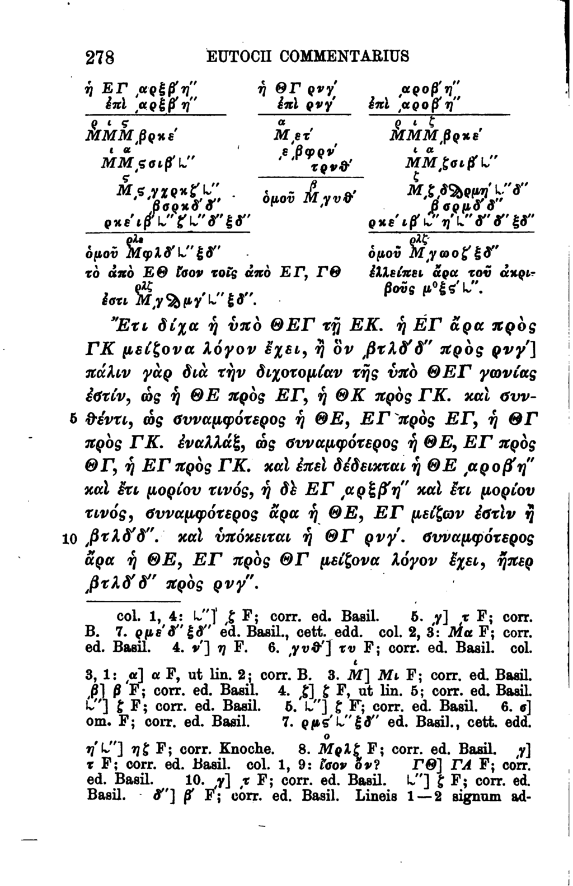

- **Preface**
  - **About This Book**
    - The book originated from lecture notes for algorithms classes at the University of Illinois at Urbana-Champaign.
    - It covers fundamental algorithmic material suited for a junior-level theory course.
  - **Prerequisites**
    - Requires knowledge in discrete mathematics, proof techniques, iterative programming, and fundamental data structures.
    - Familiarity with asymptotic notation and mathematical maturity in formal proofs is necessary.
    - Recommended supplementary materials include textbooks by Fleck, Lehman et al., and Morin.
  - **Additional References**
    - Lists influential textbooks and resources like Aho-Hopcroft-Ullman, Cormen et al., and Knuth.
    - Suggests consulting multiple sources to gain diverse perspectives on algorithms.
  - **About the Exercises**
    - Exercises are clustered by theme rather than difficulty.
    - They serve as practice opportunities, not mere problem-solving targets.
    - No official solutions are provided, encouraging independent problem-solving.
  - **Steal This Book!**
    - The book is Creative Commons licensed for free use and adaptation with attribution.
    - Materials include lecture notes, homeworks, exams, and are regularly updated.
    - Instructors are encouraged to supplement and share their own materials openly.
  - **Acknowledgments**
    - Thanks numerous students, teaching assistants, and colleagues for contributions and feedback.
    - Mentions influence from notable teachers and prior courses.
  - **Caveat Lector!**
    - Acknowledges the presence of errors and invites readers to report them via GitHub.
    - Emphasizes the evolving nature of the book's content and welcomes all feedback.

- **0 Introduction**
  - **0.1 What is an algorithm?**
    - Defines an algorithm as a precise, mechanically executable sequence of instructions.
    - Explains the historical origin of the word "algorithm" from al-Khwārizmī’s works.
    - Highlights the evolution of numerical notation and algorithmic concepts from India, Arabia, and Europe.
  - **0.2 Multiplication**
    - Describes lattice multiplication as a historical O(mn)-time algorithm from various ancient cultures.
    - Introduces peasant multiplication relying on operations like addition, halving, and parity.
    - Explains compass-and-straightedge constructions as geometric algorithms operating in constant time in an idealized model.
  - **0.3 Congressional Apportionment**
    - Presents the Huntington-Hill apportionment method used in US House representation.
    - Shows the algorithm allocates seats based on state populations using a priority queue data structure.
    - Compares related proportional representation algorithms used worldwide.
  - **0.4 A Bad Example**
    - Provides Martin’s algorithm as a non-algorithmic example due to vague instructions.
    - Emphasizes that algorithms must be executable on standard computers with clear primitive operations.
  - **0.5 Describing Algorithms**
    - Stresses the importance of precise problem specification, algorithm description, correctness proof, and running time analysis.
    - Advises writing clearly for a competent but skeptical programmer.
    - Recommends describing algorithms using pseudocode and structured English over informal prose.
  - **0.6 Analyzing Algorithms**
    - Requires proving algorithms correct for all inputs, commonly via induction.
    - Uses asymptotic analysis to measure running time as input size grows.
    - Recognizes running time depends on the implementation of primitive operations and data structures.
    - Mentions alternative computational resources beyond time, such as space or memory.

- **1 Recursion**
  - **1.1 Reductions**
    - Defines reduction as using one problem's algorithm as a black box to solve another problem.
    - Explains correctness depends on black box correctness, not its internal workings.
    - Illustrates with multiplication reducing to addition, halving, and parity.
  - **1.2 Simplify and Delegate**
    - Describes recursion as reducing a problem to simpler instances of the same problem.
    - Requires base cases to prevent infinite recursion.
    - Introduces the “Recursion Fairy” metaphor for the induction hypothesis.
  - **1.3 Tower of Hanoi**
    - Introduces the puzzle and its history through Lucas and Parville.
    - Presents a recursive algorithm reducing n-disk moves to two moves of n−1 disks plus one largest disk move.
    - Proves correctness via induction with base case n=0, doing nothing.
    - Derives running time recurrence T(n) = 2T(n−1)+1 with solution T(n) = 2^n − 1.
  - **1.4 Mergesort**
    - Outlines mergesort dividing input into halves, recursively sorting, and merging.
    - Details the merge procedure which combines two sorted arrays.
    - Proves merge and mergesort correctness via induction.
    - Analyzes running time with recurrence T(n) = 2T(n/2) + O(n), solving to O(n log n).
  - **1.5 Quicksort**
    - Defines quicksort choosing a pivot, partitioning the array, and recursively sorting partitions.
    - Describes Lomuto partitioning algorithm.
    - Proves correctness using loop invariants and induction.
    - Analyzes running time with recurrence T(n) = T(r−1) + T(n−r) + O(n); worst-case is O(n²), best-case O(n log n).
    - Notes randomized pivot selection achieves expected O(n log n) time under uniform assumptions.
  - **1.6 The Pattern**
    - Identifies divide and conquer pattern as dividing, delegating, and combining solutions.
    - Indicates correctness proofs usually require induction.
    - Notes running time analysis typically involves setting up and solving recurrences.
  - **1.7 Recursion Trees**
    - Explains recursion trees as a pictorial tool representing recursive calls and their costs per level.
    - Describes construction of the recursion tree for recurrences T(n) = r T(n/c) + f(n).
    - Shows total running time as the sum of all nodes’ costs across levels.
    - Demonstrates tree depth L = log_c n and leaf count r^L = n^(log_c r).
    - Provides a formula for total time as sum over levels of r^i * f(n/c^i).
    - Cites base cases for asymptotic simplification and ease of analysis.
