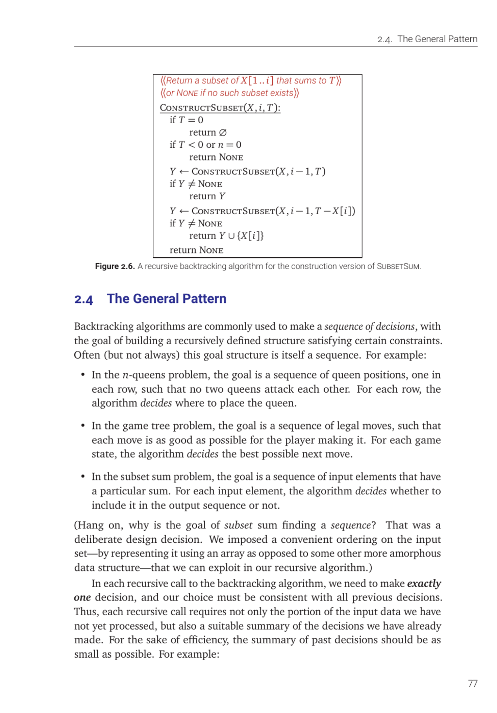

- **3. Dynamic Programming**
  - **3.1. Mātrāvr.tta**
    - The section introduces recursion from classical Sanskrit prosody, focusing on meters with fixed beats of light and heavy syllables.  
    - It explains Virahān.ka’s recurrence relating the count of meters for n beats to counts for n-1 and n-2 beats.  
    - The Fibonacci numbers are presented as the well-known sequence satisfying a similar recurrence, linking to Virahān.ka’s formula.  
    - Naive recursive Fibonacci computation is analyzed and shown to be exponentially slow due to repeated computations.  
    - Memoization is introduced as a technique to improve recursion efficiency by caching and reusing computed results.  
    - Dynamic programming is described as the deliberate bottom-up filling of tables, exemplified by iterative Fibonacci computation.  
    - Historical context traces dynamic programming to ancient Indian scholars, Leonardo Pisano, and modern formalization by Bellman.  
    - Space optimization techniques for dynamic programming, such as storing only necessary intermediate results, are discussed.  
    - For further reading, see [Dynamic Programming on Wikipedia](https://en.wikipedia.org/wiki/Dynamic_programming).
  - **3.2. Aside: Even Faster Fibonacci Numbers**
    - The section presents an advanced method to compute Fibonacci numbers using matrix exponentiation and the properties of 2x2 matrices.  
    - It explains how repeated squaring reduces computation to O(log n) operations, significantly faster than standard iterative methods.  
    - An alternative identity-based recurrence for computing Fibonacci pairs is introduced, offering the same logarithmic complexity.  
    - The section discusses the practical computational cost of arbitrary-precision arithmetic, which makes lower-bound time Ω(n) due to number size.  
    - It clarifies that while logarithmic step count in arithmetic operations is possible, actual runtime depends on multiplication complexity, currently O(n log n 4log n).  
    - This makes fast recursive methods asymptotically faster compared to O(n²) iterative methods despite overhead.  
    - For additional context, consult [Fibonacci Number Algorithms](https://en.wikipedia.org/wiki/Fibonacci_number#Algorithms).
