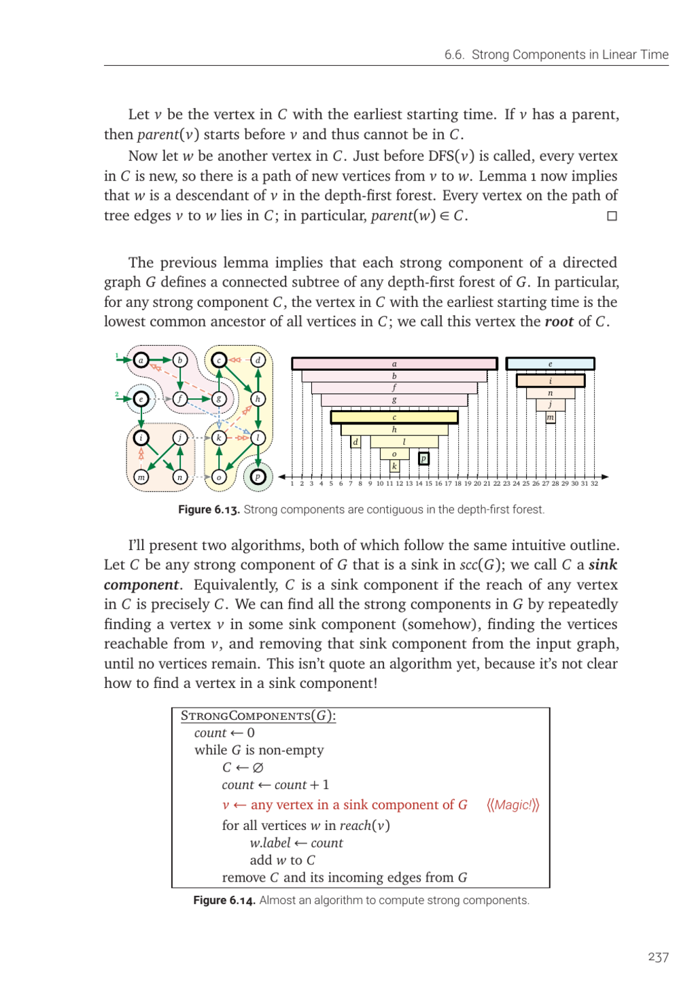

- **6.6. Strong Components in Linear Time**
  - **Strong components and depth-first search properties**
    - Each strong component defines a connected subtree of any depth-first forest.
    - The vertex with earliest starting time in a strong component acts as the root.
    - Paths within a strong component involve only new vertices during DFS invocation.
    - See [Cormen et al., Introduction to Algorithms](https://mitpress.mit.edu/books/introduction-algorithms-third-edition) for more on DFS and strong components.
  - **Algorithm outline for finding strong components via sink components**
    - The algorithm repeatedly finds vertices in sink components and removes them.
    - Sink components are defined as strong components with no outgoing edges to other components.
    - The main challenge is identifying a vertex in a sink component efficiently.
    - [Kosaraju-Sharir algorithm](https://en.wikipedia.org/wiki/Kosaraju%27s_algorithm) addresses this challenge.
  - **Kosaraju-Sharir’s Algorithm**
    - Uses two DFS phases: first on reversed graph rev(G) to order vertices by finish times.
    - The last vertex in postordering lies in a source component of rev(G), corresponding to a sink in G.
    - Second DFS processes vertices in reverse postorder to find strong components.
    - Runs in O(V + E) time and partitions graph into strong components.
    - Further details in [Kosaraju's Algorithm](https://cp-algorithms.com/graph/strongly_connected_components.html).
  - **Tarjan’s Algorithm**
    - Computes low(v) for each vertex v to identify roots of sink components in one DFS.
    - Uses a stack to track vertices of the current component, popping once a root is recognized.
    - Runs entirely during a single DFS traversal in O(V + E) time.
    - Provides an elegant, recursive characterization of strong components.
    - See [Tarjan's original paper](https://doi.org/10.1137/0206010) for a formal description.
  - **Exercises**
    - Include: algorithms for graph reversal, acyclicity of scc graph, semi-connectedness tests.
    - Problems related to cut vertices and edges, transitive closure and reduction, and variants of graph traversals.
    - Practical applications described, such as security systems and traversal validation.
    - Exercises encourage algorithmic design and complexity analyses grounded in concepts from the chapter.
    - Reference for deeper practice: [Algorithms Illuminated](https://algorithm-illustrations.github.io/).
