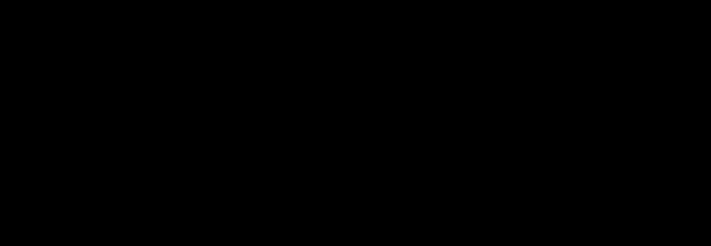

- **12.1 A Game You Can’t Win**
  - The problem CircuitSat asks whether any input setting can turn a boolean circuit's output to True.
  - CircuitSat verification is polynomial-time but no known polynomial-time solver exists.
  - The Adversary scenario illustrates the challenge of solving CircuitSat efficiently.
  - The complexity of CircuitSat connects to unsolved questions in computer science.
  - See [Circuit Satisfiability Problem](https://en.wikipedia.org/wiki/Circuit_satisfiability_problem).

- **12.2 P versus NP**
  - P is the class of decision problems solvable in polynomial time; NP includes problems whose Yes answers can be verified in polynomial time.
  - Every problem in P is also in NP and co-NP, but it’s unknown if P equals NP or NP equals co-NP.
  - The P versus NP problem is a fundamental open question in theoretical computer science.
  - The Clay Mathematics Institute offers a $1 million prize for resolving P vs NP.
  - See [P versus NP Problem](https://en.wikipedia.org/wiki/P_versus_NP_problem).

- **12.3 NP-hard, NP-easy, and NP-complete**
  - NP-hard problems are at least as hard as every problem in NP; solving one in polynomial time implies P=NP.
  - NP-complete problems belong to NP and are NP-hard, representing the hardest problems in NP.
  - Cook-Levin Theorem proves CircuitSat is NP-hard.
  - NP-hardness implies practical improbability of polynomial-time algorithms for those problems.
  - See [NP-Completeness](https://en.wikipedia.org/wiki/NP-completeness).

- **12.4 Formal Definitions (HC SVNT DRACONES)**
  - Complexity classes P, NP, and co-NP are formally defined using languages and Turing machines.
  - Polynomial-time many-one (Karp) reductions are preferred for defining NP-hardness.
  - Cook reductions (Turing reductions) are more general but less restrictive than Karp reductions.
  - Logarithmic-space reductions are a refinement but the practical impact is minimal.
  - See [Computational Complexity Theory](https://en.wikipedia.org/wiki/Computational_complexity_theory).

- **12.5 Reductions and SAT**
  - NP-hardness proofs use polynomial-time reductions from known NP-hard problems.
  - The fundamental rule is to reduce a known NP-hard problem to the problem under study.
  - CircuitSat can be reduced to SAT via transforming circuits into equivalent boolean formulas.
  - Reductions must preserve satisfiability and run in polynomial time.
  - See [Boolean Satisfiability Problem](https://en.wikipedia.org/wiki/Boolean_satisfiability_problem).

- **12.6 3SAT (from SAT)**
  - 3SAT restricts SAT to formulas in 3-conjunctive normal form with exactly three literals per clause.
  - Circuits can be transformed into equivalent 3CNF formulas in polynomial time through several staged transformations.
  - Logical equivalences allow encoding AND, OR, and NOT gates as 3CNF clauses.
  - The transformation preserves satisfiability, proving 3SAT is NP-hard.
  - See [3SAT Problem](https://en.wikipedia.org/wiki/Boolean_satisfiability_problem#3-satisfiability).

- **12.7 Maximum Independent Set (from 3SAT)**
  - MaxIndSet seeks the largest vertex subset in a graph with no edges between them.
  - A graph is constructed from a 3CNF formula where vertices represent literals and edges correspond to conflicts.
  - Independent sets of size equal to the number of clauses correspond exactly to satisfying assignments.
  - This reduction proves MaxIndSet is NP-hard.
  - See [Maximum Independent Set](https://en.wikipedia.org/wiki/Independent_set_(graph_theory)).

- **12.8 The General Pattern**
  - Polynomial-time reductions involve transforming instances and certificates of one problem into another with correctness proofs both ways.
  - Correct reductions require designing forward and backward transformations for inputs and solutions.
  - The three-part approach ensures the reduction is sound and complete.
  - Careful simultaneous development of algorithms and proofs is critical.
  - See [Polynomial-time Reduction](https://en.wikipedia.org/wiki/Reduction_(complexity)).

- **12.9 Clique and Vertex Cover (from Independent Set)**
  - MaxClique and MinVertexCover problems are proven NP-hard via straightforward reductions from MaxIndSet.
  - The complement graph converts independent sets into cliques.
  - Complement of an independent set is a vertex cover.
  - These dualities enable polynomial-time transformations preserving solution sizes.
  - See [Clique Problem](https://en.wikipedia.org/wiki/Clique_problem) and [Vertex Cover Problem](https://en.wikipedia.org/wiki/Vertex_cover).

- **12.10 Graph Coloring (from 3SAT)**
  - 3Color asks if a graph is colorable with three colors without adjacent vertices sharing a color.
  - The reduction builds a graph from a 3CNF formula using gadgets for truth values, variables, and clauses.
  - Clause gadgets enforce satisfiability constraints via color assignments acting like logical majority gates.
  - The graph is 3-colorable if and only if the original formula is satisfiable.
  - See [Graph Coloring](https://en.wikipedia.org/wiki/Graph_coloring).
