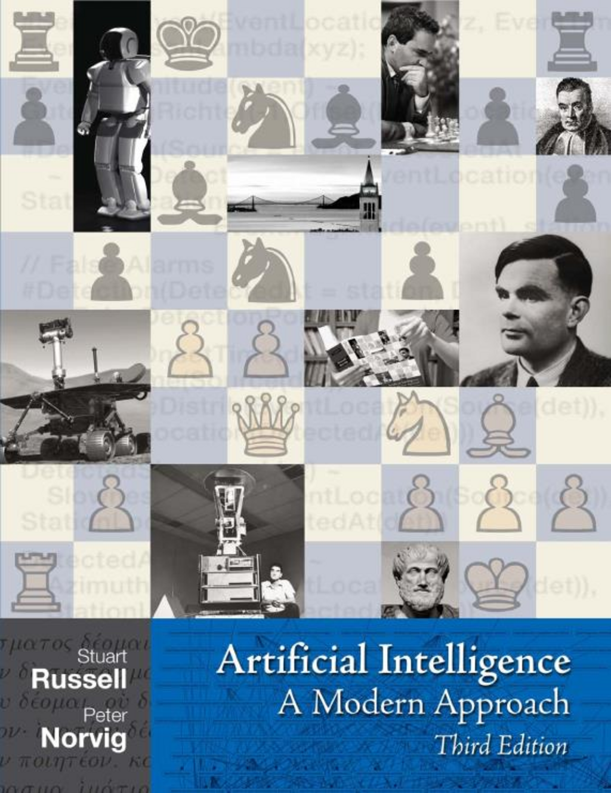

- **Preface**
  - The book aims to explore the full breadth of AI, including logic, probability, perception, reasoning, learning, and action.
  - The authors focus on synthesis into a common framework rather than subfield historical contexts.
  - New to this edition are updates on partially observable environments, representations, planning, first-order probabilistic models, and machine learning.
  - The primary theme is defining AI as the study of intelligent agents mapping percepts to actions.
  - The book is intended mainly for undergraduate courses with prerequisites of basic computer science.

- **About the Authors**
  - Stuart Russell is a professor at UC Berkeley with extensive contributions to AI and multiple awards.
  - Peter Norvig is Director of Research at Google with a background at NASA and academia.
  - Both have authored other seminal AI works and contributed to this book.

- **Contents**
  - The book is divided into seven parts, covering Artificial Intelligence fundamentals, Problem-solving, Knowledge and reasoning, Uncertainty, Learning, Communicating/perceiving/acting, and Conclusions.
  - Accompanying appendices cover mathematical background and algorithm descriptions.

- **1 Introduction**
  - **1.1 What is AI?**
    - AI definitions vary along dimensions of thought versus behavior and human-likeness versus rationality.
    - Four approaches are acting humanly (Turing Test), thinking humanly (cognitive modeling), thinking rationally (laws of thought logic), and acting rationally (rational agents).
    - The rational agent approach is emphasized as the most general and scientifically amenable.
  - **1.2 The Foundations of Artificial Intelligence**
    - Philosophy established notions of reasoning, knowledge, and mind-body relations foundational to AI.
    - Mathematics contributed formal logic, computation theory, tractability concepts, and probability theory.
    - Economics formalized decision-making with utility theory and game theory relevant to AI.
    - Neuroscience clarified brain structures and suggested neural bases for thought but distinct from computers.
    - Psychology framed cognition as information processing and contributed experimental methods.
    - Computer engineering developed hardware and software enabling AI applications.
    - Control theory and cybernetics introduced feedback and goal-achieving behavior.
    - Linguistics connected language with thought and computational models.
  - **1.3 The History of Artificial Intelligence**
    - Early foundations included McCulloch and Pitts' neuron models and Turing’s AI concepts.
    - The Dartmouth conference in 1956 officially birthed AI as a field.
    - Initial progress involved programs like Logic Theorist and General Problem Solver.
    - Early enthusiasm met reality checks in the mid-1960s due to combinatorial explosion and knowledge bottlenecks.
    - Knowledge-based expert systems emerged in the 1970s, with applications such as MYCIN and DENDRAL.
    - The 1980s AI industry flourished, followed by an "AI winter" caused by unmet expectations.
    - Neural networks resurged in the 1980s with backpropagation algorithms.
    - Since the late 1980s, AI adopted the scientific method, emphasizing rigorous experiments and real-world relevance.
    - The agent-based paradigm emerged in the 1990s, integrating subfields and addressing uncertainty.
    - Calls for human-level AI and artificial general intelligence advocate renewed focus on broad intelligence.
    - The availability of huge data sets in the 2000s has fueled learning-based approaches outperforming prior methods.
  - **1.4 The State of the Art**
    - Autonomous robotic vehicles have successfully navigated complex real-world courses.
    - Speech recognition systems conduct fluent automated dialogs.
    - NASA spacecraft employ autonomous onboard planning and error recovery.
    - AI systems excel at strategic game playing, exemplified by Deep Blue defeating Kasparov.
    - Spam detection uses learning methods to filter billions of messages daily.
    - AI streamlines complex logistics planning for large-scale military operations.
    - Commercial robotic devices perform home and defense tasks.
    - Machine translation benefits from massive parallel data and statistical models.
  - **1.5 Summary**
    - AI has various goals and approaches unified by the rational agent perspective.
    - The field’s foundation spans philosophy, mathematics, economics, neuroscience, psychology, engineering, control theory, and linguistics.
    - AI developed through cycles of success, overoptimism, and revision incorporating rigorous science.
    - Recent decades emphasize mathematical rigor, integration with related fields, and data-driven methods.
    - Modern AI demonstrates tangible applications in numerous domains and continues evolving.
