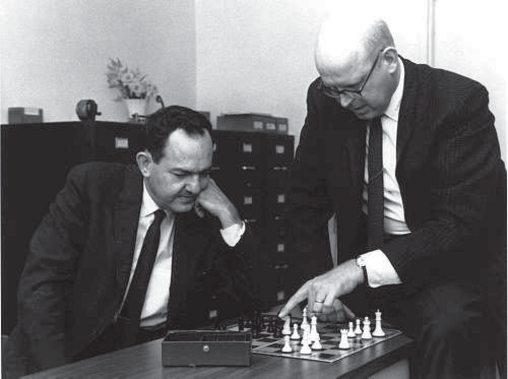

- **5.1 Games**
  - Defines games as deterministic, turn-taking, two-player, zero-sum games with perfect information.
  - Games involve alternating moves and opposing utility functions for the players.
  - Games have complex state spaces requiring approximations for decision-making.
  - Relevant resource: [Game Theory and Economic Modelling](https://mitpress.mit.edu/books/game-theory-and-economic-modelling)

- **5.2 Optimal Decisions in Games**
  - Optimal strategy requires considering contingent responses to all opponent moves.
  - Defines minimax value as utility assuming both players play optimally.
  - Extends minimax values to multiplayer games using utility vectors.
  - Optimal decisions assume worst-case opponent responses.
  - Guidance for coalition formation and strategic rationale is discussed.
  - Relevant resource: [Artificial Intelligence: A Modern Approach, Chapter 5](https://aima.cs.berkeley.edu/)

  - **5.2.1 The minimax algorithm**
    - Implements minimax value calculation recursively until terminal states.
    - Time complexity is exponential in tree depth, space complexity is linear.
    - Serves as foundation for advanced game-solving algorithms.
    - Resource: [Minimax Algorithm Overview](https://en.wikipedia.org/wiki/Minimax)

  - **5.2.2 Optimal decisions in multiplayer games**
    - Uses utility vectors to evaluate terminal states for multiple players.
    - Players choose successors maximizing their own utilities.
    - Alliances may emerge naturally under rational selfish strategies.
    - Explains alliance stability via trust and payoff considerations.
    - Resource: [Multiplayer Game Theory](https://plato.stanford.edu/entries/game-multiplayer/)

- **5.3 Alpha–Beta Pruning**
  - Alpha-beta pruning prunes branches that cannot affect the minimax decision.
  - Defines parameters α and β as bounds on best choices for MAX and MIN along path.
  - Pruning drastically reduces nodes evaluated without changing outcome.
  - Performance depends on move ordering; ordering moves to examine best first improves pruning.
  - With good ordering, effective branching factor reduces from b to approximately √b.
  - Use of killer move heuristic and iterative deepening improves move ordering.
  - Transposition tables reduce repeated state evaluation by storing results of previous evaluations.
  - Relevant resource: [Alpha-Beta Pruning - Stanford](https://web.stanford.edu/class/cs221/handouts/minimax.pdf)

  - **5.3.1 Move ordering**
    - Ordering successors by likely best moves maximizes α–β pruning efficiency.
    - Past best moves and heuristic info guide move ordering dynamically.
    - Iterative deepening search interleaves progressively deeper searches to improve ordering.
    - Typical chess move ordering achieves pruning close to theoretical optimum.
    - Resource: [Move Ordering in Game Trees](https://pdfs.semanticscholar.org/5f0a/a7e2ed554a340533b1886d725361e8e4150c.pdf)
