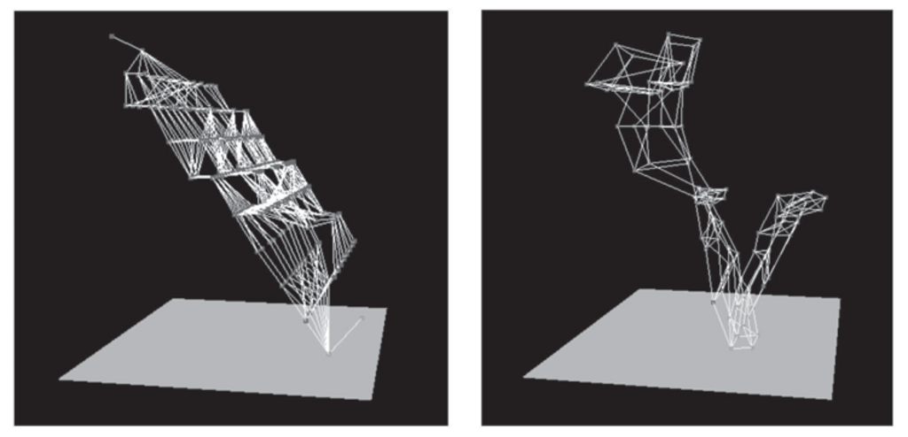

- **Classical Planning**
  - **Definition of Classical Planning**
    - AI planning involves rational action based on goal-directed sequences of actions.
    - Uses factored representations of states as conjunctions of ground fluents.
    - Actions are defined by schemas with preconditions and effects, supporting universal quantification.
    - The initial state and goal define the problem, solved by finding a plan transforming the initial state to a goal state.
    - For further details, see [Ghallab et al., 2004](https://example.org).
  - **Examples of Classical Planning Domains**
    - Air cargo transportation involves actions Load, Unload, Fly with maintenance of cargo locations.
    - Spare tire problem models tire replacement with actions Remove, PutOn, LeaveOvernight.
    - Blocks world involves stacking blocks with actions Move and MoveToTable, using predicates like On and Clear.
    - Domain constraints handle practical issues such as no-op actions or predicate maintenance.
  - **Complexity of Classical Planning**
    - PlanSAT and Bounded PlanSAT are decidable for classical planning but in PSPACE complexity class.
    - Problems remain NP-hard even with restricted effects; complexity reduces to P if negative preconditions are disallowed.
    - Domain-specific structures can ease planning complexity.
    - Heuristics are crucial for practical performance.
  - **Algorithms for Planning as State-Space Search**
    - Planning defined as search from initial state with ACTIONS and RESULT functions and a goal test.
    - Forward (progression) search generates successor states by applying applicable actions.
    - Backward (regression) search works from goal state using relevant actions and regressed state descriptions.
    - Heuristics derive from relaxed problems, such as ignoring preconditions or delete lists, and decomposition assumptions.
    - Effective heuristics guide search and improve efficiency.
  - **Planning Graphs**
    - Planning graph is a layered data structure alternating states and actions levels.
    - Records literals achievable at each level and mutual exclusion (mutex) relations between actions and literals.
    - Persistence actions represent literals unchanged by actions.
    - Planning graphs help derive admissible heuristics like max-level, level-sum, and set-level.
    - The GRAPHPLAN algorithm builds a planning graph incrementally and uses it to extract plans via backward search.
    - Mutex and no-good relations guide search and termination conditions ensure algorithm completeness.
    - See [Blum and Furst, 1997](https://example.org) for foundational work.
  - **Other Classical Planning Approaches**
    - Classical planning can be encoded as Boolean satisfiability (SAT) problems using propositionalization and successor-state axioms.
    - Situation calculus uses first-order logic to represent actions and states over branching situations, with possibility and successor-state axioms.
    - Planning can be represented as constraint satisfaction problems (CSPs), encoding bounded plan lengths with action variables.
    - Partially ordered plans represent plans with partial action orderings to capture independent subproblems.
    - Partial-order planning uses flaw detection and least commitment to refine plans.
    - Partial-order planners are effective for explainability and real-time planning; forward search planners dominate classical planning competitions.
  - **Analysis of Planning Approaches**
    - Planning complexity arises from combinatorial explosion in states and negative interactions between actions.
    - Subgoal independence and serializability reduce complexity in specific domains.
    - GraphPLAN, SATPLAN, and FF have raised planning efficiency significantly.
    - Future advances likely require integration of factored, propositional, first-order, and hierarchical representations.
    - For extended analysis, consult [Ghallab et al., 2004](https://example.org).
  - **Summary**
    - Classical planning involves factored state/action representations, initial state, and goal definitions.
    - Forward and backward state-space searches rely on heuristics derived from domain relaxations.
    - Planning graphs provide structured heuristics and support the GRAPHPLAN algorithm.
    - Alternative methods include SAT encoding, situation calculus, CSP, and partial-order plan refinement.
    - The field benefits from diverse approaches; no single method universally dominates.

- **Bibliographical and Historical Notes**
  - Classical planning originated from state-space search and theorem proving, notably in S TRIPS for Shakey robot control.
  - PDDL standardizes planning problem representation and extends predecessors like STRIPS and ADL.
  - Early planners focused on linear, totally ordered plans; partial-order planning addressed interleaving and flaws.
  - Partial-order planners include N OAH, T WEAK, SNLP, and UCPOP, dominating until faster heuristics emerged.
  - State-space planners (e.g., UNPOP, HSP, FF, Fast Downward, LAMA) use heuristics from relaxed problems and planning graphs.
  - Planning graphs and GRAPHPLAN, by Blum and Furst, contributed major performance gains and heuristic methods.
  - Situation calculus enables expressive first-order representations but lacks practical scaling heuristics.
  - Advances also include SAT-based planners (SATPLAN, BLACKBOX), CSP-based planners (GP-CSP), and BDD-based planners.
  - Comparative studies show trade-offs: CSP methods excel on certain NP-hard tasks, search methods perform well for feasible solutions.
  - Recommended readings: [Weld, 1994](https://example.org), [Ghallab et al., 2004](https://example.org), [LaValle, 2006](https://example.org).

- **Exercises**
  - **Planning Fundamentals and Applications**
    - Contrast problem solving vs. planning in terms of state representations and goal handling.
    - Identify applicable Fly actions from given initial states in air cargo domain.
    - Model the monkey-and-bananas problem with states, actions, and goals; assess classical planning applicability.
    - Formalize Shakey robot domain with PDDL; plan moving boxes across rooms.
    - Encode finite Turing machine acceptance as a planning problem, illustrating PSPACE-hardness.
  - **Planning Problem Analysis**
    - Explain relaxed planning problems caused by ignoring negative effects.
    - Solve the Sussman anomaly; explain why noninterleaved planners fail.
    - Prove completeness of regression (backward) search with PDDL representations.
    - Construct initial planning graph levels for the air cargo example.
  - **Planning Graph and Heuristics**
    - Prove literal appearance and level cost admissibility in planning graphs.
    - Interpret the relaxed problem solved by set-level heuristic.
  - **Search Techniques and Plan Structures**
    - Analyze bidirectional search over states and partial-order plans.
    - Relate forward/backward state-space search to plan-space search; identify refinement operators.
  - **Successor-State Axioms and Logical Formalisms**
    - Analyze behavior of plans with illegal actions under successor-state axioms.
    - Translate Fly action schema into situation calculus: define Poss and successor-state axioms.
    - Extend for Teleport action; generalize translation procedure from action schemas to successor-state axioms.
  - **SAT Plan Encoding**
    - Discuss single vs. multiple SAT calls for plans up to Tmax steps; consider spurious solutions and heuristic modifications.
