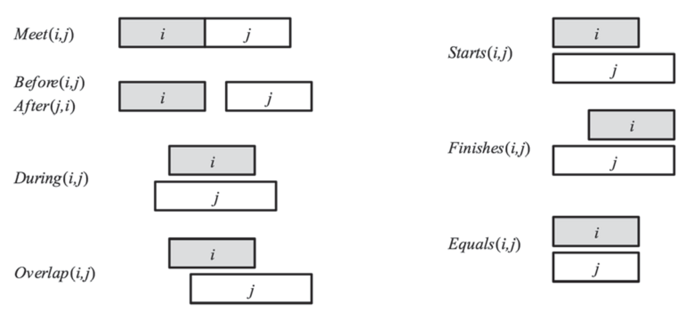

- **12 Knowledge Representation**
  - **12.1 Ontological Engineering**
    - Formalizes general concepts like events, time, physical objects, and beliefs for flexible domain representations.
    - Emphasizes the need for an upper ontology serving as a foundational framework for various domains.
    - Recognizes first-order logic limitations in handling exceptions and uncertainty.
    - Classifies approaches to ontology creation: expert teams, database imports, text parsing, and crowdsourcing.
    - For further reading, see [Ontological Engineering (Wikipedia)](https://en.wikipedia.org/wiki/Ontological_engineering).  
  - **12.2 Categories and Objects**
    - Organizes knowledge via categories, subclasses, and membership, enabling inheritance of properties.
    - Defines relations like subset, disjointness, exhaustive decomposition, and partitions among categories.
    - Differentiates between count nouns (things) and mass nouns (stuff) emphasizing intrinsic versus extrinsic properties.
    - Introduces "bunches" as composite objects with parts but no fixed structure.
    - Recommended reading: [Natural Kind (Stanford Encyclopedia of Philosophy)](https://plato.stanford.edu/entries/natural-kinds/).
  - **12.3 Events**
    - Introduces event calculus to represent concurrent, continuous, and overlapping events using time intervals.
    - Defines predicates like Happens, Initiates, Terminates, Clipped, and Restored to reason about fluents over time.
    - Distinguishes discrete events from processes (liquid events) that hold over subintervals.
    - Explains the representation of physical objects as generalized events (four-dimensional space-time entities).
    - See also [Event Calculus (Wikipedia)](https://en.wikipedia.org/wiki/Event_calculus) for further detail.
  - **12.4 Mental Events and Mental Objects**
    - Models propositional attitudes like belief and knowledge using modal logic with possible worlds semantics.
    - Defines accessibility relations between worlds to capture knowledge states of agents.
    - Addresses referential opacity issues to distinguish an agent’s knowledge of co-referential terms.
    - Formalizes knowledge axioms including closure under logical consequence and introspection.
    - Consult [Reasoning about Knowledge (Fagin et al.)](https://mitpress.mit.edu/books/reasoning-about-knowledge) for an in-depth resource.
  - **12.5 Reasoning Systems for Categories**
    - Describes semantic networks as graphical knowledge bases supporting inheritance reasoning with default and overriding properties.
    - Presents description logics as formal languages specialized for defining and reasoning about categories with efficient subsumption algorithms.
    - Highlights the trade-off between expressiveness and tractability in description logics.
    - Suggests procedural attachment to handle predicates outside pure semantic network expressiveness.
    - See [Description Logic (Stanford Encyclopedia of Philosophy)](https://plato.stanford.edu/entries/logic-description/) for more.
  - **12.6 Reasoning with Default Information**
    - Explains nonmonotonic reasoning through circumscription and default logic to model defaults and exceptions.
    - Illustrates how circumscription minimizes abnormalities to compute preferred models.
    - Defines default rules with prerequisites, justifications, and conclusions governing contingent reasoning.
    - Introduces truth maintenance systems (JTMS and ATMS) to efficiently revise beliefs when new information contradicts defaults.
    - For detailed theory, see [Nonmonotonic Reasoning Handbook](https://www.cs.utexas.edu/~halpern/cs395t/handbook.pdf).
  - **12.7 The Internet Shopping World**
    - Demonstrates application of knowledge representation to an internet shopping agent navigating web pages.
    - Defines relevance by recursive traversal of links with anchor text matching product categories using a product taxonomy.
    - Employs wrappers to extract structured product info such as price, specifications, and store details.
    - Handles product comparison via attribute dominance and partial user preferences.
    - Further reading: [Information Extraction from Web Pages](https://dl.acm.org/doi/10.1145/1367497.1367535).
  - **12.8 Summary**
    - Reviews the need for a general-purpose ontology to organize rich, interconnected knowledge.
    - Recognizes challenges in building comprehensive ontologies and limitations of first-order logic for natural kinds and defaults.
    - Highlights the utility of event-based representations and modal logic for reasoning about dynamic and mental events.
    - Summarizes specialized languages and systems like semantic networks, description logics, and truth maintenance for organizing and updating knowledge.
    - Points to progress in knowledge representation with ongoing challenges in exception handling and incorporation of uncertainty.
    - Suggested overview: [Knowledge Representation (Russell & Norvig)](http://aima.cs.berkeley.edu/).
