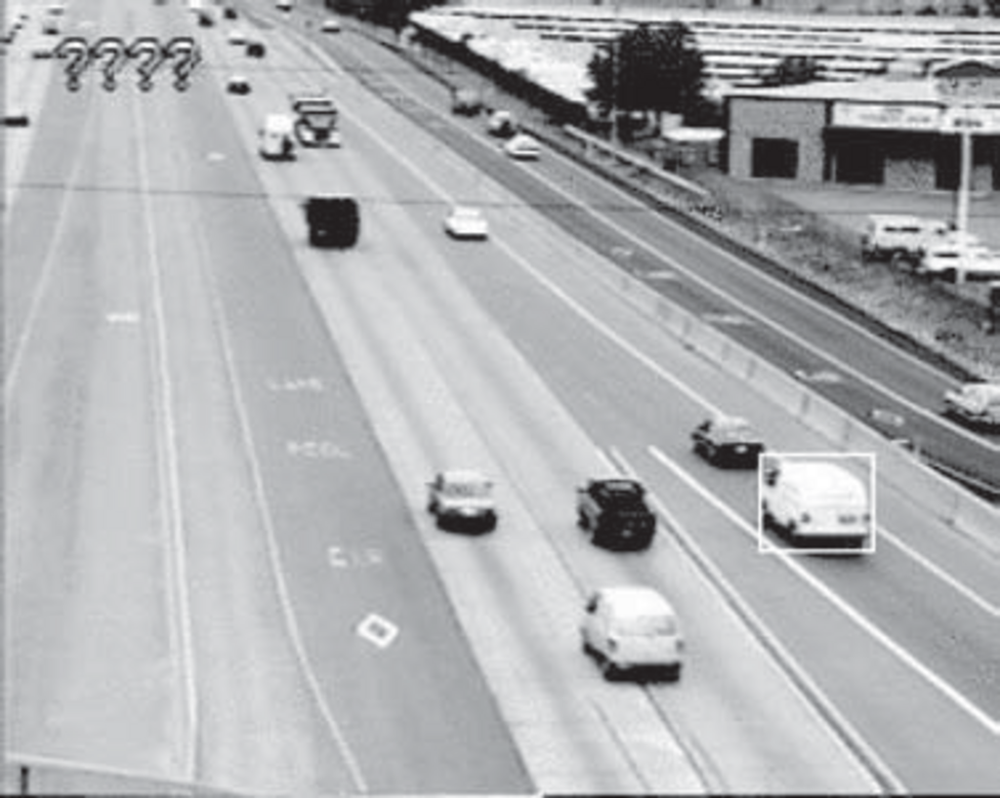

- **Probabilistic Reasoning Over Time**
  - Agents in partially observable environments maintain a belief state representing possible world states.
  - Belief states are updated using transition and sensor models, with uncertainty represented probabilistically.
  - Time is modeled via variables for each world aspect at each point, with first and second-order Markov assumptions.
  - Relevant models include hidden Markov models, Kalman filters, and dynamic Bayesian networks.
  - [Probabilistic Reasoning Over Time - Original Source](#)

- **15.1 Time and Uncertainty**
  - Dynamic problems require modeling state changes over time, crucial for domains like health monitoring and robot tracking.
  - The world is divided into time slices containing state variables (hidden) and evidence variables (observable).
  - Transition models describe how states evolve; sensor models describe evidence generation, both possibly uncertain.
  - The Markov assumption restricts dependencies to a finite number of past states; stationarity assumes time-invariant transition probabilities.
  - [Markov Process Theory](https://en.wikipedia.org/wiki/Markov_process)

  - **15.1.1 States and Observations**
    - Time slices contain state variables Xt (hidden) and evidence variables Et (observable).
    - Example given with umbrella and rain states, demonstrating partial observability with noisy sensors.
    - Fixed interval slices are assumed, and notation for sequences (e.g., Xa:b) is introduced.

  - **15.1.2 Transition and Sensor Models**
    - Transition models specify P(Xt | past states) simplified by Markov assumptions, often first-order.
    - Stationarity means transition probabilities do not vary with time.
    - Sensor models simplify to P(Et | Xt ) by assuming sensors depend only on current state.
    - Prior distribution at t=0 must also be specified to complete the temporal model.

- **15.2 Inference in Temporal Models**
  - Four primary inference tasks are filtering, prediction, smoothing, and finding the most likely sequence.
  - Filtering computes the current belief state given all evidence to date; prediction projects future state distributions.
  - Smoothing computes past state distributions incorporating all evidence including future observations.
  - The most likely explanation finds the single most probable sequence of states given observations.
  - Learning transition and sensor models is possible using EM algorithms, requiring smoothing.

  - **15.2.1 Filtering and Prediction**
    - Recursive estimation updates the belief state incrementally using forward prediction and evidence incorporation.
    - Filtering formula depends on transition and sensor models, enabling constant-time updates per step.
    - Prediction extends filtering without evidence updates and converges to the stationary distribution over time.
    - Likelihood of evidence sequence can be computed using forward messages but tends to underflow.

  - **15.2.2 Smoothing**
    - Smoothing decomposes posterior into forward message (filtering) and backward message (future evidence).
    - Backward message computed recursively backward in time; combined with forward message for smoothed estimate.
    - Forward–backward algorithm efficiently computes smoothing for entire sequence in linear time.
    - Fixed-lag smoothing can be optimized to constant time per update independently of lag in special cases.

  - **15.2.3 Finding the Most Likely Sequence**
    - The Viterbi algorithm efficiently computes the most likely state sequence by maximizing probabilities recursively.
    - Unlike smoothing, maximizing each time step independently leads to incorrect sequences.
    - The Viterbi algorithm stores back-pointers to reconstruct the optimal path; complexity linear in sequence length.

- **15.3 Hidden Markov Models**
  - HMMs model temporal processes with a single discrete state variable and associated observations.
  - Transition and sensor models are represented as matrices enabling elegant matrix-vector recursive updates.
  - Filtering and smoothing in HMMs have time complexity O(S² t) where S is the number of states.
  - Fixed-lag smoothing algorithms exist with constant time per update; invertibility of transition matrices is required.
  - Application example: robot localization using sensor data with noisy observations modeled via HMMs.
  - [Rabiner (1989) Tutorial on HMMs](https://ieeexplore.ieee.org/document/18626)

- **15.4 Kalman Filters**
  - Kalman filters perform state estimation for continuous variables in linear Gaussian dynamic systems.
  - Transition and sensor models are linear functions with Gaussian noise.
  - Kalman update equations preserve Gaussian distributions and compute means and covariances recursively.
  - Univariate example illustrates completing the square to obtain closed-form updates.
  - Multivariate form extends to high-dimensional state vectors; Kalman gain matrix balances prediction and observation.
  - Extensions include Extended Kalman Filter (EKF) for nonlinear models and switching Kalman filters for multimodal systems.
  - Applications span radar tracking, robotics, economic modeling, and control systems.
  - [Kalman Filter Wikipedia](https://en.wikipedia.org/wiki/Kalman_filter)

- **15.5 Dynamic Bayesian Networks**
  - DBNs generalize temporal models with multiple variables per slice connected by stationary first-order Markov assumptions.
  - DBNs offer sparse structure, reducing parameter complexity compared to monolithic HMM representations.
  - Construction requires specifying prior, transition, and sensor models, often at the template slice.
  - Complex sensor models can handle noise, transient and persistent failures by augmenting state variables.
  - Exact inference uses unrolling but scales poorly due to exponential growth in state factors.
  - Approximate inference methods include particle filtering and MCMC, maintaining tractable real-time updates.
  - Particle filtering propagates weighted samples and resamples to approximate filtering distributions.
  - Data association problem arises when multiple objects generate observations, requiring inference over identity mappings.
  - [Murphy (2002), Dynamic Bayesian Networks](https://mitpress.mit.edu/books/dynamic-bayesian-networks)

  - **15.5.1 Constructing DBNs**
    - Slice-wise replication with stationary transition and sensor models defines the dynamic model.
    - Example: Robot localization augmented with battery state, sensors with noise, transient, and persistent failures.
    - Sensor noise modeled as Gaussian or discrete approximations; failure modeled with additional discrete variables.
    - Failure persistence modeled by Markov chains over sensor health states.

  - **15.5.2 Exact Inference in DBNs**
    - Scaling exact inference requires recursive elimination maintaining only two slices at a time.
    - Computational costs remain exponential in the number of state variables per slice.
    - Exact inference is often infeasible for large systems despite structural sparsity.

  - **15.5.3 Approximate Inference in DBNs**
    - Likelihood weighting applied naively leads to sample degeneration over time.
    - Particle filtering uses weighted samples propagated and resampled per time step for constant-time updates.
    - Particle filtering is consistent and performs well in practice with sufficient samples.
    - Evidence reversal and Rao-Blackwellized particle filters improve sampling performance.
    - MCMC and other variational methods serve as alternatives or supplements.

- **15.6 Keeping Track of Many Objects**
  - Multi-object tracking suffers from identity uncertainty, called data association in control theory.
  - Multiple objects generate observations with unknown correspondence, causing combinatorial explosion.
  - The joint distribution sums over possible assignments (combinatorial in number).
  - Simple single-assignment heuristics (nearest-neighbor, Hungarian algorithm) work only in low-uncertainty.
  - Advanced approaches include MCMC and particle filtering for multiple hypothesis tracking.
  - Real-world challenges include false alarms, detection failures, and object birth/death dynamics.
  - Successful applications include freeway surveillance with noisy visual data and large object counts.
  - [Bar-Shalom and Fortmann (1988), Multitarget-Multisensor Tracking](https://www.amazon.com/Multitarget-Multisensor-Tracking-Bar-Shalom/dp/0898712210)

- **15.7 Summary**
  - Temporal probabilistic processes use random variables indexed by time, under Markov and stationarity assumptions.
  - Transition and sensor models define dynamics and observations respectively.
  - Principal inference tasks are filtering, prediction, smoothing, and computing most likely explanation.
  - HMMs, Kalman filters, and DBNs provide distinct but related frameworks, each with trade-offs.
  - Particle filtering approximates inference in large DBNs; data association demands specialized tracking algorithms.
