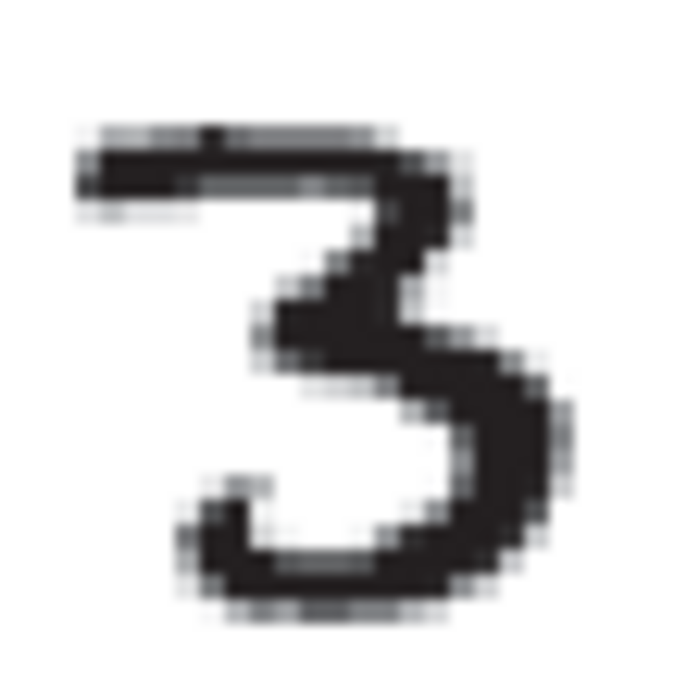

- **18 Learning from Examples**
  - Describes agents improving behavior through study of experiences.
  - Focuses on learning a function from input-output pairs to predict new outputs.
  - Details reasons for learning: unanticipated situations, changing environments, and inability to program solutions.
- **18.1 Forms of Learning**
  - Learning improves various agent components including condition-action rules, world inference, and utility information.
  - Influenced by prior knowledge, data/representation, and feedback available.
  - Differentiates inductive (from examples) and deductive (from known rules) learning.
  - Three main feedback types: unsupervised, reinforcement, and supervised, plus semi-supervised learning as a continuum.
- **18.2 Supervised Learning**
  - Task: Given training examples, find a hypothesis approximating the true function.
  - Defines classification (discrete valued output) and regression (continuous valued output).
  - Introduces hypothesis space and the problem of multiple consistent hypotheses.
  - Uses Occam’s razor principle to prefer simpler hypotheses.
  - Discusses realizability and Bayesian approach to select hypotheses.
- **18.3 Learning Decision Trees**
  - **18.3.1 The decision tree representation**
    - Decision trees classify inputs by sequential attribute tests with discrete or continuous outputs.
    - Positive and negative examples guide tree construction.
  - **18.3.2 Expressiveness of decision trees**
    - Decision trees represent any propositional logic function equivalent to disjunctive normal form.
    - Some functions like majority require exponentially large trees.
    - The hypothesis space is enormous; searching requires heuristics.
  - **18.3.3 Inducing decision trees from examples**
    - Uses a greedy divide-and-conquer algorithm selecting attributes maximizing importance to split data.
    - four recursion cases: all positive/negative examples, mixed examples, no examples, and conflicting examples due to noise.
  - **18.3.4 Choosing attribute tests**
    - Attribute importance is measured by information gain based on entropy reduction.
    - Measures uncertainty and information theory to guide attribute split selection.
  - **18.3.5 Generalization and overfitting**
    - Overfitting occurs when complex trees memorize noise.
    - Decision tree pruning removes irrelevant nodes using statistical significance tests (e.g., χ2 test).
  - **18.3.6 Broadening the applicability of decision trees**
    - Discusses handling missing data, multi-valued attributes, continuous inputs, and continuous outputs.
    - Introduces regression trees with linear functions at leaves.
- **18.4 Evaluating and Choosing the Best Hypothesis**
  - Defines stationarity and i.i.d. assumptions tying past and future data.
  - Explains error rate, holdout cross-validation, k-fold cross-validation, and the danger of peeking.
  - **18.4.1 Model selection: Complexity versus goodness of fit**
    - Balances model complexity and fit using cross-validation and selecting size minimizing validation error.
  - **18.4.2 From error rates to loss**
    - Introduces loss functions for classification/regression capturing cost of different errors.
    - Defines expected generalization loss and empirical loss.
    - Addresses reasons for approximation error: unrealizability, variance, noise, and computational limits.
  - **18.4.3 Regularization**
    - Combines empirical loss and complexity into cost for hypothesis selection, penalizing complex models.
    - Details L1 and L2 regularization differences, feature selection, and minimum description length (MDL).
- **18.5 The Theory of Learning**
  - Computational learning theory connects number of examples to learning accuracy.
  - PAC (Probably Approximately Correct) learning guarantees that after N examples, hypothesis is approximately correct with high probability.
  - Formula relates sample complexity to hypothesis space size, accuracy, and confidence.
  - Restricting hypothesis space or using simple hypotheses improves generalization.
  - **18.5.1 PAC learning example: Learning decision lists**
    - Decision lists are ordered tests of conjunctions yielding classification outcomes.
    - Decision lists subsume decision trees of corresponding depth.
    - PAC-learnable with polynomial samples.
    - Greedy learning algorithm builds decision lists by removing covered examples iteratively.
- **18.6 Regression and Classification with Linear Models**
  - **18.6.1 Univariate linear regression**
    - Fits a straight line y = w1 x + w0 minimizing squared error loss.
    - Closed-form solutions derived from setting derivatives to zero.
    - Gradient descent and stochastic gradient descent algorithms adjust weights to minimize loss.
  - **18.6.2 Multivariate linear regression**
    - Extends to vector inputs; hypothesis is a weighted sum plus bias.
    - Batch and stochastic gradient descent applicable.
    - Closed form solution: w* = (XᵀX)^−1 Xᵀ y.
    - Regularization (L1, L2) methods avoid overfitting, with L1 encouraging sparsity.
  - **18.6.3 Linear classifiers with a hard threshold**
    - Classify inputs by thresholding weighted sum w · x at zero.
    - Perceptron learning rule updates weights perceptron-style.
    - Converges on linearly separable data, but may fail otherwise.
  - **18.6.4 Linear classification with logistic regression**
    - Replace hard threshold with logistic sigmoid giving probabilistic soft classification.
    - Loss minimized via gradient descent using differentiable sigmoid.
    - More reliable convergence on noisy or nonseparable data than perceptron.
- **18.7 Artificial Neural Networks**
  - **18.7.1 Neural network structures**
    - Composed of units (nodes) connected with weighted directed links.
    - Units apply nonlinear activation functions to weighted sums of inputs.
    - Feed-forward networks have layered, acyclic structure; recurrent networks have cycles and internal state.
  - **18.7.2 Single-layer feed-forward neural networks (perceptrons)**
    - Have inputs directly connected to outputs.
    - Can learn linearly separable functions like AND, but not non-separable ones like XOR.
    - More compact than decision trees for some functions (e.g., majority).
  - **18.7.3 Multilayer feed-forward neural networks**
    - Include one or more hidden layers enabling nonlinear function approximation.
    - Complex functions composed of layered sigmoid activations can approximate any continuous function.
  - **18.7.4 Learning in multilayer networks**
    - Uses back-propagation algorithm: compute output error and propagate backwards.
    - Weight updates performed via gradient descent on the error.
    - Supports multiple outputs and arbitrary numbers of hidden layers.
  - **18.7.5 Learning neural network structures**
    - Overfitting controlled by controlling number of layers and units; cross-validation guides architecture choice.
    - Techniques include pruning (optimal brain damage) and growing networks (tiling algorithm).
- **18.8 Nonparametric Models**
  - Parametric models fix the number of parameters independent of data size.
  - Nonparametric models grow in complexity with data size, often retaining all examples (instance-based).
  - **18.8.1 Nearest neighbor models**
    - k-nearest neighbors classify or regress based on the k closest training points.
    - Distance metrics like Euclidean, Manhattan, Hamming, and Mahalanobis used.
    - Curse of dimensionality limits effectiveness in high dimensions due to sparse data.
  - **18.8.2 Finding nearest neighbors with k-d trees**
    - k-d trees are balanced binary trees partitioning data iteratively on coordinate medians.
    - Nearest neighbor search uses pruning but requires searching both branches near boundaries.
    - Efficient for moderate dimensions with sufficient data.
  - **18.8.3 Locality-sensitive hashing**
    - Uses multiple random projections and hash functions to achieve approximate nearest neighbors.
    - Reduces search from millions to thousands in high-dimensional image data.
  - **18.8.4 Nonparametric regression**
    - Methods include piecewise-linear (connect-the-dots), k-nearest-neighbor averaging, and k-nearest neighbor linear regression.
    - Locally weighted regression fits smooth functions using weighted linear regression with kernels.
    - Balances bias and variance to improve fit and reduce discontinuities.
