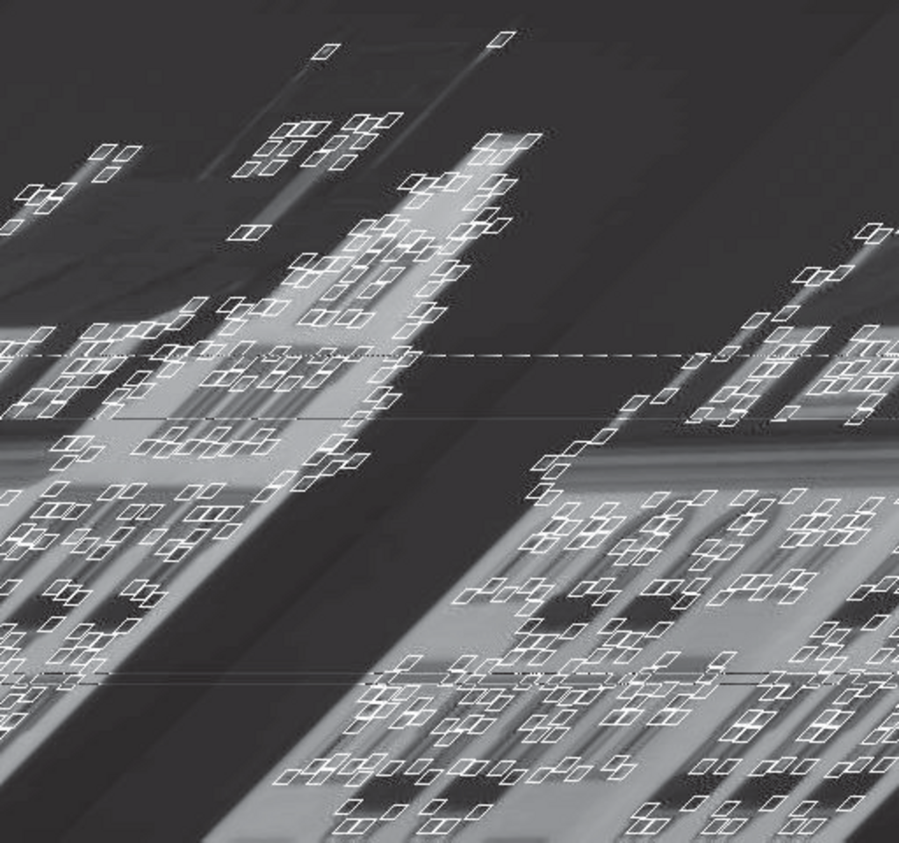

- **24 Perception**
  - **24.1 Image Formation**
    - Image formation is a process that geometrically and physically transforms 3D scenes into 2D images.
    - Perspective projection causes distant objects to appear smaller and parallel lines to converge at vanishing points.
    - Lens systems enable focused images with adjustable focal planes but have limited depth of field.
    - Scaled orthographic projection approximates perspective when depth variation within an object is small.
    - Illumination effects such as diffuse reflection, specular reflection, and shadows influence image brightness according to Lambert’s cosine law.
    - Color perception relies on three types of cones sensitive to red, green, and blue wavelengths, enabling color constancy under varying illumination.
    - For further details see [Forsyth and Ponce (2002)](https://www.springer.com/gp/book/9780130851987).
  - **24.2 Early Image-Processing Operations**
    - Edge detection identifies significant brightness changes corresponding to scene discontinuities.
    - Gaussian filtering smooths images to reduce noise prior to edge detection using gradients and thresholding.
    - Texture is a spatially repeating pattern measured by local orientation histograms aiding in segmentation and recognition.
    - Optical flow measures apparent motion between video frames and is computed by minimizing similarity measures like SSD.
    - Segmentation partitions images into regions of uniform attributes using boundary detection or pixel clustering approaches.
    - Superpixels are over-segmentations used to simplify subsequent high-level processing.
    - See [Canny Edge Detector](https://ieeexplore.ieee.org/document/4767851) for foundational edge detection methods.
  - **24.3 Object Recognition by Appearance**
    - Recognition relies on fixed or variable local patterns and class-specific features.
    - Sliding window technique scans windows over images at multiple scales and orientations to detect objects like faces.
    - Histogram of Oriented Gradients (HOG) features capture local gradient orientations weighted by contrast for pedestrian detection.
    - Classifiers aggregate evidence from these features for object detection, using postprocessing like non-maximum suppression.
    - Multi-part pattern elements manage complex object variations due to pose, occlusion, and deformation.
    - Review practical applications in Dalal and Triggs (2005) for HOG features.
  - **24.4 Reconstructing the 3D World**
    - Depth recovery exploits stereo disparity, motion parallax, multiple views, texture gradients, shading, contour analysis, and known object models.
    - Motion parallax relates optical flow to camera velocity and scene depth, enabling time-to-contact and relative depth estimation.
    - Binocular stereopsis uses horizontal disparity between two eye images with known baseline to estimate absolute depth.
    - Multiple-view reconstruction combines correspondences across many images to robustly recover 3D geometry.
    - Texture variation and shading provide additional shape cues based on surface orientation and reflectance.
    - Contour cues such as occluding boundaries and T-junctions signal figure-ground relationships and support shape inference.
    - Known object sizes and ground plane constraints allow distance estimation and detection pruning in scenes.
    - Alignment methods solve pose estimation by matching 3D model points to 2D image projections using rotation, translation, and projection.
    - For extensive theory see [Hartley and Zisserman (2000)](https://link.springer.com/book/10.1007/978-3-642-51468-7).
  - **24.5 Object Recognition from Structural Information**
    - Deformable template models represent humans as connected body segments with probabilistic spatial relationships.
    - Pictorial structure models use local image features and relational constraints to infer body pose from images.
    - Dynamic programming efficiently finds the best configuration due to tree-structured dependencies.
    - Appearance models based on color and texture help score candidate matches for body parts.
    - Tracking in video exploits slowly changing appearance models and repeated detection across frames.
    - See Felzenszwalb and Huttenlocher (2000) for pictorial structure methodology.
  - **24.6 Using Vision**
    - Vision enhances applications in surveillance, human-computer interaction, and behavior recognition.
    - Background subtraction isolates moving foreground objects in stable scenes.
    - Action recognition employs spatiotemporal features and histograms, exemplified by consistent motion patterns.
    - Object and scene retrieval often involve combining textual metadata with image feature-based annotation and segmentation.
    - Multi-view reconstruction enables creation of detailed 3D models from unstructured photo collections.
    - Vision systems for autonomous driving use lane detection, stereo disparity, and obstacle avoidance via task-specific feature extraction.
    - Combining vision with inertial sensors and probabilistic filtering counters odometry drift for navigation.
    - Task-specific vision systems prioritize computation of only necessary visual information.
    - Additional details in [Brown and Lowe (2007) Multiple View Geometry](https://www.robots.ox.ac.uk/~vgg/publications/papers/brown07.pdf).
  - **24.7 Summary**
    - Image formation is a well-understood geometric and physical process; inverse reconstruction remains challenging.
    - Early vision extracts primitive features (edges, textures) locally without knowledge of object identity.
    - Multiple cues—motion, stereo, texture, shading, contour—provide three-dimensional scene understanding under assumptions.
    - Object recognition combines brightness, feature-based methods, and pose estimation for varied appearance and geometries.
    - Successful vision systems combine layered representations suited to specific perceptual and task requirements.
