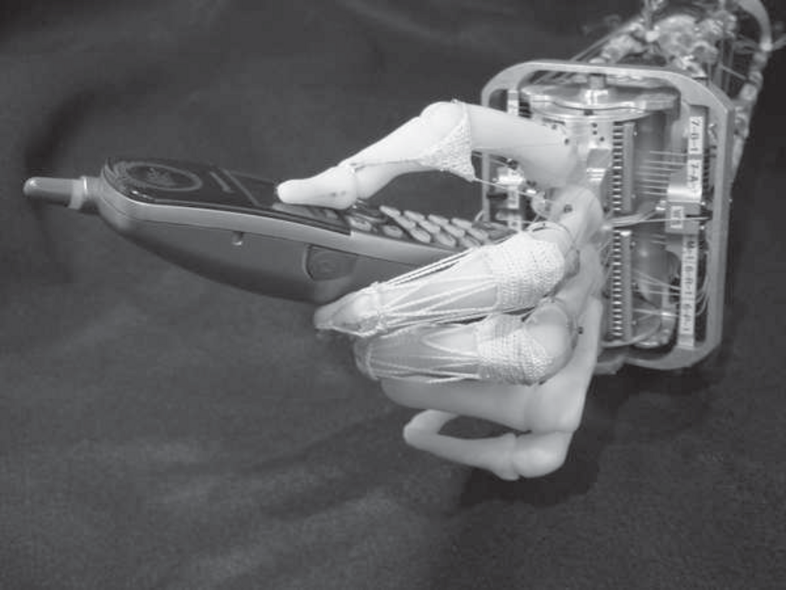

- **25 Robotics**
  - **25.1 Introduction**
    - Robots are physical agents equipped with effectors and sensors to manipulate and perceive their environment.
    - Main categories of robots are manipulators, mobile robots, and mobile manipulators, each with distinct locomotion and manipulation capabilities.
    - Robots face challenges due to partial observability, stochasticity, and the continuous dynamic nature of the real world.
    - Robotics integrates concepts like probabilistic estimation, planning, and learning from earlier AI topics.
    - Further reading: [Introduction to Robotics by John J. Craig](https://www.amazon.com/Introduction-Robotics-John-J-Craig/dp/0201543613)
  - **25.2 Robot Hardware**
    - Robots use active and passive sensors including sonar, lidar, cameras, GPS, and proprioceptive sensors to gather environmental and self-motion data.
    - Effectors provide the robot with degrees of freedom, including revolute and prismatic joints in manipulators, and wheels or legs in mobile robots.
    - Nonholonomic robots have more effective than controllable degrees of freedom, complicating their control.
    - Power sources and actuation methods include electric motors, pneumatic, and hydraulic systems.
    - Further reading: [Robotics: Modelling, Planning and Control](https://www.springer.com/gp/book/9781846286414)
    - **25.2.1 Sensors**
      - Sensors are divided into range finders, location sensors, and proprioceptive sensors and can be active or passive.
      - Modern robots rely on time-of-flight cameras, scanning lidars, radar, and tactile sensors for range measurements.
      - Localization sensors include GPS outdoors, beacons indoors, and sonar underwater; proprioceptive sensors measure joint angles and velocities.
      - Force and torque sensors are essential for delicate manipulation and grasping.
    - **25.2.2 Effectors**
      - Degrees of freedom define independent directions of motion, with six DOF standard for rigid bodies.
      - Manipulators use revolute and prismatic joints to achieve desired poses; many have seven DOFs for easier control.
      - Mobile robots use various drives: differential, synchro, holonomic, and legs for rough terrain.
      - Dynamic stability distinguishes robots that remain upright dynamically versus statically.
      - Controllers and power mechanisms determine how effectively the effectors execute motions.
  - **25.3 Robotic Perception**
    - Robotic perception maps sensor measurements to internal environment representations through probabilistic filtering.
    - State estimation uses recursive Bayesian filtering integrating motion (transition) and sensor models.
    - **25.3.1 Localization and Mapping**
      - Localization estimates the robot's pose using maps, motion models, and sensor models with Gaussian or particle filter approaches.
      - Monte Carlo Localization uses particle filtering with motion and sensor models for belief updates.
      - The Extended Kalman Filter applies linearization for Gaussian approximation of nonlinear models.
      - Simultaneous Localization and Mapping (SLAM) addresses building maps while localizing using EKF or graphical methods.
    - **25.3.2 Other Types of Perception**
      - Robots perceive other quantities such as temperature and odors using variants of dynamic Bayes nets.
      - Reactive agent architectures operate without explicit probabilistic reasoning for some tasks.
      - Probabilistic methods offer semantic richness but may be complemented with heuristic solutions.
    - **25.3.3 Machine Learning in Robot Perception**
      - Machine learning aids in dimensionality reduction and sensor model learning.
      - Adaptive perception techniques let robots adjust to changing environments, e.g., changing lighting conditions.
      - Self-supervised learning lets robots collect labeled data to improve sensor models, enabling faster and more robust perception.
      - Further reading: [Probabilistic Robotics](https://mitpress.mit.edu/books/probabilistic-robotics)
  - **25.4 Planning to Move**
    - Robot motion planning operates primarily in configuration space, encompassing robot joint angles and poses.
    - Obstacles and linkage constraints complicate configuration space geometry, dividing it into free and occupied spaces.
    - **25.4.1 Configuration Space**
      - Configuration space represents robot states in joint coordinates rather than workspace Cartesian coordinates.
      - Workspace obstacles transform into complex, often nonlinear obstacles in configuration space.
      - Forward kinematics is straightforward, but inverse kinematics may be nonunique or infinite in solution count.
    - **25.4.2 Cell Decomposition Methods**
      - Cell decomposition partitions free space into manageable cells, converting continuous planning into discrete graph search.
      - Regular grid decomposition is simple but suffers from curse of dimensionality and handling mixed cells.
      - Recursive subdivision and exact cell decomposition improve completeness but add complexity.
      - Hybrid A* improves path smoothness by integrating continuous path states during search.
    - **25.4.3 Modified Cost Functions**
      - Potential fields add cost to proximity to obstacles, enabling safer paths with clearance.
      - Cost functions can include smoothing terms for practical, smooth robot trajectories.
      - Post-planning trajectory smoothing is often necessary for feasibility.
    - **25.4.4 Skeletonization Methods**
      - Skeletonization reduces configuration space to lower-dimensional structures like Voronoi graphs or probabilistic roadmaps.
      - Voronoi graphs maximize obstacle clearance but are computationally complex in high dimensions.
      - Probabilistic roadmaps use random samples to map free spaces, scalable to higher dimensions but probabilistically incomplete.
      - Further reading: [Motion Planning](https://roboticsproceedings.org/rss07/p53.pdf)
  - **25.5 Planning Uncertain Movements**
    - Uncertainty arising from partial observability and stochastic robot actions complicates motion planning.
    - Most robots plan with maximum likelihood states and replan online but may fail when uncertainty is large.
    - Markov Decision Processes (MDPs) provide policies over states for stochastic transitions with full observability.
    - Partially Observable MDPs (POMDPs) require policies over belief states, enabling information gathering actions.
    - Robust control methods plan for worst-case uncertainty intervals rather than probabilistic models.
    - Fine-motion planning designs guarded motions and termination conditions to handle bounded motion and sensing uncertainty.
    - Further reading: [Planning Under Uncertainty for Robotics](https://arxiv.org/abs/1609.02965)
  - **25.6 Moving**
    - Robot motion entails dynamics and control, requiring force generation rather than idealized path following.
    - **25.6.1 Dynamics and Control**
      - Robot dynamics extend kinematic states with velocities and accelerations modeled by differential equations.
      - Reference controllers (e.g., PD and PID) generate feedback controls to reduce path deviations and stabilize motions.
      - Proportional-Derivative (PD) controllers add damping and reduce oscillations compared to simple proportional control.
      - PID controllers also add integral action to eliminate steady-state errors.
    - **25.6.2 Potential-field Control**
      - Potential fields generate real-time control signals by combining attractive goal forces and repulsive obstacle forces.
      - Efficient gradient ascent can navigate locally but is susceptible to local minima, limiting global path success.
      - Potential fields lack velocity-based force consideration and mainly address kinematic control.
    - **25.6.3 Reactive Control**
      - Reactive controllers (e.g., finite state machines) operate without explicit environment models using sensor feedback.
      - Emergent behavior arises from interaction between these reactive controllers and complex environments.
      - Hexapod locomotion uses simple reactive AFSMs to achieve stable, dynamic walking without planning.
    - **25.6.4 Reinforcement Learning Control**
      - Policy search reinforcement learning enables solving complex, nonlinear control problems like acrobatic helicopter flight.
      - Learning models from expert demonstrations creates accurate state-transition predictions for policy optimization.
      - Reinforcement learning methods can surpass model-based approaches in difficult robotic control tasks.
      - Further reading: [Reinforcement Learning: An Introduction](http://incompleteideas.net/book/the-book-2nd.html)
  - **25.7 Robotic Software Architectures**
    - Software architectures structure robot algorithms integrating sensors, effectors, and processors.
    - Hybrid architectures combine reactive low-level control with deliberative high-level planning.
    - **25.7.1 Subsumption Architecture**
      - Subsumption architecture composes reactive finite state machines with sensor-driven states and cooperative priorities.
      - Augmented finite state machines (AFSMs) include timers and sensor conditions for richer behavior.
      - Effective for simple, reactive tasks but limited by lack of deliberation, difficulty in adapting goals, and control complexity.
    - **25.7.2 Three-layer Architecture**
      - Three layers consist of reactive (millisecond cycle), executive (seconds cycle), and deliberative (minutes cycle) for control hierarchy.
      - The executive layer sequences behaviors and integrates sensor data for localization and state estimates.
      - Deliberative layer generates global solutions using models and planning algorithms.
      - Variants add user interfaces or multi-agent coordination layers.
    - **25.7.3 Pipeline Architecture**
      - Pipeline architecture executes perception, planning, and control modules asynchronously and in parallel.
      - Asynchronous data flow enables efficient real-time processing and decision making resembling human sensorimotor integration.
      - Includes cross-cutting modules managing communication and system health.
  - **25.8 Application Domains**
    - Robots dominate manufacturing tasks requiring repetitive, precise work, especially assembly lines with manipulators.
    - Transportation robots cover autonomous cars, forklifts, and hospital delivery robots, often requiring environmental aids for localization.
    - Robotic cars like DARPA challenge winners showcase autonomous navigation on complex terrain and urban settings.
    - Healthcare robots assist with surgery, rehabilitation, and elderly care, improving precision and safety.
    - Robots operate in hazardous environments for nuclear cleanup, bomb disposal, and disaster responses via teleoperation or autonomy.
    - Robotic exploration includes planetary rovers, underwater mapping, and volcanic probes.
    - Personal service robots perform tasks like vacuuming (Roomba), lawn mowing, and public information services.
    - Entertainment robotics advances include robot soccer and humanoid robots.
    - Human augmentation includes prosthetics and teleoperation systems extending human reach and manipulation.
    - Further reading: [Robotics Overview - MIT OpenCourseWare](https://ocw.mit.edu/courses/aeronautics-and-astronautics/16-405-robotics-systems-fall-2011/)
  - **25.9 Summary**
    - Robots combine sensors and effectors to engage physical tasks, broadly as manipulators or mobile systems.
    - Perception employs probabilistic filtering to estimate state from noisy and partial sensor data.
    - Motion planning uses configuration space techniques such as cell decomposition and skeletonization to find feasible paths.
    - Controllers like PID and potential-field methods bridge the gap between plans and real-world execution.
    - Reactive and learning-based controls complement model-based planning architectures.
    - Software architectures integrate planning, control, and sensing from reactive to deliberative layers.
    - Robotics impacts diverse application domains from industrial automation to healthcare and exploration.
