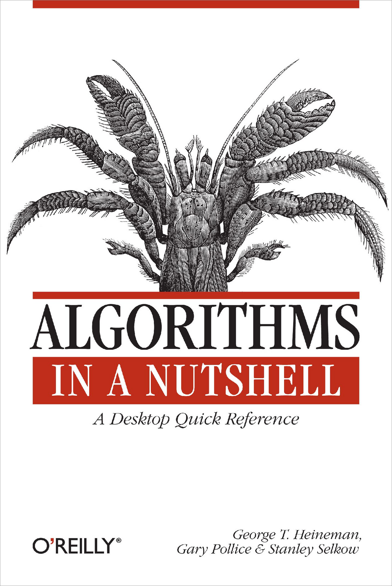

- **Preface**
  - **Principle: Use Real Code, Not Pseudocode**
    - Pseudocode commonly found in textbooks is not sufficient for direct software implementation.
    - The book provides fully implemented, documented, and tested real code for algorithms.
    - Readers are encouraged to use or adapt the provided code in their own software.
    - Further reading: [Ford-Fulkerson Algorithm](http://en.wikipedia.org/wiki/Ford_Fulkerson)
  - **Principle: Separate the Algorithm from the Problem Being Solved**
    - Implementation separates generic algorithms from problem-specific details using well-defined interfaces.
    - Code readability and maintainability improve by encapsulating domain-specific elements.
    - Optimization is discouraged until correctness is established; premature optimization is warned against.
    - Further reading: [AlphaBeta pruning](https://en.wikipedia.org/wiki/Alpha%E2%80%93beta_pruning)
  - **Principle: Introduce Just Enough Mathematics**
    - Only mathematics essential to understanding data structures and control flow is introduced.
    - Detailed mathematical proofs are referenced but not included; readers are directed to other sources.
    - Key terms and analytic techniques for differentiating algorithm behaviors are explained.
    - Further reading: [Introduction to Algorithms](https://mitpress.mit.edu/books/introduction-algorithms-third-edition)
  - **Principle: Support Mathematical Analysis Empirically**
    - Performance is analyzed mathematically and validated by empirical benchmarking.
    - Benchmark results demonstrate that algorithm design impacts efficiency more than implementation platform.
    - An appendix details benchmarking methodology for independent validation.
    - Further reading: [JUnit Testing Framework](http://junit.org)
  - **Audience**
    - The book targets experienced programmers familiar with essential data structures and programming languages.
    - Readers are expected to leverage the book for improving or developing efficient algorithmic solutions.
    - Emphasis is placed on practical, documented code and understanding algorithmic key decisions.
    - Further reading: [The Art of Computer Programming, Donald Knuth](http://www-cs-faculty.stanford.edu/~knuth/taocp.html)
  - **Contents of This Book**
    - Divided into four parts: Introduction to algorithms, categorized algorithm chapters, resources for further study, and benchmarking appendix.
    - Parts are designed to build understanding from foundational math to domain-specific algorithms and final epilogue.
    - The benchmarking appendix provides standard empirical data and replicable procedures.
  - **Conventions Used in This Book**
    - Code appears in a distinct typeface, reflecting real code from the repository.
    - Italics indicate key terms and variables in pseudocode.
    - Constant width font designates software elements like classes and constants.
    - SMALL CAPS refer to algorithm names.
  - **Using Code Examples**
    - Code may be freely used for personal programming and documentation with no permission needed for small uses.
    - Significant reproduction or commercial redistribution requires permission.
    - Attribution is appreciated but not required.
  - **Comments and Questions**
    - Contact information for O’Reilly Media is provided for comments and technical questions.
    - A dedicated book website and email address are available for errata and inquiries.
    - Further reading: [O’Reilly Media](http://oreilly.com), [Safari Books Online](http://safari.oreilly.com)
- **Part I: I**
  - **Chapter 1. Algorithms Matter**
    - **Section 1.1. Understand the Problem**
      - Real-world memory leak detection was inefficient due to improper data structure choice.
      - Knowing the correct structure and balancing it (red-black tree) dramatically improved performance.
      - Performance analysis must consider how data structures affect runtime.
      - Further reading: [Red-Black Trees](https://en.wikipedia.org/wiki/Red%E2%80%93black_tree)
    - **Section 1.2. Experiment if Necessary**
      - Experiments demonstrated performance depended on simultaneous open allocations rather than total leaks.
      - Instrumentation and testing reveal underlying algorithmic bottlenecks.
      - Conceptual insight leads to better algorithmic design choices.
    - **Section 1.3. Side Story**
      - Memory allocation performance varies depending on allocation sizes and order of deallocation.
      - Underlying system implementations may use complex, platform-dependent algorithms.
      - Empirical benchmarking validates claims about algorithmic behavior.
      - Further reading: [malloc implementation details](https://man7.org/linux/man-pages/man3/malloc.3.html)
    - **Section 1.4. The Moral of the Story**
      - Choosing the right algorithm is a critical software development skill.
      - Algorithms need not be perfect, but must be suitable and effective.
      - Empirical testing and understanding of algorithm characteristics are essential.
    - **Section 1.5. References**
      - Cormen et al., 2001, Introduction to Algorithms, Second Edition.
  - **Chapter 2. The Mathematics of Algorithms**
    - **Section 2.1. Size of a Problem Instance**
      - Input size affects algorithm complexity; encoding choices impact performance.
      - Examples show how different encodings alter problem size and computational cost.
      - Effective problem representation influences algorithm efficiency.
      - Further reading: [Algorithm Analysis and Encoding](https://en.wikipedia.org/wiki/Problem_size)
    - **Section 2.2. Rate of Growth of Functions**
      - Algorithm efficiency characterized by growth rate of execution time relative to input size.
      - O-notation (e.g., linear, logarithmic) abstracts computational complexity.
      - Real-world factors may cause deviations from theoretical growth.
      - Further reading: [Big O Notation](https://en.wikipedia.org/wiki/Big_O_notation)
    - **Section 2.3. Analysis in the Best, Average, and Worst Cases**
      - Algorithms have different performance depending on input: best, average, and worst case.
      - Understanding input characteristics is essential to algorithm choice.
      - Examples illustrate sorting algorithms behave differently on nearly sorted data.
      - Further reading: [Algorithm Best and Worst Cases](https://en.wikipedia.org/wiki/Algorithm_analysis)
    - **Section 2.4. Performance Families**
      - Algorithms are classified by asymptotic performance: constant, logarithmic, linear, n log n, quadratic, exponential.
      - Examples include searching, addition, multiplication, and gcd algorithms.
      - Transitions in performance can arise from data representation or algorithm design.
      - Further reading: [Time Complexity Classes](https://en.wikipedia.org/wiki/Time_complexity)
    - **Section 2.5. Mix of Operations**
      - Combining operations with different costs and frequencies influences overall performance.
      - Scale changes can reverse performance advantages between implementations.
    - **Section 2.6. Benchmark Operations**
      - Benchmark operations are core actions whose counts predict execution time.
      - Example: multiplication operation (*) as benchmark for exponentiation by repeated multiplication.
      - Detailed empirical testing reveals nonlinear effects from data sizes and platform architecture.
    - **Section 2.7. One Final Point**
      - O-notation omits constants but both upper and lower bounds (O and Ω) define tighter behavior (Θ).
      - The book uses upper-bound notation (O) for simplicity, emphasizing dominant complexity terms.
    - **Section 2.8. References**
      - Bentley & McIlroy, “Engineering a Sort Function” (1993).
      - Zuras, “More on Squaring and Multiplying Large Integers” (1994).
  - **Chapter 3. Patterns and Domains**
    - **Section 3.1. Patterns: A Communication Language**
      - Design patterns are proven solutions to common problems; they enable effective communication.
      - Patterns separate general algorithmic solutions from domain-specific details.
      - Originates from architectural design literature and adapted for software engineering.
      - Further reading: [Design Patterns: Elements of Reusable Object-Oriented Software](https://www.oreilly.com/library/view/design-patterns-elements/0201633612/)
    - **Section 3.2. Algorithm Pattern Format**
      - The book uses a structured pattern format to describe algorithms consistently.
      - Patterns include problem context, solution description, performance characteristics, and implementations.
    - **Section 3.3. Pseudocode Pattern Format**
      - Pseudocode is used in patterns to communicate control flow and logic abstractly.
      - Accompanied by real code to bridge theory and practice.
    - **Section 3.4. Design Format**
      - Designs are presented to separate algorithm logic from domain concerns using interfaces or abstractions.
    - **Section 3.5. Empirical Evaluation Format**
      - Empirical evidence accompanies each pattern to demonstrate real-world performance.
      - Benchmarking methodology supports claims of efficiency and aids algorithm selection.
    - **Section 3.6. Domains and Algorithms**
      - Algorithms apply within specific problem domains, requiring understanding of domain constraints.
    - **Section 3.7. Floating-Point Computations**
      - Floating point arithmetic characteristics and limitations affect algorithm design and analysis.
    - **Section 3.8. Manual Memory Allocation**
      - Memory management strategies impact algorithm performance and complexity.
    - **Section 3.9. Choosing a Programming Language**
      - Programming language features influence ease of implementation and algorithm efficiency.
    - **Section 3.10. References**
      - Relevant literature and web resources supporting algorithmic pattern theory.
