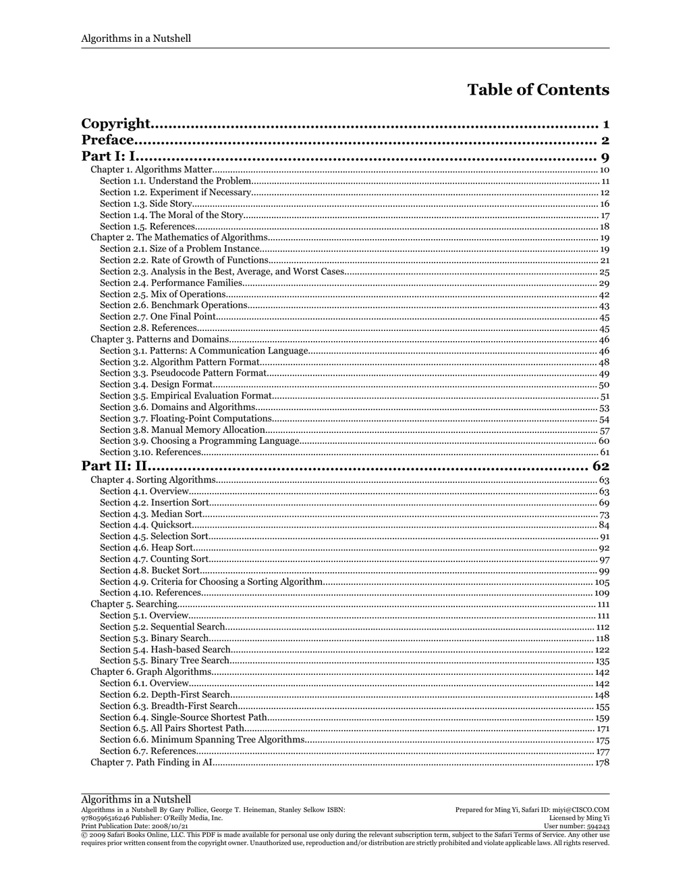

- **Copyright**
  - Copyright notices and usage restrictions for the book are detailed.  
  - Personal use is allowed during the subscription term under Safari Terms of Service.  
  - Unauthorized reproduction or distribution violates applicable laws.  
  - Further reading: [Copyright Basics](https://www.copyright.gov/help/faq/)

- **Preface**
  - Introduces the scope and goals of the book.  
  - Provides context about the book's approach to algorithms.  
  - Highlights the intended audience and usage scenarios.  
  - Further reading: [Introduction to Algorithms](https://mitpress.mit.edu/books/introduction-algorithms)

- **Part I: I**
  - Contains foundational concepts and mathematical background of algorithms.

  - **Chapter 1. Algorithms Matter**
    - Discusses the importance of understanding problems before algorithm design.  
    - Emphasizes experimentation as part of algorithm development.  
    - Presents narrative examples to illustrate practical challenges.  
    - Concludes with moral lessons on algorithms' relevance.  
    - Further reading: [Algorithm Design Manual](https://www.algorist.com/)

    - **Section 1.1. Understand the Problem**
      - Stresses clarity in problem definition as a prerequisite for algorithm creation.  
      - Identifies problem constraints and requirements as influencing algorithm design.  
      - Encourages precise understanding to avoid costly errors.  
      - Further reading: [Problem Solving Techniques](https://www.cs.cmu.edu/~15110-s12/lectures/lec02-problem-solving.pdf)

    - **Section 1.2. Experiment if Necessary**
      - Advocates for experimental evaluation when analytical solutions are insufficient.  
      - Details scenarios where experimentation clarifies performance or correctness.  
      - Highlights empirical data's role in refining algorithm choices.  
      - Further reading: [Empirical Algorithmics](https://link.springer.com/book/10.1007/978-3-642-31068-9)

    - **Section 1.3. Side Story**
      - Provides illustrative anecdotal examples related to algorithm challenges.  
      - Demonstrates practical implications of theoretical principles.  
      - Supports understanding through storytelling of algorithmic problem-solving.  

    - **Section 1.4. The Moral of the Story**
      - Summarizes key lessons learned from prior sections and stories.  
      - Reinforces principles about problem understanding and algorithm design balance.  
      - Encourages critical thinking in algorithm application.  

    - **Section 1.5. References**
      - Lists scholarly and practical sources referenced in the chapter.  

  - **Chapter 2. The Mathematics of Algorithms**
    - Covers mathematical foundations essential to algorithm analysis.  
    - Introduces complexity metrics and growth rate functions.  
    - Differentiates among best, average, and worst-case analyses.  
    - Addresses performance families and operation mixes.  
    - Discusses benchmarking operations for algorithm evaluation.  
    - Further reading: [Big O Cheat Sheet](https://www.bigocheatsheet.com/)

    - **Section 2.1. Size of a Problem Instance**
      - Defines problem instance size as a basis for complexity measurement.  
      - Explains how input size influences resource needs.  

    - **Section 2.2. Rate of Growth of Functions**
      - Describes common function growth rates such as linear, quadratic, logarithmic.  
      - Demonstrates how growth rates affect algorithm scalability.  

    - **Section 2.3. Analysis in the Best, Average, and Worst Cases**
      - Differentiates complexity under varying input scenarios.  
      - Provides insight on when worst-case analysis is critical.  

    - **Section 2.4. Performance Families**
      - Categorizes algorithms according to their performance profiles.  
      - Highlights families such as divide-and-conquer, dynamic programming.  

    - **Section 2.5. Mix of Operations**
      - Examines how different operations contribute to overall cost.  
      - Advises careful operation-level analysis for precise performance predictions.  

    - **Section 2.6. Benchmark Operations**
      - Identifies standard operations used as benchmarks in empirical studies.  

    - **Section 2.7. One Final Point**
      - Offers concluding remarks on mathematical considerations in algorithms.  

    - **Section 2.8. References**
      - Provides references supporting mathematical content in the chapter.  

  - **Chapter 3. Patterns and Domains**
    - Discusses standardized communication formats for algorithm description.  
    - Covers pseudocode conventions and design documentation.  
    - Explores algorithm domains and special considerations like floating-point and memory management.  
    - Guides choosing appropriate programming languages for algorithm implementation.  
    - Further reading: [Algorithm Patterns](https://www.oreilly.com/library/view/algorithm-design/9780132131088/)

    - **Section 3.1. Patterns: A Communication Language**
      - Explains how patterns help in communicating algorithm designs.  
      - Provides structure for describing algorithms consistently.  

    - **Section 3.2. Algorithm Pattern Format**
      - Details a formalized format to describe algorithms.  
      - Emphasizes clarity and completeness in algorithm presentation.  

    - **Section 3.3. Pseudocode Pattern Format**
      - Specifies conventions for writing pseudocode relatable across languages.  

    - **Section 3.4. Design Format**
      - Outlines the design documentation template for algorithms.  

    - **Section 3.5. Empirical Evaluation Format**
      - Suggests a standardized approach for reporting evaluation results.  

    - **Section 3.6. Domains and Algorithms**
      - Identifies various application domains affecting algorithm selection.  

    - **Section 3.7. Floating-Point Computations**
      - Highlights issues and considerations unique to floating-point arithmetic.  

    - **Section 3.8. Manual Memory Allocation**
      - Examines algorithms requiring explicit memory management.  

    - **Section 3.9. Choosing a Programming Language**
      - Discusses factors influencing language choice for algorithm implementation.  

    - **Section 3.10. References**
      - Provides citations related to patterns and domain topics.  

- **Part II: II**
  - Focuses on core algorithm categories such as sorting, searching, graph processing, AI pathfinding, network flows, and computational geometry.

  - **Chapter 4. Sorting Algorithms**
    - Provides an overview of sorting techniques and their applications.  
    - Describes multiple sorting algorithms with details on procedure and complexity.  
    - Discusses criteria for selecting a suitable sorting algorithm depending on context.  
    - Further reading: [Sorting Algorithms](https://visualgo.net/en/sorting)

    - **Section 4.1. Overview**
      - Introduces sorting as a fundamental operation in computer science.  

    - **Section 4.2. Insertion Sort**
      - Explains the principle and steps of insertion sort.  
      - Notes its efficiency on small or nearly sorted datasets.  

    - **Section 4.3. Median Sort**
      - Describes an algorithm using median-based partitioning methods.  

    - **Section 4.4. Quicksort**
      - Details quicksort's divide-and-conquer strategy and pivot selection.  

    - **Section 4.5. Selection Sort**
      - Covers selection sort mechanics and performance characteristics.  

    - **Section 4.6. Heap Sort**
      - Explains use of a heap data structure to achieve O(n log n) sorting.  

    - **Section 4.7. Counting Sort**
      - Describes a non-comparison sort effective for limited key ranges.  

    - **Section 4.8. Bucket Sort**
      - Details dividing elements into buckets for linear time sorting under suitable distributions.  

    - **Section 4.9. Criteria for Choosing a Sorting Algorithm**
      - Lists important factors such as data size, stability, and memory usage impacting choice.  

    - **Section 4.10. References**
      - Cites sources for deepening sorting algorithm knowledge.  

  - **Chapter 5. Searching**
    - Surveys searching algorithms from simple to sophisticated.  
    - Examines trade-offs and typical use cases for each method.  

    - **Section 5.1. Overview**
      - Defines searching and its importance in data retrieval.  

    - **Section 5.2. Sequential Search**
      - Outlines linear scanning through data.  
      - Notes simplicity at the cost of higher time complexity.  

    - **Section 5.3. Binary Search**
      - Discusses logarithmic search on sorted sequences.  

    - **Section 5.4. Hash-based Search**
      - Introduces hashing to achieve expected constant time lookups.  

    - **Section 5.5. Binary Tree Search**
      - Explains search within binary tree structures and balancing implications.  

  - **Chapter 6. Graph Algorithms**
    - Introduces graphs and essential algorithms for traversal and optimization.  
    - Explores shortest paths, minimum spanning trees, and search strategies.  

    - **Section 6.1. Overview**
      - Defines graph terminology and representations.  

    - **Section 6.2. Depth-First Search**
      - Details DFS approach for exploring graph structures.  

    - **Section 6.3. Breadth-First Search**
      - Describes BFS for layer-wise graph traversal.  

    - **Section 6.4. Single-Source Shortest Path**
      - Presents algorithms computing shortest paths from one vertex.  

    - **Section 6.5. All Pairs Shortest Path**
      - Explains algorithms for shortest paths between all node pairs.  

    - **Section 6.6. Minimum Spanning Tree Algorithms**
      - Introduces MST concepts and popular algorithms like Prim’s and Kruskal’s.  

    - **Section 6.7. References**
      - Provides sources on graph theory and algorithm design.  

  - **Chapter 7. Path Finding in AI**
    - Focuses on algorithmic approaches to AI navigation and decision problems.  
    - Covers search strategies and heuristic improvements.  

    - **Section 7.1. Overview**
      - Introduces pathfinding challenges in artificial intelligence.  

    - **Section 7.2. Depth-First Search**
      - Applies DFS to AI search problems.  

    - **Section 7.3. Breadth-First Search**
      - Uses BFS for uninformed search scenarios.  

    - **Section 7.4. A* Search**
      - Describes heuristic-guided search optimizing path cost and efficiency.  

    - **Section 7.5. Comparison**
      - Compares different search algorithms based on their properties and suitability.  

    - **Section 7.6. Minimax**
      - Details the minimax algorithm for adversarial search in game theory.  

    - **Section 7.7. NegMax**
      - Introduces NegMax as a simplification of minimax for two-player games.  

    - **Section 7.8. AlphaBeta**
      - Explains alpha-beta pruning to optimize minimax search.  

    - **Section 7.9. References**
      - Lists seminal works and papers on AI pathfinding and search algorithms.  

  - **Chapter 8. Network Flow Algorithms**
    - Covers algorithms related to flow networks and optimization problems.  

    - **Section 8.1. Overview**
      - Defines network flow problems and their significance.  

    - **Section 8.2. Maximum Flow**
      - Explains algorithms to compute maximum flow in networks.  

    - **Section 8.3. Bipartite Matching**
      - Describes matching problems in bipartite graphs.  

    - **Section 8.4. Reflections on Augmenting Paths**
      - Discusses the augmenting path method as solution basis.  

    - **Section 8.5. Minimum Cost Flow**
      - Introduces methods for flow with cost minimization.  

    - **Section 8.6. Transshipment**
      - Explains flow problems with intermediate nodes.  

    - **Section 8.7. Transportation**
      - Discusses optimization of goods transportation in networks.  

    - **Section 8.8. Assignment**
      - Covers assignment problems as special cost flow instances.  

    - **Section 8.9. Linear Programming**
      - Connects network flows to linear programming formulations.  

    - **Section 8.10. References**
      - Provides foundational literature on network flow algorithms.  

  - **Chapter 9. Computational Geometry**
    - Introduces geometric algorithms and data structures for spatial problems.  

    - **Section 9.1. Overview**
      - Defines computational geometry and typical problems addressed.  

    - **Section 9.2. Convex Hull Scan**
      - Details algorithms to compute the convex hull of points.  

    - **Section 9.3. LineSweep**
      - Explains the line sweep paradigm for processing geometric events.  

    - **Section 9.4. Nearest Neighbor Queries**
      - Describes data structures for efficient nearest neighbor searching.  

    - **Section 9.5. Range Queries**
      - Covers querying points within geometric ranges.  

    - **Section 9.6. References**
      - Lists key texts on computational geometry algorithms.  

- **Part III: III**
  - Addresses advanced topics and fallback strategies for algorithmic challenges.

  - **Chapter 10. When All Else Fails**
    - Explores alternative algorithmic strategies when standard solutions are inadequate.  
    - Discusses approximation, offline, parallel, randomized, and probabilistic algorithms.  
    - Further reading: [Approximation Algorithms](https://www.springer.com/gp/book/9783642076813)

    - **Section 10.1. Variations on a Theme**
      - Introduces variations in algorithmic approaches adapting to problem needs.  

    - **Section 10.2. Approximation Algorithms**
      - Details algorithms providing near-optimal solutions with performance guarantees.  

    - **Section 10.3. Offline Algorithms**
      - Discusses algorithms that process input in batch mode without real-time constraints.  

    - **Section 10.4. Parallel Algorithms**
      - Covers algorithms designed for concurrent execution to improve performance.  

    - **Section 10.5. Randomized Algorithms**
      - Explains use of randomness to simplify or accelerate algorithms.  

    - **Section 10.6. Algorithms That Can Be Wrong, but with Diminishing Probability**
      - Describes probabilistic algorithms balancing correctness with efficiency.  

    - **Section 10.7. References**
      - Lists important readings on advanced algorithm strategies.  

  - **Chapter 11. Epilogue**
    - Summarizes overarching principles of algorithm design and understanding.  
    - Emphasizes data knowledge, problem decomposition, and appropriate data structures.  
    - Discusses performance trade-offs, search construction, and problem reduction.  
    - Ends with reflections on the complexity of writing and testing algorithms.  

    - **Section 11.1. Overview**
      - Provides a high-level recap of key algorithmic principles.  

    - **Section 11.2. Principle: Know Your Data**
      - Stresses importance of data characteristics in algorithm selection.  

    - **Section 11.3. Principle: Decompose the Problem into Smaller Problems**
      - Advocates modular problem-solving to simplify complexity.  

    - **Section 11.4. Principle: Choose the Right Data Structure**
      - Links data structure choice to algorithmic efficiency.  

    - **Section 11.5. Principle: Add Storage to Increase Performance**
      - Notes trade-offs involving memory to accelerate computation.  

    - **Section 11.6. Principle: If No Solution Is Evident, Construct a Search**
      - Suggests systematic search methods when direct solutions are unclear.  

    - **Section 11.7. Principle: If No Solution Is Evident, Reduce Your Problem to Another Problem That Has a Solution**
      - Encourages problem transformations to leverage existing algorithms.  

    - **Section 11.8. Principle: Writing Algorithms Is Hard—Testing Algorithms Is Harder**
      - Recognizes challenges in algorithm correctness and validation.  

- **Part IV: IV**
  - Contains supplemental material on benchmarking and statistical aspects.

  - **Appendix A. Benchmarking**
    - Presents methodology for performance measurement of algorithms.  
    - Covers statistical foundations, hardware considerations, and reporting standards.  

    - **Section A.1. Statistical Foundation**
      - Discusses statistical methods used to analyze benchmarking data.  

    - **Section A.2. Hardware**
      - Explains how hardware affects algorithm performance measurements.  

    - **Section A.3. Reporting**
      - Provides guidelines on presenting benchmarking results clearly.  

    - **Section A.4. Precision**
      - Details precision issues in timing and performance metrics.  

- **About the Authors**
  - Provides biographical information about the book’s authors.  

- **Colophon**
  - Describes publication details and production credits.  
