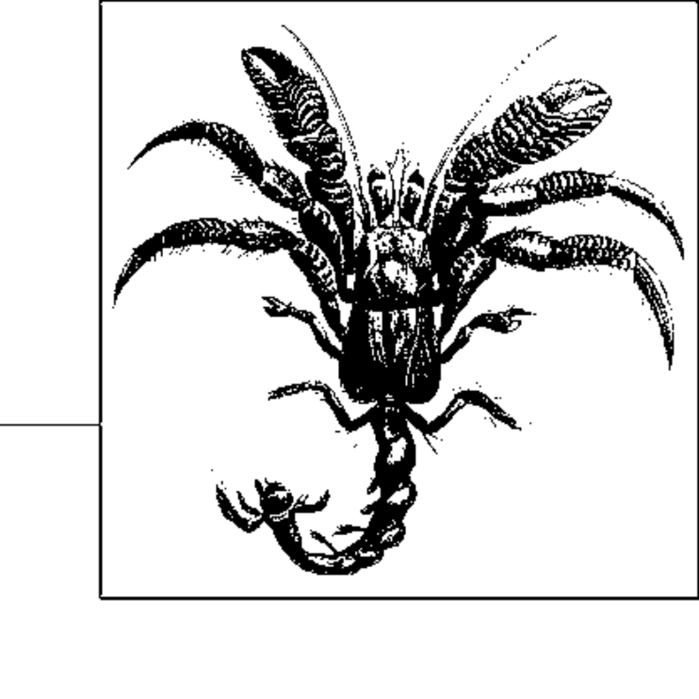

- **Chapter 2 The Mathematics of Algorithms**
  - **Size of a Problem Instance**
    - An instance is a particular input dataset applied to a program, and execution time usually increases with instance size.
    - Different encodings of the same data may have similar size but vary significantly in operational efficiency.
    - Evaluating algorithm efficiency assumes the encoding method is not the deciding factor in implementation efficiency.
    - Further details at [Algorithms in a Nutshell: Encoding Impact](https://example.org/encoding-impact)
  - **Rate of Growth of Functions**
    - Algorithm behavior is described by the growth rate of execution time relative to input size, abstracting away constants.
    - Platform factors like CPU, OS, and programming language impact timings by constant factors, not asymptotic growth.
    - Example: SEQUENTIAL SEARCH examines about half the list elements on average, leading to linear time behavior.
    - Additional resources: [Big O Notation](https://en.wikipedia.org/wiki/Big_O_notation)
  - **Analysis in the Best, Average, and Worst Cases**
    - Worst-case defines maximum runtime for any input of size n, important for guaranteed performance.
    - Average-case reflects expected runtime over a probability distribution of inputs, representing typical usage.
    - Best-case indicates minimal work for inputs favoring the algorithm, though rarely encountered in practice.
    - Consult [Algorithm Analysis Techniques](https://www.geeksforgeeks.org/average-case-analysis/)
  - **Worst-Case**
    - Worst-case runtime is the maximum over all inputs of size n and provides a pessimistic performance bound.
    - It supports real-time system design where delays can be catastrophic.
    - Finding exact worst-case inputs often requires adversarial reasoning rather than empirical data.
    - See [Worst-Case Analysis](https://www.cs.princeton.edu/~wayne/kleinberg-tardos/pdf/06Analysis.pdf)
  - **Average-Case**
    - Average-case runtime uses a probability distribution over inputs to weight expected work.
    - It balances realistic expectations against worst-case pessimism and assumes knowledge of input distributions.
    - Average-case ignores inputs with zero probability in the distribution.
    - For more, refer to [Average-Case Complexity](https://en.wikipedia.org/wiki/Average-case_complexity)
  - **Best-Case**
    - Best-case runtime corresponds to inputs requiring minimal computation.
    - It provides insight into optimal algorithm behavior but is typically not representative.
    - Some algorithms, like COUNTING SEARCH, have linear best-case performance regardless.
    - Additional insight: [Best Case Complexity](https://www.tutorialspoint.com/best-case-average-case-and-worst-case-in-data-structure)
  - **Performance Families**
    - Algorithm efficiency classifications range from constant, logarithmic, sublinear, linear, n log n, quadratic, to exponential.
    - These families help compare algorithms based on how their runtime scales with input size.
    - Constants are often ignored in favor of growth rates for long-term performance understanding.
    - See [Computational Complexity Classes](https://en.wikipedia.org/wiki/Time_complexity)
    - **Discussion 0: Constant Behavior**
      - Primitive operations on fixed-size inputs perform in constant time, denoted O(1).
      - Comparing k-bit numbers is constant time if k is fixed and does not grow.
      - This abstraction ignores multiplicative constants for fixed k values.
      - See [Constant Time Operations](https://www.geeksforgeeks.org/constant-time-complexity-examples/)
    - **Discussion 1: Log n Behavior**
      - Logarithmic algorithms reduce problem size approximately by half each iteration.
      - Example: GUESSING a number between 1 and n can be done in ⎡log n⎤ guesses.
      - Newton’s method converges rapidly with logarithmic digit precision gain per iteration.
      - Additional reference: [Binary Search Algorithm](https://en.wikipedia.org/wiki/Binary_search_algorithm)
    - **Discussion 2: Sublinear O(nd) Behavior for d<1**
      - Some algorithms perform better than linear but worse than logarithmic, e.g., kd-tree search with O(n^(1-1/d)) time.
      - Sublinear behavior arises in multidimensional data partitions.
      - Related topic: [kd-tree Algorithm](https://en.wikipedia.org/wiki/K-d_tree)
    - **Discussion 3: Linear Performance**
      - Algorithms like addition scan input elements once, yielding O(n) linear time.
      - Small coding differences and platform factors affect constants but not asymptotic complexity.
      - Benchmarking confirms linear scaling for ADDITION variants across languages and machines.
      - See [Linear Time Algorithms](https://en.wikipedia.org/wiki/Linear_time)
    - **Discussion 4: n log n Performance**
      - Divide and conquer algorithms split problems recursively halving input size and recombine in linear time.
      - The recurrence t(n) = 2 t(n/2) + O(n) solves to t(n) = O(n log n).
      - Sorting algorithms like mergesort and optimized quicksort exhibit this behavior.
      - Further reading: [Divide and Conquer](https://en.wikipedia.org/wiki/Divide_and_conquer_algorithm)
    - **Discussion 5a: Quadratic Performance**
      - Nested loops over n elements yield O(n²) time, as seen in elementary multiplication algorithms.
      - Implementation variants may reduce constants but not the quadratic classification.
      - Specialized multiplication algorithms can outperform quadratic for large integers.
      - See [Multiplication Algorithms](https://en.wikipedia.org/wiki/Multiplication_algorithm)
    - **Discussion 5b: Less Obvious Performance Computations**
      - Some algorithms like Euclid's GCD may have highly input-dependent runtimes.
      - Naive GCD exhibits exponential O(n*2^n) worst-case time due to repeated subtraction.
      - Improved MODGCD algorithm uses modulo to achieve quadratic O(n²) average-case performance.
      - Additional reference: [GCD Algorithms](https://en.wikipedia.org/wiki/Euclidean_algorithm)
  - **Mix of Operations**
    - Data structures may contain multiple operations optimized differently for various inputs.
    - Overall performance depends on workload mix and input size.
    - Implementation A may outperform B on large scales despite B being initially faster at small scales.
    - See [Algorithmic Tradeoffs](https://dl.acm.org/doi/10.1145/632388.632394)
  - **Benchmark Operations**
    - Benchmark operations are core computations that predict overall algorithm performance.
    - Multiplications for 2^n and their runtime behaviors illustrate platform-dependent performance variations.
    - Performance discontinuities correspond to word sizes and storage requirements in underlying machines.
    - For extensive study see [Benchmarking in Computing](https://en.wikipedia.org/wiki/Benchmark_(computing))
  - **One Final Point**
    - Big O notation describes upper bounds ignoring constants; tighter bounds use Θ notation.
    - Understanding both upper and lower bounds provides better classification of algorithm efficiency.
    - This book uses O notation in the informal, common sense for clarity.
    - More at [Asymptotic Notation](https://en.wikipedia.org/wiki/Big_O_notation#Formal_definition)
