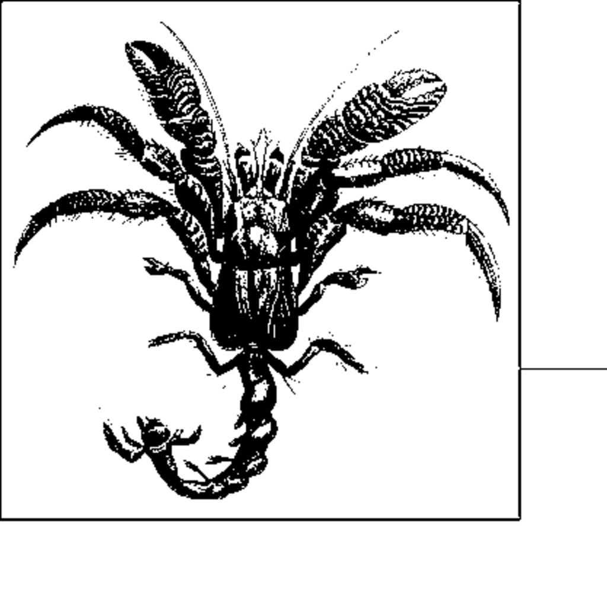

- **Overview**
  - Three fundamental queries on a collection: existence, retrieval, and associative lookup.
  - Collections may contain duplicates, so they are not strict mathematical sets.
  - Efficiency depends on whether elements can be randomly accessed or only iterated over.
  - Choosing the right data structure balances query speed and maintenance cost.
  - See related sorting algorithms in Chapter 4 for ordering data before search.

- **Sequential Search**
  - **Definition and Context**
    - Searches elements sequentially from start until matching target is found or all elements checked.
    - Suitable when collection is small, unordered, or accessed only via iterator.
  - **Input/Output and Solution**
    - Input: collection C with n elements and target t.
    - Output: true if t exists in C, false otherwise.
    - Implementation involves iterating through elements and testing equality.
  - **Forces and Consequences**
    - Efficient when n is small or search is infrequent.
    - Insertions in linked lists are O(1), but in arrays may be costly.
    - Average time complexity is O(n), linear growth with collection size.
  - **Analysis**
    - Average elements checked is about n/2 if item is present.
    - Worst case searches entire collection when item is absent.
    - Empirical timing tables confirm doubling n roughly doubles search time.
  - **Variations**
    - Strategies exist to reorder elements dynamically based on search patterns to improve average time.
    - Examples include move-to-front, move-up, and move-to-end on success.
    - Mathematical analysis of these variations is complex.
  - For further reading, see Knuth's *The Art of Computer Programming, Volume 3*.

- **Binary Search**
  - **Definition and Context**
    - Requires a sorted collection allowing random access by index.
    - Uses divide-and-conquer to halve the search space iteratively.
  - **Input/Output and Solution**
    - Input: sorted indexed collection A and target t.
    - Output: true if t found, false otherwise.
    - Algorithm maintains low, high indices and compares middle element to target.
  - **Forces and Consequences**
    - Performs well on static datasets with random access.
    - Inefficient if frequent insertions or deletions alter order.
    - Access to arbitrary elements A[i] is necessary.
  - **Analysis**
    - Worst and average case require O(log n) comparisons.
    - Empirical tests show execution times grow logarithmically.
    - Disk-based binary search dominated by I/O latency, but still O(log n).
  - **Variations**
    - Dynamic data requires search trees or hash tables to maintain efficiency.
    - For large data sets exceeding memory, B-Trees optimize disk access.
  - Recommended reading: Cormen et al., *Introduction to Algorithms*.

- **Hash-based Search**
  - **Definition and Context**
    - Uses a hash function to map keys of elements into bins in a hash table.
    - Efficient for large, unordered datasets in memory.
    - Key hashing distributes elements to bins; collisions are handled by chaining.
  - **Input/Output and Assumptions**
    - Input: hash table A of size b and target element t.
    - Output: true if t is in appropriate bin, false otherwise.
    - Assumes hash function is available and that average load factor remains acceptable.
  - **Forces and Consequences**
    - Good hash function minimizes collisions and unused table slots.
    - Memory overhead includes storage for hash table bins and linked list nodes.
    - Average search time is O(1); worst case is O(n) if many collisions.
  - **Solution**
    - Build hash table by inserting elements into linked lists per bin.
    - Hash function must normalize negative values.
    - Searching involves hashing target and scanning corresponding linked list.
  - **Analysis**
    - Load factor α = n/b controls average collisions per bin.
    - Performance improves as hash table size increases.
    - Rehashing during table growth trades build time for faster queries.
  - **Variations**
    - Collision resolution can use open addressing (linear or quadratic probing).
    - Perfect hashing avoids collisions via secondary hash tables.
    - Dynamic collections require resizing or rehashing strategies.
  - For more details see Cormen et al., *Introduction to Algorithms* and [GPERF Perfect Hashing](http://www.gnu.org/software/gperf/).

- **Binary Tree Search**
  - **Definition and Context**
    - Stores dynamic data sets in a tree structure maintaining ordering via keys.
    - Binary search trees facilitate efficient insertions, deletions, and ordered traversal.
  - **Forces and Consequences**
    - Preferred when data is dynamic or size unknown.
    - Balancing the tree is essential to avoid degenerate linear structures.
    - Red-black trees are an efficient form of balanced binary trees.
  - **Solution**
    - Search starts at root and moves left or right based on key comparisons.
    - Insertion employs coloring and rotations to maintain red-black properties.
    - Rotations restructure subtrees preserving binary search properties.
  - **Analysis**
    - Search, insert, and delete operations have O(log n) time complexity.
    - Extra storage per node includes color and parent pointer.
  - **Variations**
    - AVL trees and other balanced trees offer alternative balancing schemes.
    - For large datasets exceeding memory, B-Trees are preferred for disk optimization.
  - Further reading: Adel’son-Vel’skii and Landis (1962), Cormen et al., *Introduction to Algorithms*.
