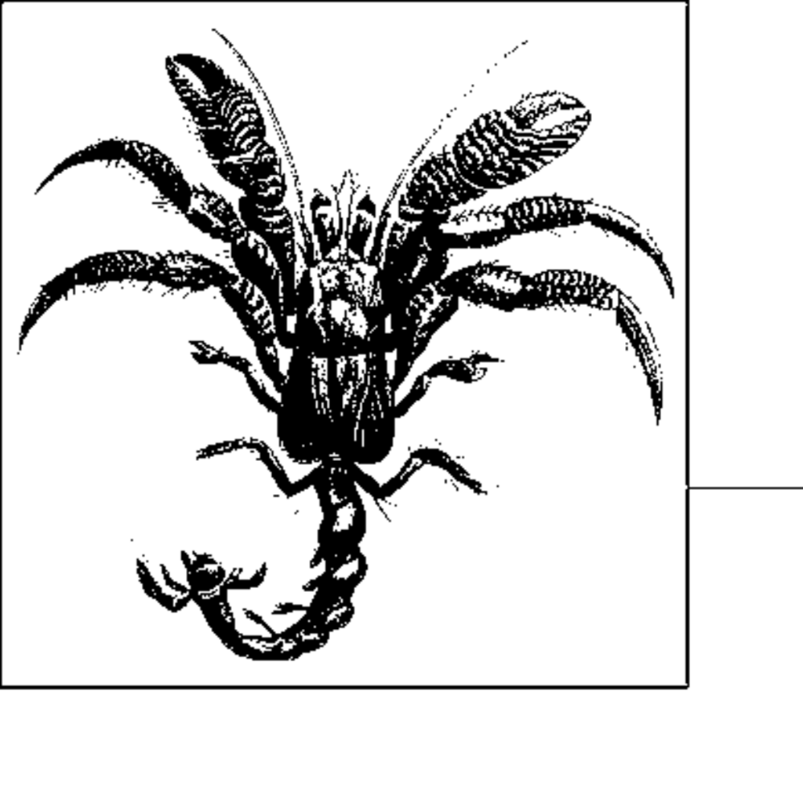

- **Sorting Algorithms**
  - **Overview**
    - Sorting makes numerous computations and tasks simpler by ordering information in advance.
    - Early research in algorithms focused on sorting large data collections too big for memory.
    - Sorting collections may be stored in RAM, secondary storage, or tertiary storage affecting access speed.
    - Read about sorting fundamentals in [Algorithms in a Nutshell](https://www.oreilly.com/library/view/algorithms-in-a/9780596516246/).
  - **Terminology**
    - A collection \( A \) contains comparable elements \( A[i] \) with \( A[0] \) as the first element.
    - Sorting arranges \( A \) so \( A[i] < A[j] \) implies \( i < j \), with duplicates contiguous.
    - Sorted \( A \) is a permutation of the original elements, typically sorted in-place.
  - **Representation**
    - Collections may be pointer-based (pointers to data) or value-based (contiguous fixed-size records).
    - Pointer-based allows arbitrarily complex records; value-based enables efficient contiguous storage.
    - Sorting algorithms can operate on secondary storage with adapted swap functions.
  - **Comparable Elements**
    - Elements must admit a total ordering where exactly one of \( p<q \), \( p=q \), or \( p>q \) holds.
    - Lexicographical ordering applies to composite elements like strings.
    - Unicode collation algorithms address complex ordering rules; see [Unicode Collation Algorithm](http://unicode.org/reports/tr10/).
  - **Stable Sorting**
    - Stable sorts maintain original relative order for equal elements.
    - Stability matters when sorting by secondary keys, e.g., sorting flights by destination retains departure time order.
    - Unstable sorts may reorder equal elements arbitrarily.
  - **Analysis Techniques**
    - Sorting algorithms are analyzed by best-case, average-case, and worst-case performance.
    - Any comparison-based sort requires at least \( O(n \log n) \) comparisons on average or worst case.
    - The lower bound proof involves binary decision trees with height related to \( \log(n!) \).
    - Non-comparison sorts like Counting Sort may achieve better than \( O(n \log n) \). 
  - **Insertion Sort**
    - Sorts by incrementally inserting elements into a sorted subarray.
    - Best for small or nearly sorted input due to minimal data movement.
    - Implementation shifts elements to accommodate new elements, efficient with pointer-based storage.
    - Best-case time is \( O(n) \), average and worst-case \( O(n^2) \).
    - See C implementations in Examples 4-1 and 4-2 for pointer- and value-based data.
  - **Median Sort**
    - Divide-and-conquer algorithm recursively partitions array around median element.
    - Uses partition to reorder elements relative to median; then sorts left and right subarrays.
    - Selection of the median uses a linear average-time algorithm (selectKth) relying on partition.
    - Average-case is \( O(n \log n) \), worst-case can degrade to \( O(n^2) \).
    - BFPRT algorithm ensures \( O(n \log n) \) worst-case by better median selection; see Example 4-6.
  - **Quicksort**
    - Chooses a pivot to partition array into elements less or greater than pivot, then recursively sorts subarrays.
    - Pivot selection strategies affect performance: random, median-of-three, or leftmost element.
    - Average-case performance is \( O(n \log n) \), but worst case can be \( O(n^2) \).
    - Optimizations include using insertion sort on small partitions, non-recursive implementations, and introsort.
    - Quicksort implementation is shown in Example 4-7.
    - Recommended reading: Sedgewick (1978) and Bentley & McIlroy (1993).
  - **Selection Sort**
    - Repeatedly selects largest element and places it at proper position.
    - Always requires quadratic time \( O(n^2) \), making it the slowest method here.
    - Simple but inefficient due to repeated scanning without leveraging partial order.
  - **Heap Sort**
    - Uses a binary heap data structure satisfying shape and heap properties.
    - Heap can be efficiently stored in an array mapping parent and children indices.
    - Builds a max-heap, then repeatedly extracts maximum and heapifies remaining elements.
    - Time complexity is \( O(n \log n) \) with guaranteed worst-case performance.
    - Implementation includes heapify and buildHeap functions; recursive and non-recursive variants exist.
  - **Counting Sort**
    - Non-comparison sort for values in a known fixed range [0, k).
    - Counts occurrences in buckets and reconstructs sorted array via bucket counts.
    - Runs in linear time \( O(n) \) under constraints of small k relative to n.
    - See Example 4-10 for counting sort implementation.
  - **Bucket Sort**
    - Distributes input into n buckets based on a hash function with ordered buckets and uniform distribution.
    - Sorts individual buckets (usually with insertion sort) and concatenates results.
    - Expected linear time \( O(n) \) when elements are uniformly distributed and buckets balanced.
    - Implementation uses linked lists per bucket; bucket count function and hash function are user-defined.
    - Variations include Hash Sort where buckets correspond to hash codes.
    - Example hash functions for uniform [0,1) values and strings are shown in Examples 4-12 and 4-13.
  - **Criteria for Choosing a Sorting Algorithm**
    - Insertion Sort excels for few or nearly sorted elements.
    - Heap Sort is suitable when worst-case performance is critical.
    - Quicksort offers the best average-case performance in most cases.
    - Bucket or Counting Sort are effective when elements lie in a dense, limited range.
    - Choice depends on data characteristics and performance requirements.
    - Reference detailed benchmarks comparing various algorithms on string and floating-point inputs.
  - **References**
    - Key foundational and advanced works: Cormen et al. on algorithms, Sedgewick on quicksort, Blum et al. on median selection.
    - Unicode Collation Algorithm by Davis and Whistler.
    - Musser on introsort and selection algorithms.
    - Gilreath on hash sort algorithms.
