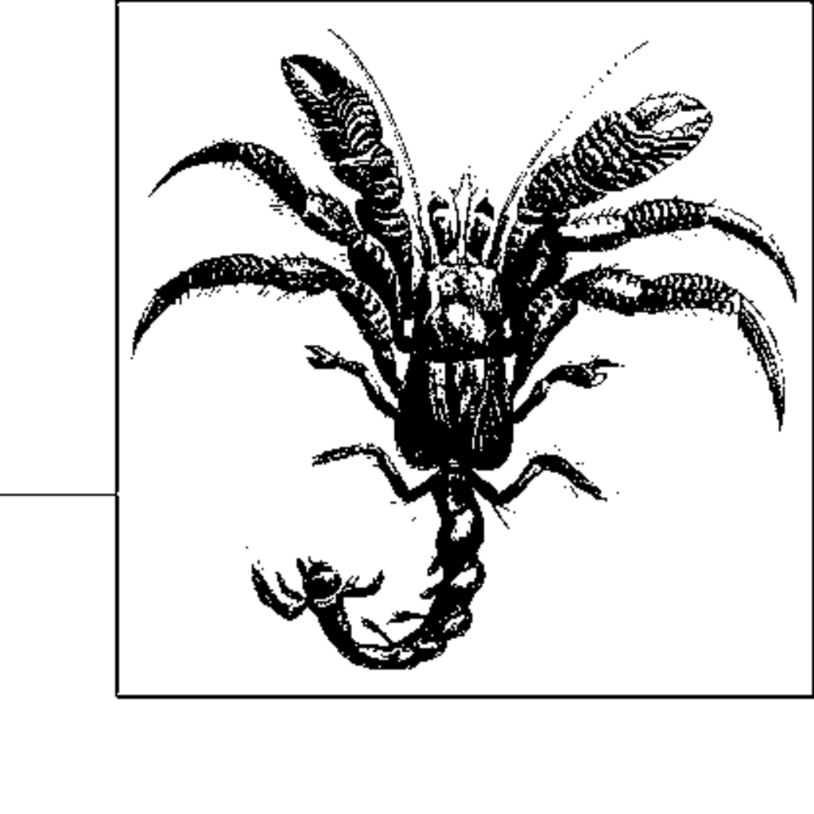

- **Chapter 6 Graph Algorithms**
  - **Overview**
    - Graphs represent complex structured information using vertices and edges.
    - The chapter focuses on simple graphs without self-edges or multiple edges between the same vertices.
    - Four graph types are described: undirected, directed, weighted, and hypergraphs.
    - [Graphs - Wikipedia](https://en.wikipedia.org/wiki/Graph_(discrete_mathematics))
  - **Graphs**
    - Graph G=(V,E) consists of vertices V and edges E over vertex pairs.
    - Undirected graphs model symmetric relationships; directed graphs model asymmetric relationships.
    - Weighted graphs attach numeric values to edges; hypergraphs allow multiple edges between vertices.
    - Simple graphs disallow self-edges and parallel edges.
  - **Graph Representations**
    - Two common storage methods are adjacency lists (linked lists per vertex) and adjacency matrices (n-by-n matrix).
    - Adjacency lists store edges explicitly and weights implicitly; adjacency matrices store weights explicitly.
    - Undirected graph edges appear twice in adjacency lists, and adjacency matrices must be symmetric.
  - **Storage Issues**
    - Adjacency matrices require O(n²) space, which can be infeasible for large sparse graphs.
    - Sparse graphs have far fewer edges than possible, making matrices inefficient.
    - Matrices are unsuitable for multiple relationships between vertex pairs.
    - Sparseness is a key factor in choosing a representation.
  - **Graph Analysis**
    - Algorithm complexity reflects number of vertices |V| and edges |E|.
    - Sparse graphs have |E| ≈ O(|V|); dense graphs have |E| ≈ O(|V|²).
    - Performance of some algorithms depends on graph density and representation.
    - Break-even graph density is approximately |E| = O(|V|² / log|V|).
  - **Data Structure Design**
    - Core graph operations include creation, query, and update.
    - Graphs are stored as arrays of edge lists (adjacency lists) with edges represented as integer pairs including weights.
    - Directed graphs add edges one way; undirected graphs add edges in both directions.
  - **Problems**
    - Common problems include shortest path (single-source and all-pairs) and minimum spanning tree (MST).
    - Shortest path length is sum of edge weights in a path.
    - MST connects all vertices with minimum total edge weight.
  - **Depth-First Search**
    - DFS explores vertices by moving forward until no unvisited neighbors remain, then backtracks.
    - Vertices are colored white (unvisited), gray (discovered but incomplete), and black (completed).
    - DFS produces timing arrays d (discovery time) and f (finish time), and predecessor array pred.
    - Edges are classified as tree, back, forward, and cross edges.
    - DFS runs in O(|V| + |E|) time.
    - [Depth-first search - Wikipedia](https://en.wikipedia.org/wiki/Depth-first_search)
  - **Breadth-First Search**
    - BFS explores vertices in order of their distance from the source (level by level).
    - Vertices are colored similarly as in DFS but processed using a queue.
    - BFS computes dist[], the shortest edge count from source, and pred[] arrays.
    - BFS runs in O(|V| + |E|) time and always finds shortest paths by edge count.
    - [Breadth-first search - Wikipedia](https://en.wikipedia.org/wiki/Breadth-first_search)
  - **Single-Source Shortest Path**
    - Finds the shortest path from a source vertex s to all others in a weighted graph.
    - Dijkstra’s algorithm uses a priority queue to greedily select the closest vertex not yet processed.
    - Edge weights must be positive; negative edges cause failures or infinite loops.
    - Bellman-Ford algorithm handles graphs with negative edges if no negative cycles exist.
    - Algorithm complexities:
      - Dijkstra with priority queue: O((V+E) log V)
      - Dijkstra for dense graphs: O(V² + E)
      - Bellman-Ford: O(V*E)
    - Benchmark results favor Dijkstra’s priority queue version for sparse graphs and optimized dense versions for dense graphs.
    - [Dijkstra's algorithm - Wikipedia](https://en.wikipedia.org/wiki/Dijkstra%27s_algorithm)
    - [Bellman-Ford algorithm - Wikipedia](https://en.wikipedia.org/wiki/Bellman%E2%80%93Ford_algorithm)
  - **All Pairs Shortest Path**
    - Computes shortest paths between all vertex pairs in a graph.
    - Floyd-Warshall algorithm uses dynamic programming by incrementally considering intermediate vertices.
    - Maintains dist[][] matrix with shortest path lengths and pred[][] for reconstructing paths.
    - Runs in O(V³) time; suitable for graphs with positive edge weights.
    - Path reconstruction uses pred[][] to rebuild shortest paths.
    - [Floyd–Warshall algorithm - Wikipedia](https://en.wikipedia.org/wiki/Floyd%E2%80%93Warshall_algorithm)
  - **Minimum Spanning Tree Algorithms**
    - Finds subset of edges connecting all vertices with minimum total edge weight.
    - Prim’s Algorithm grows MST by adding the minimal edge connecting the tree to an outside vertex.
    - Uses a priority queue (commonly a binary heap) to select edges efficiently.
    - Runs in O((V + E) log V) time with binary heap; Fibonacci heaps improve this to O(E + V log V).
    - Kruskal’s Algorithm is an alternative MST method using sorting edges and disjoint-set data structures with O(E log E) complexity.
    - [Minimum spanning tree - Wikipedia](https://en.wikipedia.org/wiki/Minimum_spanning_tree)
    - [Prim's algorithm - Wikipedia](https://en.wikipedia.org/wiki/Prim%27s_algorithm)
    - [Kruskal's algorithm - Wikipedia](https://en.wikipedia.org/wiki/Kruskal%27s_algorithm)
