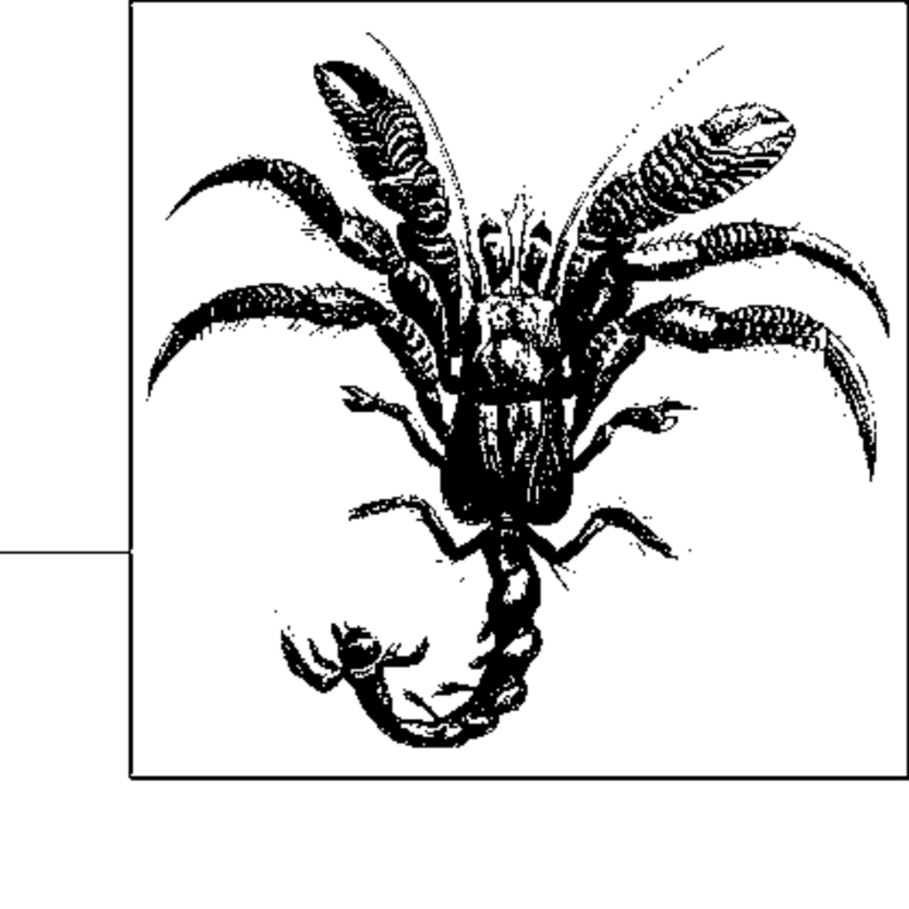

- **Chapter 8 Network Flow Algorithms**
  - **Overview**
    - Network flow problems model directed graphs with capacities over edges through which commodities flow.  
    - Specialized network flow instances include Assignment, Bipartite Matching, Transportation, Transshipment, and Maximum Flow.  
    - Ford-Fulkerson algorithm solves Maximum Flow and can be extended to solve bipartite matching and minimum cost flow problems.  
    - Linear programming can solve these problems but specialized algorithms are vastly more efficient.  
    - See [Ahuja (1993)](https://en.wikipedia.org/wiki/Network_flow) for extensive discussion on applications.  
  - **Network Flow Model**
    - A flow network is a directed graph G=(V,E) with a source vertex s and sink vertex t, involving edge capacities and flows.  
    - Three key properties are capacity constraint, flow conservation at all vertices except s and t, and skew symmetry in flow definitions.  
    - Flow paths are formed of unique vertices, and edge directions can be temporarily ignored when defining paths.  
  - **Maximum Flow**
    - The Maximum Flow problem seeks the largest feasible flow from source to sink respecting edge capacities.  
    - Ford-Fulkerson algorithm iteratively finds augmenting paths to increase flow until none exist, guaranteed to terminate with maximum flow.  
    - The algorithm maintains both forward and backward edges in adjacency structures for flow adjustments.  
  - **Ford-Fulkerson Algorithm**
    - The algorithm uses a search method (DFS or BFS) to find augmenting paths in the flow network.  
    - Flow updates are made by augmenting the path by the minimum residual capacity found.  
    - Depth-first search (DFS) and breadth-first search (BFS, Edmonds-Karp) variations differ primarily in search order and performance.  
    - Ford-Fulkerson with DFS has time complexity O(E*mf), where mf is maximum flow; Edmonds-Karp achieves O(V*E²) by BFS.  
  - **Ford-Fulkerson Components**
    - The implementation separates flow network storage, vertex and edge structure, and augmenting path search logic.  
    - The processPath method applies flow increments along paths using backward and forward edges correctly.  
    - Search implementations for augmenting path include DFS and BFS, represented as stack or queue respectively.  
    - BFS (Edmonds-Karp) finds shortest augmenting paths and often performs better in practice than DFS.  
    - See [Ford & Fulkerson (1962)](https://pubsonline.informs.org/doi/10.1287/mnsc.9.3.386) for original proof and algorithm.  
  - **Algorithm Optimizations**
    - Representing network edges using adjacency matrices enables faster lookups for dense graphs.  
    - The optimized version uses arrays and a circular queue to accelerate BFS searches for augmenting paths.  
    - Augmenting paths are found more efficiently by scanning capacities and flows with indexed arrays, improving cache performance.  
  - **Related Algorithms and Variations**
    - Push/relabel algorithm improves maximum flow performance and supports parallel computation.  
    - Extensions include vertex capacities (modeled by vertex splitting) and undirected edges (modeled by paired directed edges).  
    - Multi-commodity flow problems generalize maximum flow to multiple sources and sinks with shared capacities.  
    - See [Goldberg & Tarjan (1986)](https://dl.acm.org/doi/10.1145/12130.12144) for push/relabel algorithm.  
  - **Bipartite Matching**
    - Bipartite Matching pairs elements from two disjoint sets to maximize the number of matched pairs.  
    - The problem reduces to Maximum Flow by creating a flow network with source, sink, and edges representing acceptable pairs.  
    - Edges have capacity 1, ensuring no node is matched more than once.  
    - The maximum matching corresponds to the edges with flow 1 in the maximum flow solution.  
    - Reduction overhead is linear in problem size, preserving efficiency.  
  - **Reflections on Augmenting Paths**
    - Augmenting path search can be adapted to find least-cost augmenting paths for the Minimum Cost Flow problem.  
    - A priority queue (min-heap) is used to implement a shortest path search based on edge costs to find minimal cost augmentations.  
    - This approach generalizes Ford-Fulkerson to optimize both flow and cost concurrently.  
    - The search considers forward edges with residual capacity and backward edges where flow can be reduced.  
  - **Minimum Cost Flow**
    - Minimum Cost Flow minimizes the total cost of shipping a commodity over a network, respecting capacities, supply, and demand.  
    - Additional constraints include supply satisfaction at sources and demand satisfaction at sinks.  
    - Networks are adjusted to have a single source and sink by adding extra vertices and zero-cost edges.  
  - **Transshipment Problem**
    - Extends transportation by adding warehouses with capacities and processing costs as intermediate nodes.  
    - The problem is converted into a Minimum Cost Flow instance with added vertices for supply stations, warehouses (modeled as two nodes), and demand stations.  
    - The optimal flow schedule minimizes total shipping and transshipping costs while respecting capacity constraints.  
    - See [Orden (1956)](https://doi.org/10.1287/mnsc.2.3.295) for foundational work on transshipment problems.  
  - **Transportation Problem**
    - Determines least-cost shipment of goods from supply stations to demand stations without intermediate nodes.  
    - Reduced to Transshipment problem with zero warehouse nodes.  
    - Constraints enforce supply limits and demand satisfaction with positive capacities and costs.  
  - **Assignment Problem**
    - A special case of Transportation problem where each supply and demand node has unit capacity/demand.  
    - The problem is reduced to a Transportation problem with unit supplies and demands.  
  - **Linear Programming Approach**
    - All network flow problems can be formulated and solved as linear programming problems.  
    - Constraints include flow conservation, capacity limits, and non-negativity.  
    - Example code uses Maple’s simplex solver to minimize cost in Transportation problem.  
    - Specialized network algorithms outperform LP in practice for the described problems.  
    - See [Dantzig's Simplex Method](https://en.wikipedia.org/wiki/Simplex_algorithm) for the classic LP solving technique.
