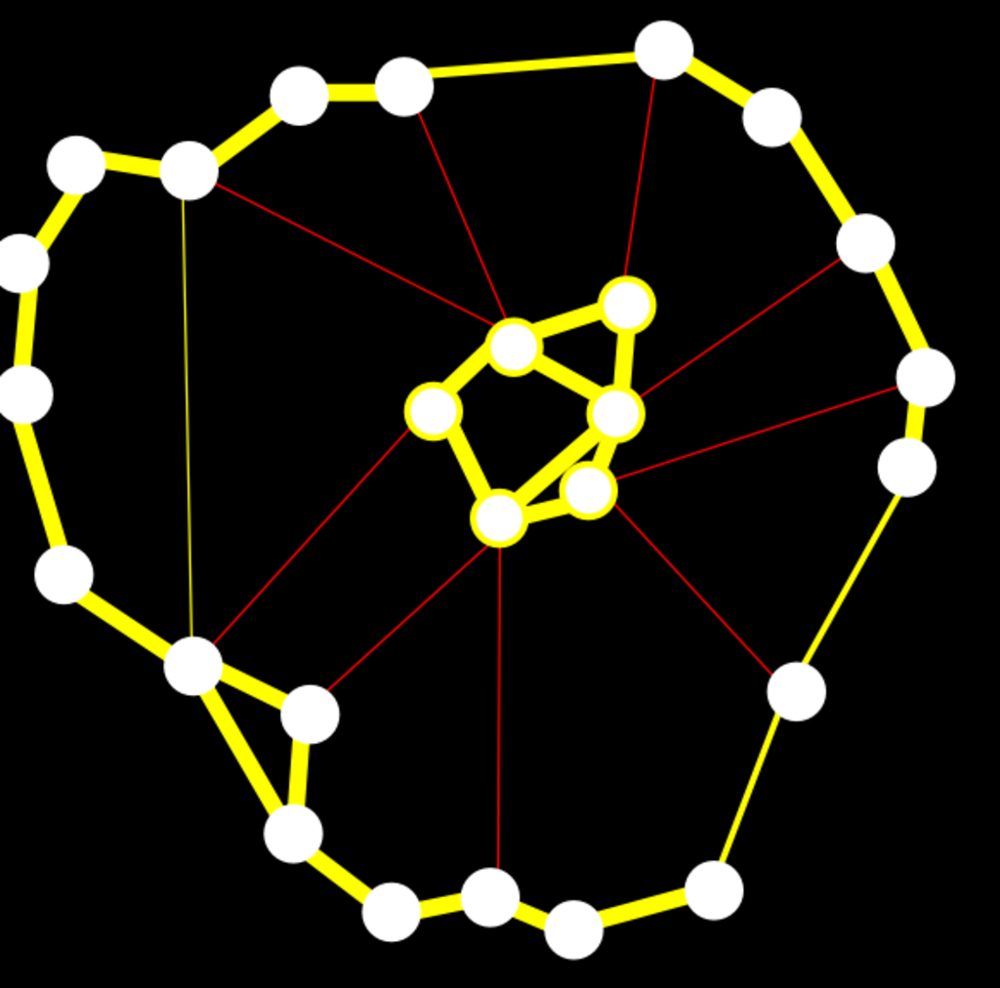

- **Chapter 2: Groups, Rings, and Fields**
  - **2.1 Groups, Subgroups, Cosets**
    - Defines groups with associative binary operations, identity elements, and inverses.
    - Explains monoids as sets with associative operations and identities but not necessarily inverses.
    - Provides examples including integers under addition and permutation groups.
    - Describes subgroups, cosets, and Lagrange's theorem regarding order divisions.
    - Discusses normal subgroups and their role in defining quotient groups.
    - Introduces group homomorphisms, kernels, images, and the first isomorphism theorem.
    - Further reading: [Abstract Algebra by Dummit and Foote](https://www.dummitandfoote.com/)
  - **2.2 Cyclic Groups**
    - Defines cyclic groups generated by powers of a single element.
    - Shows every subgroup of integers is generated by a single integer multiple.
    - Establishes isomorphisms of cyclic groups to Z or Z/nZ based on finiteness.
    - Introduces invertibility in Z/nZ tied to the GCD condition.
    - Defines Euler's totient function as counting invertible classes modulo n.
    - Further reading: [A First Course in Abstract Algebra by John B. Fraleigh](https://www.pearson.com/)
  - **2.3 Rings and Fields**
    - Defines rings as sets with two operations (+ and *) satisfying associative, distributive, and identity axioms.
    - Introduces integral domains as commutative rings without zero divisors.
    - Gives examples including integers, polynomial rings, matrix rings, and Gaussian integers.
    - Defines ring homomorphisms, ideals, and quotient rings analogous to group homomorphisms.
    - Defines fields as commutative rings where nonzero elements form a group under multiplication.
    - Explains field homomorphisms must be injective and extensions between fields.
    - Discusses characteristic of fields and algebraic closure.
    - Further reading: [Introduction to Commutative Algebra by Atiyah and MacDonald](https://www.cambridge.org/)
- **Chapter 3: Vector Spaces, Bases, Linear Maps**
  - **3.1 Motivations: Linear Combinations, Linear Independence, and Rank**
    - Considers solving linear systems as expressing a vector as a linear combination of others.
    - Defines operations of scalar multiplication, vector addition, and linear independence.
    - Explains uniqueness of representation given linear independence and zero vector.
    - Defines matrix representation of linear systems and corresponding linear transformations.
    - Introduces inner product, Euclidean norm, orthogonality, and matrix multiplication.
    - Highlights importance of LU, QR, and SVD decompositions for solving linear systems.
    - Further reading: [Linear Algebra Done Right by Sheldon Axler](https://www.springer.com/)
