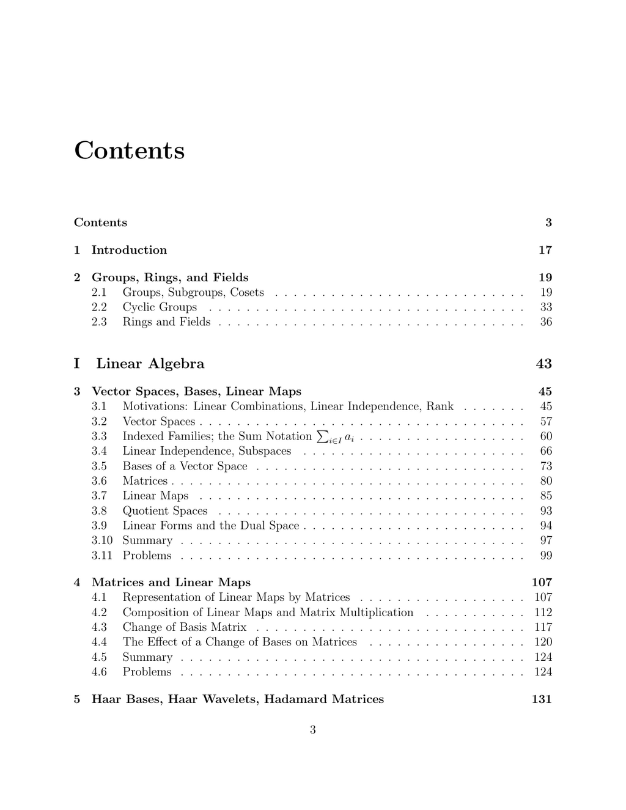

- **1 Introduction**
  - Introduces the foundational concepts and scope of the text.
  - Provides the context for the subsequent detailed treatment of algebra and geometry.
  - Recommends foundational algebra and geometry references for deeper understanding.

- **2 Groups, Rings, and Fields**
  - **2.1 Groups, Subgroups, Cosets**
    - Defines groups and introduces the concepts of subgroups and cosets.
    - Explains the role of these structures in abstract algebra.
    - Suggests [Algebra by Michael Artin](https://math.mit.edu/~etingof/artin.pdf) for extended study.
  - **2.2 Cyclic Groups**
    - Covers properties and classification of cyclic groups.
    - Describes generation and order of elements in cyclic groups.
    - References standard algebra textbooks for more examples.
  - **2.3 Rings and Fields**
    - Introduces rings and fields as algebraic structures.
    - Discusses basic properties and operations within rings and fields.
    - Recommends [Abstract Algebra by Dummit and Foote](https://www.math.vt.edu/people/faculty/dummit/) for comprehensive learning.

- **I Linear Algebra**
  - **3 Vector Spaces, Bases, Linear Maps**
    - **3.1 Motivations: Linear Combinations, Linear Independence, Rank**
      - Explains linear combinations and their role in vector spaces.
      - Defines linear independence and matrix rank.
      - Encourages further reading from [Linear Algebra Done Right by Sheldon Axler](https://linear.axler.net/).
    - **3.2 Vector Spaces**
      - Formalizes the definition of vector spaces over fields.
      - Highlights axioms governing vector operations.
    - **3.3 Indexed Families; the Sum Notation \( i \in I a_i \)**
      - Introduces notation and concepts for indexed families in vector spaces.
      - Discusses summation over indices and its algebraic significance.
    - **3.4 Linear Independence, Subspaces**
      - Defines linear independence rigorously.
      - Explores subspace criteria and properties.
    - **3.5 Bases of a Vector Space**
      - Characterizes what constitutes a basis.
      - Demonstrates bases allow unique vector representations.
    - **3.6 Matrices**
      - Introduces matrices as representations of linear maps.
      - Discusses matrix operations fundamental to linear algebra.
    - **3.7 Linear Maps**
      - Formal treatment of linear mappings between vector spaces.
      - Details kernel, image, and isomorphisms.
    - **3.8 Quotient Spaces**
      - Defines quotient spaces as spaces of cosets of subspaces.
      - Links quotient spaces to linear transformations.
    - **3.9 Linear Forms and the Dual Space**
      - Introduces linear functionals and dual vector spaces.
      - Explains pairing between vectors and linear forms.
    - **3.10 Summary**
      - Recaps major concepts of vector spaces and linear maps.
      - Emphasizes the structural role of bases and duality.
    - **3.11 Problems**
      - Provides exercises for mastery of the above topics.
      - Suggests consulting [Linear Algebra Problem Book by Paul Halmos](https://press.princeton.edu/books/hardcover/9780691019549/linear-algebra-problem-book) for additional practice.

  - **4 Matrices and Linear Maps**
    - **4.1 Representation of Linear Maps by Matrices**
      - Establishes correspondence between linear maps and matrices.
      - Explains coordinate changes and matrix construction.
    - **4.2 Composition of Linear Maps and Matrix Multiplication**
      - Demonstrates matrix multiplication encodes composition.
      - Highlights associativity and non-commutativity.
    - **4.3 Change of Basis Matrix**
      - Defines matrices that translate between bases.
      - Shows how basis change affects representation.
    - **4.4 The Effect of a Change of Bases on Matrices**
      - Details similarity transformations resulting from base changes.
    - **4.5 Summary**
      - Recaps matrix representation and basis transformations.
    - **4.6 Problems**
      - Offers exercises to reinforce chapter material.
      - References [Matrix Analysis by Roger Horn and Charles Johnson](https://www.cambridge.org/core/books/matrix-analysis/63EE85970B3A29AA48C3E3E6E867524B) for depth.

  - **5 Haar Bases, Haar Wavelets, Hadamard Matrices**
    - **5.1 Introduction to Signal Compression Using Haar Wavelets**
      - Presents Haar wavelets as tools for signal compression.
      - Explains motivation grounded in signal processing.
    - **5.2 Haar Matrices, Scaling Properties of Haar Wavelets**
      - Defines Haar matrices and their scaling properties.
      - Describes construction and orthogonality.
    - **5.3 Kronecker Product Construction of Haar Matrices**
      - Demonstrates Haar matrices via Kronecker products.
      - Explains recursive matrix construction.
    - **5.4 Multiresolution Signal Analysis with Haar Bases**
      - Introduces multiresolution techniques using Haar bases.
      - Illustrates signal decomposition at multiple scales.
    - **5.5 Haar Transform for Digital Images**
      - Applies Haar transform principles to image processing.
      - Discusses compression and noise reduction.
    - **5.6 Hadamard Matrices**
      - Defines Hadamard matrices and their combinatorial properties.
      - Describes applications in error-correcting codes.
    - **5.7 Summary**
      - Summarizes the roles of Haar bases and Hadamard matrices in analysis.
    - **5.8 Problems**
      - Provides practice problems.
      - Suggests [A Wavelet Tour of Signal Processing by Stéphane Mallat](https://wavelets.ens.fr/) for advanced reading.

  - **6 Direct Sums**
    - **6.1 Sums, Direct Sums, Direct Products**
      - Defines sum and direct sum of vector spaces.
      - Explains direct product construction.
    - **6.2 The Rank-Nullity Theorem; Grassmann’s Relation**
      - States and proves the rank-nullity theorem.
      - Introduces Grassmann’s relation in dimension theory.
    - **6.3 Summary**
      - Recapitulates direct sum structures and dimension results.
    - **6.4 Problems**
      - Exercises illuminate direct sum and rank-nullity concepts.

  - **7 Determinants**
    - **7.1 Permutations, Signature of a Permutation**
      - Defines permutations and their signatures.
      - Prepares groundwork for determinant definition.
    - **7.2 Alternating Multilinear Maps**
      - Introduces alternating multilinear forms.
      - Connects these forms to determinant properties.
    - **7.3 Definition of a Determinant**
      - Gives formal determinant definition via permutations.
    - **7.4 Inverse Matrices and Determinants**
      - Shows determinant nonvanishing characterizes invertibility.
    - **7.5 Systems of Linear Equations and Determinants**
      - Applies Cramer’s rule using determinants.
    - **7.6 Determinant of a Linear Map**
      - Interprets determinant as a linear map invariant.
    - **7.7 The Cayley–Hamilton Theorem**
      - States and proves the Cayley–Hamilton theorem.
    - **7.8 Permanents**
      - Defines permanents and contrasts with determinants.
    - **7.9 Summary**
      - Synthesizes determinant theory and applications.
    - **7.10 Further Readings**
      - Recommends [Linear Algebra by Friedberg, Insel, and Spence](https://www.pearson.com/store/p/linear-algebra/P100000079149).
    - **7.11 Problems**
      - Broad set of exercises on determinant theory.

  - **8 Gaussian Elimination, LU, Cholesky, Echelon Form**
    - **8.1 Motivating Example: Curve Interpolation**
      - Introduces solving systems through polynomial interpolation.
    - **8.2 Gaussian Elimination**
      - Details step-by-step Gaussian elimination method.
    - **8.3 Elementary Matrices and Row Operations**
      - Connects elementary row operations with elementary matrices.
    - **8.4 LU -Factorization**
      - Describes LU factorization and its computational benefits.
    - **8.5 P A = LU Factorization**
      - Incorporates row permutations into LU factorization.
    - **8.6 Proof of Theorem 8.5**
      - Provides rigorous proof of LU decomposition existence.
    - **8.7 Dealing with Roundoff Errors; Pivoting Strategies**
      - Discusses numerical stability through pivoting.
    - **8.8 Gaussian Elimination of Tridiagonal Matrices**
      - Specialized elimination for tridiagonal systems.
    - **8.9 SPD Matrices and the Cholesky Decomposition**
      - Introduces Cholesky decomposition for symmetric positive definite matrices.
    - **8.10 Reduced Row Echelon Form**
      - Defines reduced row echelon form and its uniqueness.
    - **8.11 RREF, Free Variables, Homogeneous Systems**
      - Discusses free variables and solutions to homogeneous systems.
    - **8.12 Uniqueness of RREF**
      - Establishes uniqueness theorem for reduced row echelon form.
    - **8.13 Solving Linear Systems Using RREF**
      - Employs RREF to solve general linear systems.
    - **8.14 Elementary Matrices and Columns Operations**
      - Extends elementary operations to column transformations.
    - **8.15 Transvections and Dilatations**
      - Introduces special elementary matrices: transvections and dilatations.
    - **8.16 Summary**
      - Recaps elimination methods and matrix factorizations.
    - **8.17 Problems**
      - Comprehensive problem set for method mastery.

  - **9 Vector Norms and Matrix Norms**
    - **9.1 Normed Vector Spaces**
      - Defines norms and properties on vector spaces.
    - **9.2 Matrix Norms**
      - Extends norm concepts to matrices.
    - **9.3 Subordinate Norms**
      - Discusses norms compatible with vector norms.
    - **9.4 Inequalities Involving Subordinate Norms**
      - Presents key inequalities for matrix norms.
    - **9.5 Condition Numbers of Matrices**
      - Introduces condition numbers and their importance in numerical analysis.
    - **9.6 An Application of Norms: Inconsistent Linear Systems**
      - Uses norms to analyze approximate solutions.
    - **9.7 Limits of Sequences and Series**
      - Reviews convergence criteria in normed spaces.
    - **9.8 The Matrix Exponential**
      - Defines exponential of matrices and basic properties.
    - **9.9 Summary**
      - Synthesizes norm theory and numerical implications.
    - **9.10 Problems**
      - Exercises develop understanding of norms and matrix functions.

  - **10 Iterative Methods for Solving Linear Systems**
    - **10.1 Convergence of Sequences of Vectors and Matrices**
      - Gives conditions ensuring convergence of iterative sequences.
    - **10.2 Convergence of Iterative Methods**
      - Establishes criteria for iterative method success.
    - **10.3 Methods of Jacobi, Gauss–Seidel, and Relaxation**
      - Details classical iterative techniques for linear systems.
    - **10.4 Convergence of the Methods**
      - Analyzes convergence criteria specific to these methods.
    - **10.5 Convergence Methods for Tridiagonal Matrices**
      - Addresses iterative approaches specialized for tridiagonal systems.
    - **10.6 Summary**
      - Recaps properties and applications of iterative solvers.
    - **10.7 Problems**
      - Provides problems to test comprehension.

  - **11 The Dual Space and Duality**
    - **11.1 The Dual Space E\* and Linear Forms**
      - Defines dual spaces via linear functionals.
    - **11.2 Pairing and Duality Between E and E\***
      - Explains bilinear pairings between vectors and forms.
    - **11.3 The Duality Theorem and Some Consequences**
      - Details isomorphisms and fundamental duality results.
    - **11.4 The Bidual and Canonical Pairings**
      - Introduces bidual space and natural embeddings.
    - **11.5 Hyperplanes and Linear Forms**
      - Connects hyperplanes in vector spaces with linear forms.
    - **11.6 Transpose of a Linear Map and of a Matrix**
      - Defines transpose operations in the dual context.
    - **11.7 Properties of the Double Transpose**
      - Discusses algebraic properties of double transpose.
    - **11.8 The Four Fundamental Subspaces**
      - Identifies kernel, image, cokernel and their duals.
    - **11.9 Summary**
      - Summarizes dual space theory and implications.
    - **11.10 Problems**
      - Exercises focus on dualities and transpose operations.

  - **12 Euclidean Spaces**
    - **12.1 Inner Products, Euclidean Spaces**
      - Defines inner product spaces with Euclidean structure.
    - **12.2 Orthogonality and Duality in Euclidean Spaces**
      - Develops concepts of orthogonal complements and duality.
    - **12.3 Adjoint of a Linear Map**
      - Introduces adjoint operators w.r.t. inner products.
    - **12.4 Existence and Construction of Orthonormal Bases**
      - Provides Gram-Schmidt process and existence theorems.
    - **12.5 Linear Isometries (Orthogonal Transformations)**
      - Characterizes isometries preserving inner product.
    - **12.6 The Orthogonal Group, Orthogonal Matrices**
      - Defines orthogonal groups as groups of isometries.
    - **12.7 The Rodrigues Formula**
      - Presents explicit rotation representation in 3D.
    - **12.8 QR-Decomposition for Invertible Matrices**
      - Describes QR decomposition as factorization into orthogonal and upper-triangular matrices.
    - **12.9 Some Applications of Euclidean Geometry**
      - Applies Euclidean results to geometry and linear algebra problems.
    - **12.10 Summary**
      - Recaps Euclidean spaces and orthogonal transformations.
    - **12.11 Problems**
      - Exercises reinforce inner product and orthogonality concepts.

  - **13 QR-Decomposition for Arbitrary Matrices**
    - **13.1 Orthogonal Reflections**
      - Introduces reflections and Householder transformations.
    - **13.2 QR-Decomposition Using Householder Matrices**
      - Details QR factorization via reflections for general matrices.
    - **13.3 Summary**
      - Summarizes QR algorithms and computational aspects.
    - **13.4 Problems**
      - Exercises involve implementation and properties of QR methods.

  - **14 Hermitian Spaces**
    - **14.1 Hermitian Spaces, Pre-Hilbert Spaces**
      - Defines complex inner product spaces with Hermitian forms.
    - **14.2 Orthogonality, Duality, Adjoint of a Linear Map**
      - Extends orthogonality concepts to Hermitian settings.
    - **14.3 Linear Isometries (Also Called Unitary Transformations)**
      - Characterizes unitary transformations preserving the Hermitian structure.
    - **14.4 The Unitary Group, Unitary Matrices**
      - Defines unitary group analogous to orthogonal group.
    - **14.5 Hermitian Reflections and QR-Decomposition**
      - Develops QR factorization in complex spaces.
    - **14.6 Orthogonal Projections and Involutions**
      - Discusses projections respecting Hermitian forms.
    - **14.7 Dual Norms**
      - Introduces dual norm concepts in Hermitian contexts.
    - **14.8 Summary**
      - Synthesizes Hermitian space theories.
    - **14.9 Problems**
      - Exercises cover unitary groups and decompositions.

  - **15 Eigenvectors and Eigenvalues**
    - **15.1 Eigenvectors and Eigenvalues of a Linear Map**
      - Defines eigenvalues and eigenvectors.
    - **15.2 Reduction to Upper Triangular Form**
      - Uses Schur decomposition for eigenvalue location.
    - **15.3 Location of Eigenvalues**
      - Introduces Gershgorin circles and spectral bounds.
    - **15.4 Conditioning of Eigenvalue Problems**
      - Analyzes sensitivity of eigenvalues.
    - **15.5 Eigenvalues of the Matrix Exponential**
      - Links matrix exponentials with eigenvalues.
    - **15.6 Summary**
      - Recaps spectral theory foundations.
    - **15.7 Problems**
      - Exercises focus on eigenvalue computations.

  - **16 Unit Quaternions and Rotations in SO(3)**
    - **16.1 The Group SU(2) and the Skew Field H of Quaternions**
      - Defines quaternion algebra and special unitary group SU(2).
    - **16.2 Representation of Rotation in SO(3) By Quaternions in SU(2)**
      - Connects SO(3) rotations to quaternion multiplications.
    - **16.3 Matrix Representation of the Rotation \( r_q \)**
      - Details matrix forms representing quaternionic rotations.
    - **16.4 An Algorithm to Find a Quaternion Representing a Rotation**
      - Provides constructive method for quaternion determination.
    - **16.5 The Exponential Map \( \exp : su(2) \to SU(2) \)**
      - Discusses exponential map from Lie algebra su(2) to group SU(2).
    - **16.6 Quaternion Interpolation**
      - Develops methods for smooth interpolation between rotations.
    - **16.7 Nonexistence of a “Nice” Section from SO(3) to SU(2)**
      - Explains topological obstructions in lifting maps.
    - **16.8 Summary**
      - Summarizes quaternionic approaches to 3D rotations.
    - **16.9 Problems**
      - Provides exercises on quaternion algebra and rotations.

  - **17 Spectral Theorems**
    - **17.1 Introduction**
      - Motivates study of spectral decomposition.
    - **17.2 Normal Linear Maps: Eigenvalues and Eigenvectors**
      - Defines normal operators and their spectral properties.
    - **17.3 Spectral Theorem for Normal Linear Maps**
      - States and proves spectral theorem in normal case.
    - **17.4 Self-Adjoint and Other Special Linear Maps**
      - Focuses on self-adjoint operators and related classes.
    - **17.5 Normal and Other Special Matrices**
      - Characterizes matrix classes by spectral features.
    - **17.6 Rayleigh–Ritz Theorems and Eigenvalue Interlacing**
      - Discusses variational principles for eigenvalues.
    - **17.7 The Courant–Fischer Theorem; Perturbation Results**
      - Presents eigenvalue characterizations and stability results.
    - **17.8 Summary**
      - Recaps spectral decomposition theory.
    - **17.9 Problems**
      - Exercises address spectral theorem applications.

  - **18 Computing Eigenvalues and Eigenvectors**
    - **18.1 The Basic QR Algorithm**
      - Introduces QR algorithm for eigenvalue computation.
    - **18.2 Hessenberg Matrices**
      - Discusses Hessenberg form to optimize QR steps.
    - **18.3 Making the QR Method More Efficient Using Shifts**
      - Explains shift techniques improving convergence.
    - **18.4 Krylov Subspaces; Arnoldi Iteration**
      - Introduces Krylov-based iterative eigenvalue methods.
    - **18.5 GMRES**
      - Details GMRES for solving linear system iteratively.
    - **18.6 The Hermitian Case; Lanczos Iteration**
      - Describes Lanczos algorithm specific to Hermitian matrices.
    - **18.7 Power Methods**
      - Presents power iteration for dominant eigenvalues.
    - **18.8 Summary**
      - Summarizes algorithms for eigen-computations.
    - **18.9 Problems**
      - Exercises on implementing and analyzing eigenvalue algorithms.

  - **19 Introduction to The Finite Elements Method**
    - **19.1 A One-Dimensional Problem: Bending of a Beam**
      - Explains finite element modeling for beam bending.
    - **19.2 A Two-Dimensional Problem: An Elastic Membrane**
      - Extends finite elements to 2D elasticity problems.
    - **19.3 Time-Dependent Boundary Problems**
      - Introduces finite elements for time-dependent PDEs.

  - **20 Graphs and Graph Laplacians; Basic Facts**
    - **20.1 Directed Graphs, Undirected Graphs, Weighted Graphs**
      - Defines graph types and weight assignments.
    - **20.2 Laplacian Matrices of Graphs**
      - Introduces graph Laplacians and their algebraic properties.
    - **20.3 Normalized Laplacian Matrices of Graphs**
      - Defines normalized Laplacians for spectral analysis.
    - **20.4 Graph Clustering Using Normalized Cuts**
      - Applies normalized Laplacians to clustering problems.
    - **20.5 Summary**
      - Recaps graph spectral properties and applications.
    - **20.6 Problems**
      - Exercises on graph Laplacian computations.

  - **21 Spectral Graph Drawing**
    - **21.1 Graph Drawing and Energy Minimization**
      - Connects graph embedding with energy minimization.
    - **21.2 Examples of Graph Drawings**
      - Provides illustrative examples of spectral layouts.
    - **21.3 Summary**
      - Summarizes spectral drawing approaches.

  - **22 Singular Value Decomposition and Polar Form**
    - **22.1 Properties of \( f \circ f^* \)**
      - Studies compositions of linear maps and their adjoints.
    - **22.2 Singular Value Decomposition for Square Matrices**
      - Presents SVD theory in square matrix context.
    - **22.3 Polar Form for Square Matrices**
      - Describes polar decomposition into unitary and positive components.
    - **22.4 Singular Value Decomposition for Rectangular Matrices**
      - Extends SVD to rectangular matrices.
    - **22.5 Ky Fan Norms and Schatten Norms**
      - Defines important matrix norms linked to singular values.
    - **22.6 Summary**
      - Recaps SVD and related matrix decompositions.
    - **22.7 Problems**
      - Exercises cover theory and computational aspects.

  - **23 Applications of SVD and Pseudo-Inverses**
    - **23.1 Least Squares Problems and the Pseudo-Inverse**
      - Applies SVD to solve least squares problems.
    - **23.2 Properties of the Pseudo-Inverse**
      - States defining and key properties of Moore-Penrose inverse.
    - **23.3 Data Compression and SVD**
      - Discusses SVD's role in data reduction techniques.
    - **23.4 Principal Components Analysis (PCA)**
      - Introduces PCA via SVD for dimensionality reduction.
    - **23.5 Best Affine Approximation**
      - Covers affine fitting using singular value structures.
    - **23.6 Summary**
      - Summarizes applications of SVD in data science and analysis.
    - **23.7 Problems**
      - Provides applied exercises involving SVD utilization.

- **II Affine and Projective Geometry**
  - **24 Basics of Affine Geometry**
    - **24.1 Affine Spaces**
      - Defines affine spaces as vector space analogs without fixed origins.
    - **24.2 Examples of Affine Spaces**
      - Presents common realizations of affine spaces.
    - **24.3 Chasles’s Identity**
      - States and demonstrates Chasles’s relation for affine points.
    - **24.4 Affine Combinations, Barycenters**
      - Defines affine combinations and barycenters as weighted averages.
    - **24.5 Affine Subspaces**
      - Describes affine subspaces and their dimension theory.
    - **24.6 Affine Independence and Affine Frames**
      - Defines affine independence and coordinate systems.
    - **24.7 Affine Maps**
      - Specifies mappings preserving affine structures.
    - **24.8 Affine Groups**
      - Introduces groups of affine transformations.
    - **24.9 Affine Geometry: A Glimpse**
      - Gives an overview of affine geometric structures.
    - **24.10 Affine Hyperplanes**
      - Defines affine hyperplanes as subspaces of codimension one.
    - **24.11 Intersection of Affine Spaces**
      - Discusses conditions and properties of intersections.

  - **25 Embedding an Affine Space in a Vector Space**
    - **25.1 The “Hat Construction,” or Homogenizing**
      - Lifts affine spaces to vector spaces via homogenization.
    - **25.2 Affine Frames of E and Bases of Ê**
      - Explains correspondence between affine frames and vector bases.
    - **25.3 Another Construction of Ê**
      - Presents alternative ways of embedding affine spaces.
    - **25.4 Extending Affine Maps to Linear Maps**
      - Extends affine maps to linear mappings in ambient vector space.

  - **26 Basics of Projective Geometry**
    - **26.1 Why Projective Spaces?**
      - Motivates projective geometry for handling points at infinity.
    - **26.2 Projective Spaces**
      - Defines projective spaces as lines through the origin in vector spaces.
    - **26.3 Projective Subspaces**
      - Discusses projective analogs of vector subspaces.
    - **26.4 Projective Frames**
      - Defines frames fixing projective coordinate systems.
    - **26.5 Projective Maps**
      - Characterizes projective transformations.
    - **26.6 Finding a Homography Between Two Projective Frames**
      - Gives explicit construction of homographies.
    - **26.7 Affine Patches**
      - Explains decomposition of projective spaces into affine parts.
    - **26.8 Projective Completion of an Affine Space**
      - Describes process of adding points at infinity.
    - **26.9 Making Good Use of Hyperplanes at Infinity**
      - Uses hyperplanes at infinity for geometric constructions.
    - **26.10 The Cross-Ratio**
      - Defines cross-ratio as an invariant of four collinear points.
    - **26.11 Fixed Points of Homographies and Homologies**
      - Studies fixed elements under projective maps.
    - **26.12 Duality in Projective Geometry**
      - Establishes dual correspondences between points and hyperplanes.
    - **26.13 Cross-Ratios of Hyperplanes**
      - Extends cross-ratio concept to hyperplanes.
    - **26.14 Complexification of a Real Projective Space**
      - Discusses extension to complex projective spaces.
    - **26.15 Similarity Structures on a Projective Space**
      - Introduces similarity and metric concepts projectively.
    - **26.16 Some Applications of Projective Geometry**
      - Reviews applications in vision, graphics, and geometry.

- **III The Geometry of Bilinear Forms**
  - **27 The Cartan–Dieudonné Theorem**
    - **27.1 The Cartan–Dieudonné Theorem for Linear Isometries**
      - States decomposition of isometries into reflections.
    - **27.2 Affine Isometries (Rigid Motions)**
      - Extends isometries description to affine context.
    - **27.3 Fixed Points of Affine Maps**
      - Characterizes fixed points under affine isometries.
    - **27.4 Affine Isometries and Fixed Points**
      - Links isometries with fixed point classifications.
    - **27.5 The Cartan–Dieudonné Theorem for Affine Isometries**
      - Generalizes theorem to affine isometries.

  - **28 Isometries of Hermitian Spaces**
    - **28.1 The Cartan–Dieudonné Theorem, Hermitian Case**
      - Adapts theorem to complex inner product spaces.
    - **28.2 Affine Isometries (Rigid Motions)**
      - Reviews rigid motions preserving Hermitian structure.

  - **29 The Geometry of Bilinear Forms; Witt’s Theorem**
    - **29.1 Bilinear Forms**
      - Defines and classifies bilinear forms on vector spaces.
    - **29.2 Sesquilinear Forms**
      - Introduces sesquilinear forms relevant to Hermitian geometry.
    - **29.3 Orthogonality**
      - Discusses orthogonality with respect to bilinear and sesquilinear forms.
    - **29.4 Adjoint of a Linear Map**
      - Defines adjoint maps thereby induced by bilinear forms.
    - **29.5 Isometries Associated with Sesquilinear Forms**
      - Examines isometries preserving sesquilinear forms.
    - **29.6 Totally Isotropic Subspaces**
      - Characterizes subspaces on which forms vanish.
    - **29.7 Witt Decomposition**
      - Develops decomposition theorem for quadratic spaces.
    - **29.8 Symplectic Groups**
      - Defines symplectic groups and their properties.
    - **29.9 Orthogonal Groups and the Cartan–Dieudonné Theorem**
      - Connects orthogonal groups and reflection decompositions.
    - **29.10 Witt’s Theorem**
      - States Witt’s extension theorem for isometries.

- **IV Algebra: PID’s, UFD’s, Noetherian Rings, Tensors, Modules over a PID, Normal Forms**
  - **30 Polynomials, Ideals and PID’s**
    - **30.1 Multisets**
      - Defines multisets and their algebraic contexts.
    - **30.2 Polynomials**
      - Covers polynomial rings over fields.
    - **30.3 Euclidean Division of Polynomials**
      - States division algorithm analog for polynomials.
    - **30.4 Ideals, PID’s, and Greatest Common Divisors**
      - Introduces ideals, principal ideal domains, and gcd computations.
    - **30.5 Factorization and Irreducible Factors in \( K[X] \)**
      - Discusses factorization theory for polynomials.
    - **30.6 Roots of Polynomials**
      - Covers roots multiplicity and algebraic closure.
    - **30.7 Polynomial Interpolation (Lagrange, Newton, Hermite)**
      - Presents interpolation formulas and techniques.

  - **31 Annihilating Polynomials; Primary Decomposition**
    - **31.1 Annihilating Polynomials and the Minimal Polynomial**
      - Defines minimal polynomials for linear maps.
    - **31.2 Minimal Polynomials of Diagonalizable Linear Maps**
      - Connects minimal polynomials with diagonalizability.
    - **31.3 Commuting Families of Linear Maps**
      - Studies properties of commuting operators.
    - **31.4 The Primary Decomposition Theorem**
      - Presents decomposition of modules into primary components.
    - **31.5 Jordan Decomposition**
      - Introduces Jordan canonical form.
    - **31.6 Nilpotent Linear Maps and Jordan Form**
      - Focuses on nilpotent parts and Jordan blocks.
    - **31.7 Summary**
      - Recaps primary decomposition and Jordan theory.
    - **31.8 Problems**
      - Provides exercises on canonical forms.

  - **32 UFD’s, Noetherian Rings, Hilbert’s Basis Theorem**
    - **32.1 Unique Factorization Domains (Factorial Rings)**
      - Defines UFDs and their algebraic properties.
    - **32.2 The Chinese Remainder Theorem**
      - States and proves CRT for commutative rings.
    - **32.3 Noetherian Rings and Hilbert’s Basis Theorem**
      - Introduces Noetherian conditions and Hilbert's theorem.
    - **32.4 Further Readings**
      - Recommends [Introduction to Commutative Algebra by Atiyah and MacDonald](https://global.oup.com/academic/product/introduction-to-commutative-algebra-9780201407518).

  - **33 Tensor Algebras**
    - **33.1 Linear Algebra Preliminaries: Dual Spaces and Pairings**
      - Reviews dual spaces needed for tensor constructions.
    - **33.2 Tensor Products**
      - Defines tensor products of vector spaces.
    - **33.3 Bases of Tensor Products**
      - Gives explicit bases for tensor products.
    - **33.4 Some Useful Isomorphisms for Tensor Products**
      - Establishes canonical isomorphisms.
    - **33.5 Duality for Tensor Products**
      - Describes dual spaces of tensor products.
    - **33.6 Tensor Algebras**
      - Defines the full tensor algebra construction.
    - **33.7 Symmetric Tensor Powers**
      - Introduces symmetric powers of tensor algebras.
    - **33.8 Bases of Symmetric Powers**
      - Gives bases and dimension counts for symmetric powers.
    - **33.9 Some Useful Isomorphisms for Symmetric Powers**
      - Discusses isomorphisms in symmetric tensor contexts.
    - **33.10 Duality for Symmetric Powers**
      - Details dual spaces corresponding to symmetric powers.
    - **33.11 Symmetric Algebras**
      - Defines symmetric algebras as quotients of tensor algebras.
    - **33.12 Problems**
      - Exercises applying tensor algebra constructions.

  - **34 Exterior Tensor Powers and Exterior Algebras**
    - **34.1 Exterior Tensor Powers**
      - Defines alternating tensor products.
    - **34.2 Bases of Exterior Powers**
      - Constructs bases for exterior powers.
    - **34.3 Some Useful Isomorphisms for Exterior Powers**
      - Presents isomorphisms relevant to exterior powers.
    - **34.4 Duality for Exterior Powers**
      - Describes dual spaces of exterior powers.
    - **34.5 Exterior Algebras**
      - Defines exterior algebra structures.
    - **34.6 The Hodge ∗-Operator**
      - Introduces the Hodge star operator.
    - **34.7 Left and Right Hooks**
      - Discusses hook operations in exterior algebras.
    - **34.8 Testing Decomposability**
      - Provides criteria for decomposability of tensors.
    - **34.9 The Grassmann-Plücker’s Equations and Grassmannians**
      - Develops equations defining Grassmannians.
    - **34.10 Vector-Valued Alternating Forms**
      - Studies vector-valued forms with alternating properties.
    - **34.11 Problems**
      - Exercises on exterior algebra and applications.

  - **35 Introduction to Modules; Modules over a PID**
    - **35.1 Modules over a Commutative Ring**
      - Defines modules and fundamental properties.
    - **35.2 Finite Presentations of Modules**
      - Discusses finite generation and presentations.
    - **35.3 Tensor Products of Modules over a Commutative Ring**
      - Extends tensor product to module categories.
    - **35.4 Torsion Modules over a PID; Primary Decomposition**
      - Develops torsion theory and decomposition.
    - **35.5 Finitely Generated Modules over a PID**
      - Gives classification theorems for modules over PIDs.
    - **35.6 Extension of the Ring of Scalars**
      - Explores scalar extensions and module behavior.

  - **36 Normal Forms; The Rational Canonical Form**
    - **36.1 The Torsion Module Associated With An Endomorphism**
      - Associates torsion modules to linear endomorphisms.
    - **36.2 The Rational Canonical Form**
      - Presents rational canonical form of linear maps.
    - **36.3 The Rational Canonical Form, Second Version**
      - Gives alternative formulations.
    - **36.4 The Jordan Form Revisited**
      - Re-examines Jordan canonical form.
    - **36.5 The Smith Normal Form**
      - Defines Smith normal form of matrices over PIDs.

- **V Topology, Differential Calculus**
  - **37 Topology**
    - **37.1 Metric Spaces and Normed Vector Spaces**
      - Defines metrics and norm-induced topologies.
    - **37.2 Topological Spaces**
      - Introduces abstract topological spaces.
    - **37.3 Continuous Functions, Limits**
      - Formalizes continuity and limits in topology.
    - **37.4 Connected Sets**
      - Defines connectedness and related properties.
    - **37.5 Compact Sets and Locally Compact Spaces**
      - Discusses compactness and local compactness.
    - **37.6 Second-Countable and Separable Spaces**
      - Presents countability axioms.
    - **37.7 Sequential Compactness**
      - Links sequential compactness and compactness.
    - **37.8 Complete Metric Spaces and Compactness**
      - Explores completeness and its relation to compactness.
    - **37.9 Completion of a Metric Space**
      - Constructs completions.
    - **37.10 The Contraction Mapping Theorem**
      - States fixed point theorems for contractions.
    - **37.11 Continuous Linear and Multilinear Maps**
      - Analyzes continuity in linear settings.
    - **37.12 Completion of a Normed Vector Space**
      - Completes normed vector spaces into Banach spaces.
    - **37.13 Normed Affine Spaces**
      - Extends norms to affine spaces.
    - **37.14 Further Readings**
      - Recommends [Topology by James Munkres](https://www.pearson.com/us/higher-education/program/Munkres-Topology-2nd-Edition/PGM265426.html).

  - **38 A Detour On Fractals**
    - **38.1 Iterated Function Systems and Fractals**
      - Introduces fractals constructed via iterated function systems.
      - Discusses self-similarity and Hausdorff dimension.
      - Suggests [Fractals Everywhere by Michael Barnsley](https://link.springer.com/book/10.1007/978-1-4612-4489-2).

  - **39 Differential Calculus**
    - **39.1 Directional Derivatives, Total Derivatives**
      - Defines directional and total derivatives.
    - **39.2 Jacobian Matrices**
      - Introduces Jacobian matrix of differentiable maps.
    - **39.3 The Implicit and The Inverse Function Theorems**
      - States core theorems for invertibility and implicit definitions.
    - **39.4 Tangent Spaces and Differentials**
      - Defines tangent spaces and their mappings.
    - **39.5 Second-Order and Higher-Order Derivatives**
      - Extends differential calculus to higher orders.
    - **39.6 Taylor’s formula, Faà di Bruno’s formula**
      - Presents Taylor expansions and chain rule generalizations.
    - **39.7 Vector Fields, Covariant Derivatives, Lie Brackets**
      - Introduces differentiable vector fields and Lie brackets.
    - **39.8 Further Readings**
      - Recommends [Calculus on Manifolds by Michael Spivak](https://www.amazon.com/Calculus-Manifolds-Michael-Spivak/dp/0805390219).

- **VI Preliminaries for Optimization Theory**
  - **40 Extrema of Real-Valued Functions**
    - **40.1 Local Extrema and Lagrange Multipliers**
      - Defines local extrema; introduces Lagrange multiplier method.
    - **40.2 Using Second Derivatives to Find Extrema**
      - Utilizes second derivative tests for extrema classification.
    - **40.3 Using Convexity to Find Extrema**
      - Applies convexity properties to optimization.
    - **40.4 Summary**
      - Recaps methods to identify extrema optimally.

  - **41 Newton’s Method and Its Generalizations**
    - **41.1 Newton’s Method for Real Functions of a Real Argument**
      - Presents iterative root-finding via Newton’s method.
    - **41.2 Generalizations of Newton’s Method**
      - Extends method to higher dimensions and variations.
    - **41.3 Summary**
      - Summarizes convergence and applications of Newton’s method.

  - **42 Quadratic Optimization Problems**
    - **42.1 Quadratic Optimization: The Positive Definite Case**
      - Analyzes optimization for positive definite quadratic forms.
    - **42.2 Quadratic Optimization: The General Case**
      - Extends treatment to more general cases.
    - **42.3 Maximizing a Quadratic Function on the Unit Sphere**
      - Addresses constrained quadratic optimization.
    - **42.4 Summary**
      - Recapitulates quadratic optimization techniques.

  - **43 Schur Complements and Applications**
    - **43.1 Schur Complements**
      - Introduces Schur complement matrices.
    - **43.2 SPD Matrices and Schur Complements**
      - Links Schur complements to symmetric positive definite matrices.
    - **43.3 SP Semidefinite Matrices and Schur Complements**
      - Extends to semidefinite case and applications.

- **VII Linear Optimization**
  - **44 Convex Sets, Cones, H-Polyhedra**
    - **44.1 What is Linear Programming?**
      - Explains objectives and constraints in linear programming.
    - **44.2 Affine Subsets, Convex Sets, Hyperplanes, Half-Spaces**
      - Defines geometric preliminaries in convex analysis.
    - **44.3 Cones, Polyhedral Cones, and H-Polyhedra**
      - Introduces cones and polyhedral sets.

  - **45 Linear Programs**
    - **45.1 Linear Programs, Feasible Solutions, Optimal Solutions**
      - Defines solution concepts for linear programs.
    - **45.2 Basic Feasible Solutions and Vertices**
      - Characterizes solutions as vertices in feasible regions.

  - **46 The Simplex Algorithm**
    - **46.1 The Idea Behind the Simplex Algorithm**
      - Explains pivoting along vertices to find optima.
    - **46.2 The Simplex Algorithm in General**
      - Details procedural implementation.
    - **46.3 How to Perform a Pivoting Step Efficiently**
      - Gives computational techniques for pivoting.
    - **46.4 The Simplex Algorithm Using Tableaux**
      - Uses tableaux for systematic computations.
    - **46.5 Computational Efficiency of the Simplex Method**
      - Discusses theoretical and practical efficiency.

  - **47 Linear Programming and Duality**
    - **47.1 Variants of the Farkas Lemma**
      - Provides conditions for feasibility via Farkas lemma.
    - **47.2 The Duality Theorem in Linear Programming**
      - Presents primal-dual relations.
    - **47.3 Complementary Slackness Conditions**
      - States optimality conditions involving slack variables.
    - **47.4 Duality for Linear Programs in Standard Form**
      - Focuses on standard primal-dual correspondences.
    - **47.5 The Dual Simplex Algorithm**
      - Introduces dual simplex method.
    - **47.6 The Primal-Dual Algorithm**
      - Describes combined primal-dual strategies.

- **VIII NonLinear Optimization**
  - **48 Basics of Hilbert Spaces**
    - **48.1 The Projection Lemma, Duality**
      - Covers orthogonal projections in Hilbert spaces.
    - **48.2 Farkas–Minkowski Lemma in Hilbert Spaces**
      - Extends Farkas lemma to infinite-dimensional settings.

  - **49 General Results of Optimization Theory**
    - **49.1 Optimization Problems; Basic Terminology**
      - Defines standard terms in optimization.
    - **49.2 Existence of Solutions of an Optimization Problem**
      - Gives conditions ensuring solution existence.
    - **49.3 Minima of Quadratic Functionals**
      - Studies quadratic problems in Hilbert spaces.
    - **49.4 Elliptic Functionals**
      - Analyzes functionals satisfying ellipticity.
    - **49.5 Iterative Methods for Unconstrained Problems**
      - Reviews gradient and descent algorithms.
    - **49.6 Gradient Descent Methods for Unconstrained Problems**
      - Details convergence of gradient methods.
    - **49.7 Convergence of Gradient Descent with Variable Stepsize**
      - Discusses variable stepsize strategies.
    - **49.8 Steepest Descent for an Arbitrary Norm**
      - Extends steepest descent to general norms.
    - **49.9 Newton’s Method For Finding a Minimum**
      - Employs Newton’s algorithm for optimization.
    - **49.10 Conjugate Gradient Methods; Unconstrained Problems**
      - Describes conjugate gradient algorithms.
    - **49.11 Gradient Projection for Constrained Optimization**
      - Combines gradient methods with constraints.
    - **49.12 Penalty Methods for Constrained Optimization**
      - Uses penalty terms to handle constraints.
    - **49.13 Summary**
      - Summarizes unconstrained and constrained optimization methods.

  - **50 Introduction to Nonlinear Optimization**
    - **50.1 The Cone of Feasible Directions**
      - Characterizes directions maintaining feasibility.
    - **50.2 Active Constraints and Qualified Constraints**
      - Identifies constraints influencing feasible directions.
    - **50.3 The Karush–Kuhn–Tucker Conditions**
      - States first-order optimality conditions.
    - **50.4 Equality Constrained Minimization**
      - Addresses optimization with equality constraints.
    - **50.5 Hard Margin Support Vector Machine; Version I**
      - Models and solves SVM problem in primal form.
    - **50.6 Hard Margin Support Vector Machine; Version II**
      - Investigates alternative formulations.
    - **50.7 Lagrangian Duality and Saddle Points**
      - Introduces duality framework and saddle point conditions.
    - **50.8 Weak and Strong Duality**
      - Discusses duality gaps and conditions for equality.
    - **50.9 Handling Equality Constraints Explicitly**
      - Provides methods for explicit constraint incorporation.
    - **50.10 Dual of the Hard Margin Support Vector Machine**
      - Derives dual optimization problem for SVM.
    - **50.11 Conjugate Function and Legendre Dual Function**
      - Introduces conjugate functions in convex analysis.
    - **50.12 Some Techniques to Obtain a More Useful Dual Program**
      - Discusses dual formulation improvements.
    - **50.13 Uzawa’s Method**
      - Presents iterative approach for saddle point problems.
    - **50.14 Summary**
      - Summarizes duality and constrained optimization.

  - **51 Subgradients and Subdifferentials**
    - **51.1 Extended Real-Valued Convex Functions**
      - Extends convex functions to include infinity values.
    - **51.2 Subgradients and Subdifferentials**
      - Defines generalized gradients for nonsmooth functions.
    - **51.3 Basic Properties of Subgradients and Subdifferentials**
      - Details foundational aspects and calculus of subdifferentials.
    - **51.4 Additional Properties of Subdifferentials**
      - Explores further subdifferential characteristics.
    - **51.5 The Minimum of a Proper Convex Function**
      - Connects subgradients with minimization.
    - **51.6 Generalization of the Lagrangian Framework**
      - Extends Lagrange multipliers to nonsmooth settings.
    - **51.7 Summary**
      - Recaps subdifferential theory and applications.

  - **52 Dual Ascent Methods; ADMM**
    - **52.1 Dual Ascent**
      - Introduces dual ascent algorithms for convex problems.
    - **52.2 Augmented Lagrangians and the Method of Multipliers**
      - Presents enhanced Lagrangian techniques.
    - **52.3 ADMM: Alternating Direction Method of Multipliers**
      - Describes ADMM and its algorithmic framework.
    - **52.4 Convergence of ADMM**
      - States convergence properties of ADMM.
    - **52.5 Stopping Criteria**
      - Provides stopping rules for iterative algorithms.
    - **52.6 Some Applications of ADMM**
      - Lists example applications in optimization.
    - **52.7 Applications of ADMM to \( \ell_1 \)-Norm Problems**
      - Applies ADMM to sparse recovery and regularization.
    - **52.8 Summary**
      - Summarizes dual methods and algorithmic developments.

- **IX Applications to Machine Learning**
  - **53 Ridge Regression and Lasso Regression**
    - **53.1 Ridge Regression**
      - Describes regularization using \( l_2 \)-norm penalty.
    - **53.2 Lasso Regression (\( \ell_1 \)-Regularized Regression)**
      - Introduces sparsity-promoting \( \ell_1 \)-penalties.
    - **53.3 Summary**
      - Summarizes regression techniques and their properties.

  - **54 Positive Definite Kernels**
    - **54.1 Basic Properties of Positive Definite Kernels**
      - Defines kernel functions and positivity criteria.
    - **54.2 Hilbert Space Representation of a Positive Kernel**
      - Constructs reproducing kernel Hilbert spaces.
    - **54.3 Kernel PCA**
      - Applies kernels to principal component analysis.
    - **54.4 \( \nu \)-SV Regression**
      - Discusses support vector regression formulations.

  - **55 Soft Margin Support Vector Machines**
    - **55.1 Soft Margin Support Vector Machines; (SVMs1)**
      - Introduces slack variables and soft margin.
    - **55.2 Soft Margin Support Vector Machines; (SVMs2)**
      - Alternative formulations and constraints.
    - **55.3 Soft Margin Support Vector Machines; (SVMs20)**
      - Variants with different loss functions.
    - **55.4 Soft Margin SVM; (SVMs3)**
      - Extensions including kernel methods.
    - **55.5 Soft Margin Support Vector Machines; (SVMs4)**
      - Specialized SVM modifications.
    - **55.6 Soft Margin SVM; (SVMs5)**
      - Further algorithmic improvements.
    - **55.7 Summary and Comparison of the SVM Methods**
      - Compares advantages and limitations of each formulation.

- **X Appendices**
  - **A Total Orthogonal Families in Hilbert Spaces**
    - **A.1 Total Orthogonal Families, Fourier Coefficients**
      - Defines orthogonal families and Fourier expansions.
    - **A.2 The Hilbert Space \( \ell_2(K) \) and the Riesz-Fischer Theorem**
      - Establishes correspondence between \( \ell_2 \) spaces and Hilbert spaces.

  - **B Zorn’s Lemma; Some Applications**
    - **B.1 Statement of Zorn’s Lemma**
      - Presents Zorn’s lemma as a fundamental set-theoretic principle.
    - **B.2 Proof of the Existence of a Basis in a Vector Space**
      - Uses Zorn’s lemma to prove basis existence.
    - **B.3 Existence of Maximal Proper Ideals**
      - Applies lemma to ideal theory in rings.

- **Bibliography**
  - Provides comprehensive references for all topics covered.
  - Facilitates further research and study across algebra, geometry, analysis, and optimization.
